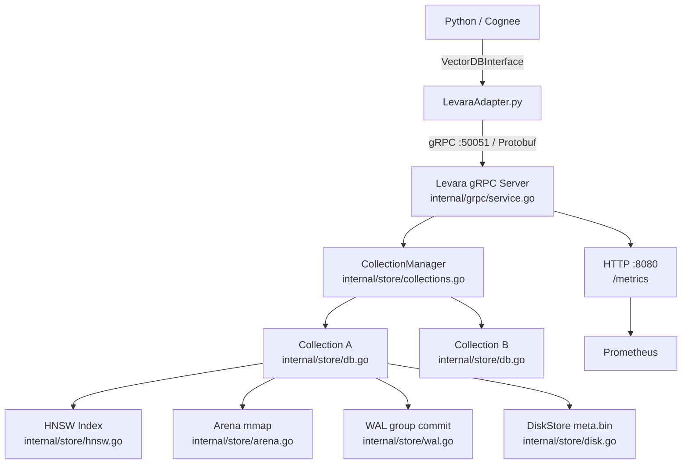

# Architecture

## Component Diagram



## Data Flow: Write Path

A single `Insert` RPC goes through four phases to balance durability with throughput.

**Phase 0 — Serialization (outside lock)**
`json.Marshal(metadata)` is called before acquiring `db.mu`. This was a key optimization: previously marshalling held the write lock for 3–15ms per record.

**Phase 1 — Atomic commit (under `db.mu` write lock)**
Three operations happen atomically inside the lock:
1. `arena.Add(vector)` — appends the L2-normalized float32 slice to the memory-mapped page.
2. `disk.Write(meta)` — appends the metadata record to `meta.bin` (append-only).
3. `wal.WriteEntryNoFlush(entry)` — writes the serialized WAL entry to the `bufio.Writer` buffer without fsync.

**Phase 1.5 — Release lock, schedule durability flush**
`db.mu.Unlock()` is called immediately after the three writes. `wal.FlushAsync()` signals the background `fsyncLoop` goroutine. This is the group commit mechanism: multiple concurrent writers all append to the WAL buffer and signal flush; the goroutine coalesces them into a single `file.Sync()`. Measured coalescing ratio: **12.5x** (50 entries → 4 fsyncs) under load.

**Phase 2 — Async HNSW indexing (background goroutine)**
The vector is enqueued in `pendingVecs` (protected by `pendingMu`). A background goroutine dequeues and calls `hnsw.Add()`. Search during this window falls back to brute-force scan of `pendingVecs`, so no vector is missed. HNSW `Add` is not under `db.mu`, allowing concurrent reads without blocking.

## Data Flow: Search Path

```
gRPC SearchReq
  → CollectionManager.Get(collection)
  → db.mu.RLock()                        # concurrent readers allowed
      → hnsw.Search(vector, k)           # graph traversal, SIMD dot product
      → brute-force scan of pendingVecs  # vectors not yet indexed
  → db.mu.RUnlock()
  → merge + deduplicate results
  → load metadata_json from DiskStore
  → return SearchResp
```

Multiple goroutines hold `db.mu.RLock` simultaneously. The only write-lock contention is during Phase 1 inserts. Under the benchmark workload (589 QPS read-heavy), measured p50 search latency is 2.6ms.

## Storage Layer

### Arena (`internal/store/arena.go`)

Memory-mapped vector storage. Vectors are L2-normalized on insert and packed as `float32` into paged memory regions. Page boundaries avoid re-mapping on growth. On restart the mmap file is re-opened and vectors are available without re-reading from disk.

### DiskStore (`internal/store/disk.go`)

Append-only binary metadata store (`meta.bin`). Each record contains the vector ID, metadata JSON, and a byte offset into the arena. Metadata is loaded on demand during search result hydration. On recovery, `disk.Replay()` reconstructs the in-memory ID→offset map.

### WAL (`internal/store/wal.go`)

Write-ahead log with group commit. Two concurrency primitives:
- `wal.mu` — protects `bufio.Writer` from concurrent writers racing with `fsyncLoop`.
- A channel signal — writers call `FlushAsync()` which sends a non-blocking signal to `fsyncLoop`.

`fsyncLoop` drains the channel (coalescing all pending signals), calls `bufio.Flush()` then `file.Sync()`, and broadcasts completion to waiting writers. WAL entries are replayed on startup before the arena is initialized, ensuring crash recovery. Measured: **100% recovery** after abrupt kill.

### HNSW (`internal/store/hnsw.go`)

Hierarchical Navigable Small World graph index. Parameters:

| Parameter | Default | Effect |
|-----------|---------|--------|
| `M` | 20 | Edges per node per layer. Higher = better recall, more memory, slower insert |
| `M0` | 40 (2×M) | Edges on layer 0 (base layer) |
| `efSearchMult` | 10 | efSearch = k × efSearchMult. Higher = better recall, slower search |
| `efSearchMin` | 64 | Floor on efSearch regardless of k |

Distance function: dot product via `vek32` (AVX2 intrinsics). Measured: **8.1x** over scalar 4-way unrolled (69ns vs 557ns per dim=1024 vector on i7-7700).

Recall@10 with default parameters on real book embeddings (dim=1024): **0.994**.

### CollectionManager (`internal/store/collections.go`)

Maps collection names to `*DB` instances. Each collection is an independent HNSW+Arena+WAL+Disk stack. Collection creation and deletion are persisted to a dedicated WAL segment so they survive restart. The gRPC server routes all RPCs through the CollectionManager.

## Concurrency Model

| Lock | Scope | Held by |
|------|-------|---------|
| `db.mu` (write) | arena.Add + disk.Write + wal.WriteEntryNoFlush | Insert RPC handler |
| `db.mu.RLock` (read) | hnsw.Search + pendingVecs scan | Search RPC handler (concurrent) |
| `wal.mu` | bufio.Writer flush + fsync | fsyncLoop goroutine + FlushAsync callers |
| `pendingMu` | pendingVecs enqueue/dequeue | Insert handler + async indexing goroutine |
| `collections.mu` | CollectionManager map read/write | CreateCollection, DropCollection, routing |

The critical insight: `db.mu` is held for only three cheap appends (arena page write, disk append, WAL buffer write). The expensive operations — JSON marshal, fsync, HNSW graph traversal — all happen outside the write lock.

## gRPC Protocol

Defined in `Levara/proto/levara.proto`. Service: `LevaraService` on port 50051.

| RPC | Description |
|-----|-------------|
| `CreateCollection` | Create a named collection (new HNSW+WAL stack) |
| `DropCollection` | Delete collection and all its data |
| `ListCollections` | Return all collection names |
| `HasCollection` | Check if a named collection exists |
| `Insert` | Insert a single vector with metadata |
| `BatchInsert` | Insert a batch of vectors; returns per-record error list |
| `Delete` | Delete vectors by ID list; marks HNSW tombstones + WAL OpDelete |
| `Search` | kNN search by vector; returns IDs, scores, metadata |
| `GetByID` | Retrieve vectors and metadata by ID list |
| `ChunkText` | Server-side text chunking (paragraph/sentence/merged strategies) |
| `Info` | Return dimension, shard count, status, collection list |

The Python adapter (`LevaraAdapter.py`) implements all 9 Cognee `VectorDBInterface` methods by translating to these RPCs. Transport overhead is approximately **0.3ms** round-trip (vs 2.6ms for the previous HTTP/JSON adapter, an 8.4x reduction).

## HNSW Parameter Tuning

| Parameter | Conservative | Default | Aggressive | Trade-off |
|-----------|-------------|---------|------------|-----------|
| `M` | 8 | 20 | 48 | Memory vs recall |
| `efSearchMult` | 5 | 10 | 20 | Latency vs recall |
| `efSearchMin` | 32 | 64 | 128 | Latency floor |

For Recall@10 > 0.99 on dim=1024 embeddings: `M=20, efSearchMult=10, efSearchMin=64` (current defaults).
For maximum throughput at the cost of recall: reduce `efSearchMult` to 5.
For maximum recall (retrieval audit, evals): `M=32, efSearchMult=20`.

Parameters are set at startup via CLI flags and apply to all collections on that server instance.
