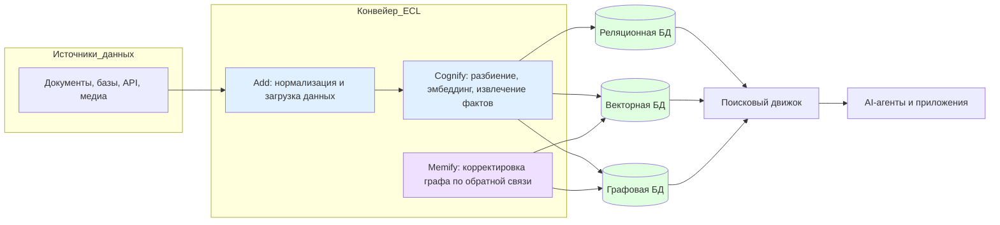

# Cognee: Система памяти на основе графов знаний

**Краткое содержание:** Cognee – это открытая платформа «памяти» для AI-агентов, предназначенная для сбора, структурирования и поиска информации из любых источников. В отличие от классических RAG-конвейеров, Cognee строит семантический **граф знаний** из документов, баз данных и других данных, постоянно обновляя его на основе обратной связи【40†L54-L58】【36†L111-L120】. Платформа сочетает три слоя хранилищ (реляционное, векторное и графовое) в одном движке, что упрощает управление данными и обеспечивает гибкие возможности поиска【36†L111-L120】【23†L114-L123】. В 2024–2026 годах Cognee активно развивался: он используется более чем в 70 компаниях (среди заказчиков – научные и образовательные учреждения, финансовые организации, стартапы) и получил инвестиции в $7,5M для расширения функциональности. Cognee интегрируется со множеством инструментов (Claude и OpenAI Agent SDK, LangGraph, Google ADK, n8n и др.), поддерживает 38+ типов данных (PDF, базы SQL, аудио, изображения, Slack, Notion и др.)【40†L61-L69】【56†L117-L126】. Его модель лицензирования комбинация бесплатного открытого ПО (Apache 2.0【51†L11-L14】) и коммерческих SaaS-планов (начиная с \$35/мес)【52†L39-L48】【52†L71-L80】. Cognee позволяет быстро получать достоверные ответы с обоснованием («с доказательствами») из большого массива данных. Например, Университет Вайоминга через Cognee получил структурированные ответы из сотен PDF (с полными ссылками на источники)【10†L169-L177】【20†L219-L227】, а образовательная платформа Knowunity связала 40 000 студентов в общие учебные группы на основе анализа метаданных【15†L303-L312】【20†L223-L227】. Среди технических преимуществ – мультиформатный вход, обширные возможности поиска, обучение на пользовательской обратной связи (механизм *memify*) и гибкость развёртывания. Ограничения включают высокие требования к ЛЛМ и сложную настройку структурированного вывода: часть пользователей отмечает, что Cognee плохо работает с малыми локальными моделями из-за формата JSON-ответа【45†L69-L73】. Для расширения Cognee можно подключать собственные коннекторы (существуют Community-адаптеры к Pinecone, Milvus, Weaviate и пр.【63†L323-L332】), настраивать конвейеры обработки, использовать REST/Python API или протокол MCP для интеграции с фронтендами (Cursor, Claude Desktop, Code assistants и др.【60†L83-L92】). Дальнейшее развитие Cognee включает разворачивание облачной SaaS-платформы, оптимизацию для edge (Rust-движок) и добавление десятков новых коннекторов в 2026 году【23†L129-L133】【23†L107-L112】. 

## 1. Обзор продукта и архитектура

Cognee позиционируется как **«движок памяти»** для AI-агентов, который вместо простого RAG-конвейера автоматически извлекает сущности и отношения из неструктурированных данных и строит из них граф знаний. По словам авторов, Cognee «объединяет три слоя хранения – реляционный, векторный и графовый – в едином движке»【23†L114-L123】, делая данные «поисковыми по смыслу и связанными отношениями». На вход платформа принимает любые форматы: текстовые документы (PDF, DOCX, TXT и др.), таблицы, изображения (с распознаванием через модели компьютерного зрения), аудио (с транскрипцией), а также данные из SQL/NoSQL БД, хранилищ в облаке и API【34†L178-L187】【56†L117-L126】. Модуль **Add** приводит все данные к единому текстовому виду, вычисляет хеши (для дедупликации) и заносит их в реляционную базу (SQLite по умолчанию, или PostgreSQL для продакшена)【34†L139-L147】【29†L112-L118】. Затем компонент **Cognify** разбивает тексты на фрагменты, получает для них embedding и извлекает факты/сущности. Эти данные сохраняются в:
- **Реляционный слой:** метаданные документов, привязки к исходникам (например, номер страницы и положение)【36†L111-L120】.  
- **Векторный слой:** эмбеддинги фрагментов (LanceDB по умолчанию, PGVector, Qdrant, Redis и др.)【31†L112-L120】.  
- **Графовый слой:** факты и отношения в виде графа знаний (Kuzu по умолчанию, Neo4j, Amazon Neptune/Analytics и др.)【30†L113-L122】.  

Гибридная архитектура Cognee выглядит так:

Изображение: **Архитектура Cognee** – конвейер *Extract-Cognify-Load*, многослойное хранилище и механизм «memify» для учёта обратной связи (непрерывного обучения)【23†L114-L123】【36†L111-L120】. Реляционное хранилище обеспечивает неизменяемость метаданных, векторное – быстрое семантическое сравнение, графовое – выполнение запросов Cypher и выяснение связей между сущностями【36†L113-L122】【36†L150-L159】. Cognee поставляется с лёгкими локальными бэкендами (SQLite, LanceDB, Kuzu) и позволяет переключаться на промышленные решения (Postgres, Neo4j, Amazon Neptune и др.) при необходимости масштаба【29†L114-L118】【30†L178-L187】. 

По сравнению с традиционными RAG-подходами, Cognee обещает глубже структурировать контекст. Как отмечается в техпрессе, «вместо простого индексирования документов Cognee строит граф знаний. Этот граф сохраняет отношения и обновляется со временем, к тому же он самонастраивается по обратной связи. В результате агент с каждой итерацией становится более точным»【40†L54-L58】. Такой подход позволяет более надежно отвечать на запросы, подкрепляя ответы доказательствами из источников.

## 2. Кейсы использования и отзывы клиентов

**Университет Вайоминга (США).** Команда университета обратилась к Cognee для ускорения работы над мета-анализом статей по педагогике. В проекте было задействовано сотни PDF-документов (исследования и образовательные материалы). Используя Cognee, исследователи автоматически извлекли ключевые факты и построили **граф доказательств**: граф сущностей (интервенции, результаты и т.д.) с привязкой к исходным источникам. После этого задавался естественно-языковой вопрос («Какие результаты показали интервенции, увеличивающие вовлеченность школьников?»), а система находила ответы прямо из графа и приводила цитаты из документов. Результат: ответы стали появляться за минуты с «полностью прозрачным обоснованием» вместо месяцев ручного поиска【10†L169-L177】【20†L219-L227】. Как отмечает кейс, Cognee «помог быстро получить ответы, которым можно доверять, из сотен PDF»【20†L219-L227】, представив их в виде «утверждения + ссылка» (см. пример на диаграмме выше【10†L169-L177】). Благодаря этому сторонние эксперты смогли легко проверять результаты и использовать «доказательную» информацию в политических решениях.

**Knowunity (Германия).** EdTech-платформа Knowunity связала через Cognee 40 000 учеников и студентов. Ранее задачи рекомендаций учебных групп и анализа поведения требовали сложных SQL-запросов и едва давали осмысленные результаты. С помощью Cognee команда Knowunity построила граф, в котором студенты, классы, города и успеваемость связаны отношениями. Реализован как интерфейс Cypher-запросов, так и естественно-языковый чат для аналитиков. Итоги были впечатляющими: система автоматически выявила сообщества и рекомендации, которые «ранее были невозможны», соединяя «изолированных» учеников на основе контекстно-зависимых связей【15†L303-L312】【15†L334-L343】. Ключевые достижения: ✅обработка всех **40 000** студентов (база интегрирована в память), ✅двойной интерфейс (Cypher + НЯЗ), ✅автоматическое выявление полезных связей (например, по интересам или тематике) и визуализация в реальном времени【15†L303-L312】【15†L334-L343】. По словам проекта, Cognee «соединил ранее изолированных учащихся, масштабировал интуицию команды и соблюдал требования GDPR»【15†L334-L343】.

**Dynamo (стартап, США).** Разработчики платформы Dynamo, предоставляющей AI-помощников для пользователей, выбрали Cognee для обогащения данных клиентов и персонализации поддержки. За **1 месяц** они с нуля построили решение: агент мог анализировать банковские транзакции, предоставлять индивидуальные рекомендации и отвечать на вопросы клиентов с учётом их истории. Оценка показала рост качества ответов (relevancy) по сравнению с базовой RAG-моделью и отсутствие «галлюцинаций», поскольку база знаний лежала в структурированном виде【18†L147-L149】. Как отметил CEO Dynamo Орр Коварски: *«Cognee помог обогатить данные для тысяч наших клиентов и предоставить им персонализированную поддержку, полностью введя решение всего за месяц»*【20†L259-L264】. Фактически, компания получила «персонализированную память» для бота почти моментально.

**Финансовая отрасль (Tier-1 банк, США).** Один из крупнейших банков США применил Cognee для интеграции разрозненных данных по кредитным картам. Раньше специалисты хранили политику, транзакции, описания продуктов в разных системах. Cognee объединил это в единый граф: теперь при запросе «приведи цитированные рекомендации по картам рассрочки» система выдаёт ответ на основе всех документов, с указанием источников. По данным анонса, решения на Cognee показали близкую к 100% точность извлечения фактов【20†L219-L227】. (К сожалению, подробного публичного кейса нет, но подобные истории подтверждают эффективность графового подхода.)

**Другие примеры:** Cognee упоминается в научных и промышленных проектах (Bayer использует его для научных исследований【23†L77-L80】, dilbloom.com – для ген. технологий, dltHub – для ETL-пайплайнов). В целом, платформа показала **500× рост** ежемесячных прогонов конвейера с 2024 по 2025 год и работает «в живых системах» более чем в 70 организациях【23†L77-L80】. 

## 3. Интеграции и коннекторы

Cognee поддерживает обширный список интеграций, объединяя популярные фреймворки агентов, хранилища данных и облачные сервисы. Ниже приведена таблица ключевых типов интеграций и примеров:

| **Тип интеграций**                | **Примеры**                                                                                                                                     |
|-----------------------------------|-------------------------------------------------------------------------------------------------------------------------------------------------|
| **Источники данных (ингест)**     | Текст, документы, таблицы (PDF, DOCX, TXT, XLSX и др.), изображения, аудио; Интернет (веб-сайты через ScrapeGraphAI); облачные хранилища S3【34†L178-L187】【56†L119-L128】; Slack, Notion, Google Drive, SharePoint и др. (через готовые коннекторы)【56†L119-L128】.                      |
| **Поставщики LLM**               | OpenAI (GPT-4, GPT-4o, др.), Azure OpenAI, Google Gemini (AI Studio), Anthropic Claude, AWS Bedrock, локальные модели через Ollama/LM Studio, а также любые совместимые OpenAI endpoint (vLLM, OpenRouter и пр.)【27†L116-L124】.                                            |
| **Поставщики эмбеддингов**        | OpenAI (text-embedding), Azure OpenAI, Google Gemini (embedding), Mistral, AWS Bedrock, Ollama, LM Studio, FastEmbed (CPU-эмбеддинги) и др.【28†L114-L122】.                                                                                             |
| **Векторные хранилища**          | LanceDB (локальный, по умолчанию), PGVector (Postgres), Qdrant, Redis Search, ChromaDB, FalkorDB, Amazon Neptune Analytics【31†L116-L123】. Кроме того, сообщества добавили адаптеры для Pinecone, Milvus, Weaviate, OpenSearch и др. (см. «cognee-community»【63†L323-L332】). |
| **Графовые хранилища**           | Kuzu (локальный, по умолчанию), Kuzu-Remote, Neo4j (рекомендуется для продакшена), Amazon Neptune (GRAPH и ANALYTICS), Memgraph (community)【30†L113-L122】. Дополнительно – Spanner Graph, TuringDB и др. через community-адаптеры【63†L342-L349】.                             |
| **Реляционные БД (метаданные)**   | SQLite (файл, дефолт), PostgreSQL (промышленное решение)【29†L114-L122】 (используется для хранения информации о документах, кусках текста и их происхождении)【36†L131-L140】.                                                                                   |
| **Фреймворки агентов и автоматизация** | Claude Agent SDK, OpenAI Agent SDK, LangGraph, Google Agent Desktop Kit (ADK), OpenClaw, n8n, Continue.ai и др. – для внедрения Cognee-памяти в ассистентов и чат-ботов【25†L139-L147】【60†L83-L92】. Cognee позволяет использовать свои API/шаблоны в этих средах.                                                    |
| **Инструменты разработки**       | IDE/плагины: Cursor, Continue, Claude Code, Cline, RooCode – расширяют функционал Cognee для кода и проектов【25†L174-L183】【60†L85-L92】. Например, через протокол MCP Cognee может напрямую служить хранилищем памяти для таких инструментов.                                                 |
| **Инструменты наблюдаемости**     | Langfuse, Keywords.AI – для логирования и оценки качества ответов Cognee (см. раздел *Integrations* в документации)【25†L91-L99】.                                                                                                                   |
| **Облачные сервисы**            | Полностью поддерживается размещение в AWS/GCP/Azure – Cognee Cloud доступен на всех трёх платформах【52†L39-L48】. Есть прямые интеграции: например, Amazon Neptune теперь официально поддерживается как графовое хранилище памяти Cognee【59†L41-L50】, можно использовать AWS Bedrock, Azure OpenAI, Google AI. |

**Пример:** интеграция с Amazon Neptune позволяет «использовать Neptune в качестве графового хранилища, лежащего в основе уровня памяти Cognee»【59†L41-L50】. Это даёт возможность выполнять мульти-проходные графовые и гибридные (граф+вектор) запросы на больших объёмах данных. Также Cognee из коробки может считывать данные из Amazon S3 (через префикс `s3://`) и хранить свои файлы на S3【35†L150-L159】, поддерживает Microsoft SharePoint/OneDrive (через коннекторы) и другие источники.

Таким образом, Cognee интегрируется с широким стеком: LLM/векторных провайдеров, баз данных, BI/ETL-инструментов и интерфейсами агентов. Ниже подытожены основные возможности:

- **Поддержка 38+ источников данных**: документы (PDF, DOCX, Markdown и др.), таблички, изображения, аудио【34†L178-L187】【56†L119-L128】.
- **Универсальные LLM/эмбеддинги**: все крупные провайдеры (OpenAI, Google, Anthropic, AWS и др.) плюс локальные модели【27†L116-L124】【28†L114-L122】.
- **Множество хранилищ**: VectorDB (LanceDB, Qdrant, Redis, PGVector и т.д.)【31†L112-L121】; GraphDB (Kuzu, Neo4j, Neptune)【30†L113-L122】; Relational (SQLite, Postgres)【29†L112-L118】.
- **Фреймворки агентов**: Claude, OpenAI Agents, LangGraph, OpenClaw, n8n, Continue и другие поддерживают подключение к Cognee【25†L139-L147】【60†L83-L92】.

## 4. Преимущества и выгоды

Cognee сочетает несколько важных преимуществ:

- **Структурированное хранилище знаний:** Вместо бессвязного мешка векторов, Cognee строит **граф знаний**. Это позволяет задавать сложные вопросы с несколькими промежуточными шагами. Как отмечено в обзоре, «Cognee извлекает весь релевантный контекст из данных во время вывода»【40†L54-L58】, снабжая ответы точными фактами. В отличие от «голого» RAG, где ответы зависят от ближайших семантически векторов, в Cognee можно явно отследить источники и связи. Так, ответы сопровождаются цитатами: например, в кейсе UWYO приводятся выписки из исследований вместе со ссылками【10†L169-L177】. Это повышает **достоверность** и доверие: эксперты получают не просто «вероятностный» ответ, а «утверждение + доказательство» из графа.

- **Ускорение аналитики:** Построение графа знаний автоматизирует многие рутинные шаги. Клиентские отчёты, научные работы, скрипты – всё это можно загрузить в Cognee и получить мгновенные обобщения. В описанных кейсах сложный анализ данных ушёл от дней/недель к минутам/часам. Например, Knowunity «умасштабировал интуицию» и «подключил 40 000 студентов»【15†L303-L312】, автоматически выявив группы по интересам и школе. Dynamo сократил время разработки AI-системы поддержки клиентов до месяца, достигнув более релевантных ответов【20†L259-L264】【18†L147-L149】.

- **Персонализация и адаптация:** Cognee сохраняет и обновляет память агентов по обратной связи. Механизм *memify* учитывает новые данные и оценки агента (например, дали ли ответ за правильный) – и соответственно усиливает или ослабляет веса рёбер в графе. Таким образом с опытом система «самоподстраивается»【40†L65-L69】. Это выгодно в долгосрочной перспективе: чем больше работают агенты, тем лучше их память. Цитата из технической статьи: «Cognee — самосовершенствующаяся система памяти, которая помогает создавать персонализированные AI-приложения»【59†L52-L55】.

- **Мультиформатность и гибридный поиск:** Cognee может работать сразу с несколькими типами данных (текст, таблички, изображения, аудио и т.д.), что выгодно для комплексных проектов. Объединив их в единую модель, платформа позволяет выполнять **гибридный поиск**: семантический (по embedding), графовый (по Cypher) или комбинированный【36†L150-L159】. Преимущества совмещения описаны так: «граф Neo4j рекомендуется для продакшена, а для поиска доступен семантический поиск по вектору и структурный поиск по графу (или их гибрид)»【36†L150-L159】. Это даёт точные и контекстно-насыщенные результаты (например, можно искать одновременно по содержанию и по отношением в графе).

- **Открытость и гибкость развёртывания:** Cognee с открытым исходным кодом (Apache 2.0【51†L11-L14】) можно запустить локально, в контейнерах или на облаке. Есть готовая облачная служба (Cognee Cloud), но при желании систему можно установить на собственных серверах: все компоненты (Postgres, Neo4j, Redis и др.) доступны. Такой подход устраняет “vendor lock-in” и позволяет адаптировать систему под свои требования (например, добавлять собственные коннекторы, задания). Отмечается, что Cognee развёрнут на «70+ компаниях в живой эксплуатации»【23†L77-L80】 – от стартапов до корпораций. И хотя он сравнительно новый, популярность растёт: репозиторий на GitHub получил >12 000 звёзд【40†L89-L90】, а инвестиции подтверждают актуальность.

- **Экономическая выгода:** Для бизнеса Cognee предлагает экономию на разработке: вместо создания множества отдельных ETL-конвейеров и ручной RAG-логики достаточно подключиться к одному движку. При интеграции (например, в банк или производство) затраты на поддержку знаний снижаются, так как обновление графа и добавление новых источников делается автоматически. Кроме того, открытая модель лицензирования снижает начальные инвестиции (Open Source), а платные планы SaaS позволяют быстро начать без накладных на инфраструктуру.

**Пример итоговых показателей:** По внутренним данным Cognee, в 2024–2025 гг. количество запусков пайплайнов выросло в 500 раз【23†L77-L80】, а производительность ответа (Precision/Recall) заметно выше, чем у классического RAG-моделя (горячая выборка HotPotQA показала успехи после оптимизации)【58†L144-L152】【58†L168-L177】. Пользователи также отмечают «100% точность» и «надежные цитаты» в ответах (кейсы Knowunity и Tier1 банк【20†L219-L227】). 

## 5. Ограничения и риски

Несмотря на возможности, Cognee имеет и некоторые ограничения:

- **Требовательность к ресурсам и сложность настроек:** Платформа опирается на LLM для структурированного вывода (JSON-схемы сущностей и отношений). Это значит, что «мелкие» локальные модели могут не справляться: в одном тесте при обработке PDF-такс-листа Cognee «не заработал на моем железе» из-за требований к формату вывода【45†L69-L73】. По словам одного энтузиаста, *«огромная зависимость фреймворка от структурированного вывода делает использование малых моделей проблематичным»*【45†L69-L73】. Иными словами, Cognee эффективно работает с мощными LLM (облачными или локальными большими), но не оптимизирован для слабых устройств. 

- **Накладные на интеграцию:** Хотя Cognee поддерживает многие коннекторы, некоторые коннекции могут потребовать ручной настройки. Например, подключение Qdrant или Milvus осуществляется через community-пакеты (их нужно дополнительно установить【31†L194-L202】). Аналогично, поток данных из нестандартных источников (собственные API, редкие форматы) придётся реализовывать вручную. В документации уже есть расширение (Cognee Community), но это усложняет начальную настройку для команд без DevOps.

- **Отсутствие некоторых корпоративных фич:** На текущий момент Cognee ориентирован прежде всего на открытое ПО и стартап-рынок. В облачных планах есть поддержка AWS/GCP/Azure и базовые меры безопасности (RBAC, VPC и пр.), но, например, SOC2/HIPAA сертификации, встроенной шифрации или SSO явно не заявлено (в отличие от зрелых enterprise-платформ). Организациям с очень строгими требованиями нужно тщательно проектировать защиту: Cognee можно разворачивать on-premise и ограничивать доступ на уровне БД (функция `ENABLE_BACKEND_ACCESS_CONTROL` для изоляции данных разных пользователей【29†L220-L228】), но «из коробки» глубокой безопасностью он не оборудован.  

- **Управление памятью:** В текущей версии Cognee нет явного концепта временных меток или версии памяти. То есть, если у агента появляются противоречащие факты (как в обобщенном примере: «я веган» и «я ем стейк»), система пока не умеет автоматически решать конфликт или «забывать» устаревшее. Для пользователей может быть неожиданно, если старые данные останутся в графе. Это типичная проблема в AI-памяти (вспоминает обсуждение гибридных систем)【49†L112-L121】, и Cognee обещает заниматься этим в будущем, но сейчас такой функционал лимитирован.

- **Крутая кривая обучения:** Платформа достаточно продвинута, что требует навыков работы с Cypher, SQL, Docker и настройкой окружения Python. Новичку может быть сложно сразу запустить всё «по щелчку». Приходится разбираться со структурами датасетов, node_set-метками【34†L210-L218】, переменными окружения (`.env`), разными БД и API-ключами. Документация подробна, но сама гибкость Cognee накладывает необходимость тщательной настройки (например, подобрать оптимальные параметры chunking, прунинг вектора, регуляризацию графа и т.д.). Практические жалобы от сообщества указывают на этот фактор: один из блогеров советует тестировать сначала на мощном GPU и только потом пробовать на локалках【45†L69-L73】. 

Итак, основные риски: потребность в надёжном LLM, сложность настройки и штатной безопасности. Но многие из этих ограничений сглаживаются со временем: команда Cognee активно расширяет документацию, планирует добавить много коннекторов и инструментов (см. ниже). Если текущих функций не хватает, можно всегда доработать движок благодаря открытой архитектуре (раздел 6).

## 6. Расширение функционала

Cognee задуман как **расширяемый модуль памяти**. Помимо базовых интеграций, пользователи могут дорабатывать систему следующими способами:

- **Собственные коннекторы и пакеты:** Есть общественный репозиторий [cognee-community](https://github.com/topoteretes/cognee-community) с адаптерами и примерами. Там уже реализованы плагины для большинства векторных баз (Pinecone, Milvus, Weaviate, OpenSearch и др.) и графовых хранилищ (Memgraph, NetworkX, Spanner Graph)【63†L323-L332】【63†L342-L349】. Если нужно подключить нестандартное хранилище или API, можно написать свой адаптер по образцу community-пакетов. Cognee позволяет «прикручивать» их через `pip install`. 

- **Пользовательские конвейеры (Pipelines):** В основе Cognee лежат **задания** и **пайплайны**, которые легко модифицировать. Документация по «Custom tasks» и «Custom pipelines» позволяет создавать новые задачи: например, вместо встроенного BAML-инструмента вытаскивать факты иными способами. Можно реализовать специфическую логику обработки (скрипты, регулярки, модели извлечения) и встроить их в pipeline. 

- **API и SDK:** Cognee предоставляет **HTTP API** и **Python SDK**【60†L83-L92】【25†L139-L147】. Через них можно интегрировать движок в любые приложения или автоматизировать процессы. Например, можно вызывать `cognee.add()` и `cognee.search()` из своих сервисов, запускать графовые запросы и сохранять результаты. Также существует **MCP-протокол** (Model Context Protocol): специальные инструменты Cognee для автопилотов (Cursor, Claude Desktop и др.)【60†L83-L92】. MCP позволяет напрямую вызывать функции памяти из кода или GUI ассистентов (например, команда ChatGPT через DuckDB/Weaviate).

- **Автоматизация и плагины:** Уже есть готовые интеграции с внешними инструментами: **n8n** (визуальный оркестратор процессов) имеет блоки для взаимодействия с Cognee. Также в блоге Cognee описаны плагины, например для OpenClaw (markdown-ассистента), которые добавляют графовую память в готовые решения. При желании можно написать плагин для популярных фреймворков (LangGraph, LlamaIndex и др.), чтобы данные из Cognee появлялись «на лету» в других системах. 

- **Безопасность и корпоративные функции:** Для организаций доступна настройка контроля доступа: можно включить изоляцию по пользователям/доменам (переменная `ENABLE_BACKEND_ACCESS_CONTROL=true`)【29†L220-L228】. Это обеспечивает разделение знаний разных команд на уровне БД. Enterprise-версия предлагает развёртывание on-premise, поддержку SLA, выделенный ревью архитектуры и даже помощь AI-экспертов (см. раздел 7). Таким образом, для крупных проектов можно обеспечить шифрование, аудит и доступность.

- **Будущие расширения:** Команда Cognee запланировала несколько направлений развития: **Rust-движок** для low-latency/edge-сценариев, **расширенный Cloud** с многопользовательскими пространствами, а также дополнительный набор инструментов (как «емкости памяти»). В частности, ожидается выпуск **30+ новых коннекторов** к Q1–Q2 2026【23†L129-L133】 (например, к корпоративным сервисам и отраслевым платформам), а также поддержка множества БД (multi-database) и расширенные возможности изоляции. Все это дополнительно повысит гибкость Cognee и позволит интегрировать его практически с любыми существующими системами.

**Рекомендуемые практики при расширении:** Разрабатывайте коннекторы, используя образцы из [cognee-community](https://github.com/topoteretes/cognee-community). Для создания собственного пайплайна следуйте гайдам по «cognee.compile()» и «cognee.load()». Помните о согласованности схемы данных – при добавлении новых сущностей обновляйте онтологию/сущностные шаблоны. Используйте механизмы **Memify** (Feedback System) для оценки качества и корректировки памяти. Для безопасности интегрируйте Cognee с корпоративным окружением (VPN, VPC, IAM). Документация Cognee регулярно обновляется – полезно следить за разделом *Integrations* и GitHub, чтобы использовать новые возможности по мере их появления.

## 7. Ценообразование и лицензирование

**Лицензия:** Ядро Cognee – с открытым исходным кодом (Apache 2.0)【51†L11-L14】. Это позволяет свободно использовать, модифицировать и развёртывать систему без платы за сам софт. Сообщество вместе с разработчиками постоянно пополняет репозиторий новыми возможностями.

**Модель оплаты:** Cognee предлагает как бесплатный (self-hosted), так и коммерческие тарифы:
- **Free (бесплатно)**: подходит для индивидуальных разработчиков. Предоставляет все основные функции (создание конвейеров, графа, оценка памяти и т.д.) с неограниченным открытым доступом к функционалу. Имеется сообщество и базовая документация【52†L23-L32】.
- **Developer ($35/мес)**: облачный сервис Cognee Cloud для одного пользователя с **1 000 документов** (~1 GB) и **10 000 API-запросов** в месяц. Включает автоматическое масштабирование, обновления и хостинг на AWS/GCP/Azure【52†L39-L48】.
- **Team ($200/мес)**: для небольших команд до 10 человек, включает **2 500 документов** (~2 GB), **10 000 запросов** в месяц, многопользовательскую архитектуру и выделенную поддержку через Slack【52†L71-L80】.
- **Enterprise (Custom)**: решения для больших компаний. Предлагает развёртывание on-premise или в приватном облаке, повышенные меры безопасности (ISO, шифрование, изоляция данных), SLA и приоритет в развитии фич. Цена – договорная【52†L99-L108】.

Приведём сводную таблицу тарифов:

| **Тариф**       | **Цена**    | **Объём данных**         | **Пользователи** | **Основные возможности**                                      |
|-----------------|-------------|--------------------------|------------------|--------------------------------------------------------------|
| **Free**        | 0 $        | – (open-source)           | –                | Всё OSS-функционал; поддержка 28+ типов источников【52†L23-L32】; сообщество |
| **Developer**   | 35 $/мес   | 1 000 документов (~1 GB)  | 1                | Весь функционал Free + хостинг на AWS/GCP/Azure, 10k API-запросов【52†L39-L48】 |
| **Team (Cloud)**| 200 $/мес  | 2 500 документов (~2 GB)  | до 10           | Всё Developer + мульти-арендность, 10k API-запросов, приоритетная поддержка【52†L71-L80】 |
| **Enterprise**  | Custom      | Неограничен               | Неограничен      | Всё Team + on-prem, приватное облако, безопасность, SLA, выделенная команда【52†L99-L108】 |

*Источники: официальная страница цен Cognee【52†L39-L48】【52†L71-L80】【52†L99-L108】 и GitHub (Apache-2.0)【51†L11-L14】.* 

Можно заметить, что бесплатная модель распространяет Cognee без ограничений по функционалу, а платные планы добавляют сервисную составляющую (хостинг, поддержку, UI). При этом в Cloud-версиях действует схема «pay-as-you-grow»: есть дополняемые пакеты (+1 000 документов за \$35, +15 000 за \$750)【52†L61-L65】【52†L91-L95】. Для компаний с большими объёмами или специфическими требованиями рекомендуется Enterprise.

## 8. Рекомендации по внедрению

**Подготовка и запуск:** 
1. **Определите источники и форматы данных.** Составьте список документов, БД и иных ресурсов, которые хотите загрузить. Cognee поддерживает практически любые файлы (PDF, Markdown, CSV, MP3, JPG и др.)【34†L178-L187】 и их комбинированную загрузку (в том числе из S3)【34†L174-L182】【35†L150-L159】. На этапе `cognee.add()` можно указать и списки путей, и веб-URL, и S3-префиксы – конвейер автоматически развернёт каталоги и скачает данные.

2. **Выберите бэкенды для хранения.** Для разработки достаточно SQLite + LanceDB + Kuzu (всё включено в пакет). Для продакшена рекомендуются PostgreSQL + pgvector (для метаданных/эмбеддингов) и Neo4j или Amazon Neptune (для графа)【29†L114-L122】【30†L178-L187】. Следите за соответствием размеров векторов: например, при использовании OpenAI-эмбеддингов задайте `EMBEDDING_DIMENSIONS="3072"`【28†L138-L147】. Установите нужные расширения: `pip install "cognee[postgres]"` для PGVector, `pip install "cognee[neo4j]"` для Neo4j и пр.

3. **Настройка окружения:** Создайте `.env` с ключами LLM/эмбеддингов и БД. В `LLM_PROVIDER` укажите провайдера (openai, gemini, etc), в `EMBEDDING_PROVIDER` – аналогично. Укажите `DB_PROVIDER="postgres"` и параметры подключения. Если используете S3-хранилище, добавьте `aws_access_key_id`/`aws_secret_access_key` и пути `DATA_ROOT_DIRECTORY="s3://..."`【35†L150-L159】. Рекомендуется сначала выполнить `cognee.quickstart` (см. документацию) для проверки окружения.

4. **Создайте датасеты и Node-метки:** Cognee организует данные в **datasets** («наборы данных» с собственным именем, id и правами). Используйте это для логической сегментации знаний (например, `customer-reports`, `research-papers`). При добавлении данных можно задавать `node_set=[...]` – теги для группировки (например, `node_set=["FinTech", "2025"]`)【34†L210-L218】. Это упростит последующий поиск по тематике.

5. **Запустите конвейеры:** После `.add` выполните `cognee.cognify()`, чтобы провести разбиение на чанк, векторизацию и заполнение графа. Этот процесс в крупных датасетах может быть длительным – при необходимости запускайте в контейнерах или с профилями (предоставлено Docker-композом). На выходе система покажет статистику: число загруженных документов, созданных узлов и рёбер.

6. **Тестирование поиска:** Проверьте оба режима поиска. С помощью `.search()` (или Cypher через Neo4j) задавайте и векторные запросы, и структурированные. Подберите подходящие типы индексов: например, для Neo4j можно настроить полнотекстовый индекс или геометрию свойств. Убедитесь, что ответы релевантны и «схожи» по смыслу.

7. **Организация доступа:** Включите многоарендность, если нужно разделять данные между командами: `ENABLE_BACKEND_ACCESS_CONTROL="true"`【29†L220-L228】. Cognee сможет хранить память разных пользователей или доменов раздельно. Также настройте VPN/SSH/Firewall для БД и LLM-сервисов.

8. **Мониторинг и обновление:** Следите за логами Cognee (LogLevel, Langfuse и др.), чтобы обнаружить ошибки при парсинге или запросах. При добавлении новых данных просто повторяйте `add`/`cognify` для обновления памяти. Используйте метрики качества: Cognee позволяет запускать ML-метрики (например, скорость ответа, точность) с помощью встроенного инструментария **MCP/Eval**.

9. **Использование API:** После того как память готова, подключайте её к приложениям. Через Python-клиент или REST API можно встраивать поиск в свои сервисы. Для чат-ботов рекомендуется использовать протокол MCP или SDK, чтобы AI-ассистенты автоматически обращались к Cognee за контекстом.

**Чек-лист внедрения:**

- Инвентаризировать источники данных (документы, БД, API) и подготовить коннекторы. 
- Выбрать хранилища (Postgres+PGVector, Neo4j/Neptune) для продакшена【29†L114-L122】【30†L178-L187】.
- Настроить LLM-провайдеры и эмбеддинги (OpenAI, Azure, Gemini и др.)【27†L116-L124】【28†L114-L122】.
- Исполнить `cognee.add()` для загрузки данных и `cognee.cognify()` для построения графа【34†L139-L147】.
- Проверить работу поиска: семантического и графового режимов【36†L150-L159】.
- При необходимости включить `ENABLE_BACKEND_ACCESS_CONTROL` для мультиарендности【29†L220-L228】.
- Настроить графические запросы и API-клиент в своих приложениях или чат-ботах.
- Следить за ростом данных, планировать масштабирование (добавлять больше памяти, switch на CLuster PG/Neo4j).

## 9. Конкурентное позиционирование

Cognee конкурирует в пространстве AI-памяти с такими решениями, как **Mem0**, **Zep/Graphiti**, а также традиционными RAG-фреймворками. Основные отличия:

- **Cognee vs классический RAG:** В отличие от RAG (где LLM отвечает на основе ближайших документов/векторов), Cognee поддерживает **граф знаний** и обновляет его. Классический RAG «не отслеживает изменения знаний во времени и не понимает сложных отношений»【40†L49-L58】. Cognee «извлекает релевантный контекст» в виде графа и позволяет делать сложные запросы с учётом взаимосвязей【40†L54-L58】. Это означает более точные результаты в задачах, где важна логика и доказательность ответа. Однако архитектура Cognee сложнее: входящий RAG легко запустить в несколько строк кода, тогда как Cognee требует настройки конвейера.

- **Cognee vs Mem0:** Mem0 – другое популярное open-source решение памяти. У Mem0 упрощённый API и быстрая интеграция (множество разработчиков его выбирают за простоту)【56†L53-L62】. Но у Mem0 платные графовые фичи: бесплатная версия поддерживает только векторный поиск, а граф доступен с Pro-тарифом ($249/мес)【56†L145-L154】. Cognee же графовый поиск обеспечивает бесплатно на всех уровнях (граф – базовая часть конвейера)【56†L149-L154】. Кроме того, Cognee изначально нацелен на **мультимодальный ввод**: документы, аудио, изображения, Slack, Notion и др. (30+ источников)【56†L117-L126】, в то время как Mem0 больше заточен под разговорную память (история чатов). В целом можно сказать, что Cognee – более полнофункциональное, но и более сложное в развёртывании решение.

- **Cognee vs Zep/Graphiti (SuperMemory):** Эти системы тоже используют вектор+графовый подход, но часто ориентированы на облачные сервисы или коммерческий продукт. Например, Zep (Graphiti) предоставляет управляемую базу памяти, но фокусируется больше на хранении историй чатов. Cognee выделяется открытым кодом и широкими возможностями подключения. 

- **Cognee vs другие (Letta, Retrievers и др.):** Существуют также решения для AGI памяти (Letta, Grakn.ai, LangChain + Knowledge Graph и др.). LangChain, к примеру, – это фреймворк, а не «движок памяти»: он предоставляет инструменты для RAG и цепочек, но не включает полноценную базу знаний. Cognee скорее сравним с системами **«Agent Memory Engine»**. Среди них Mem0 – уже упомянутый, Zep/Graphiti – коммерческий стартап. Cognee отличается тем, что является open-source, гибким под разные хранилища и предназначенным для *корпоративного* масштаба (готово к продакшен).

- **Ключевое отличие:** Граф знаний является основной фичей Cognee (есть у всех тарифов)【56†L149-L154】, тогда как у конкурентов зачастую граф либо отсутствует, либо вынесен в дорогой тариф. Cognee также ориентирован на экосистему AI: поддерживает схему MCP для ассистентов【60†L83-L92】, интегрируется с системами скрапинга (ScrapeGraphAI) и рабочими потоками (n8n). В сочетании с активной разработкой (финансирование и открытость) это даёт Cognee конкурентное преимущество в проектах, где важны **доказательная база знаний**, **тесное взаимодействие различных типов данных** и **адаптация под задачи заказчика**.

**Таблица сравнения (выборочно):**

| Функция / Продукт         | **Cognee**                           | **Mem0**                          | **Классический RAG**                 |
|---------------------------|--------------------------------------|-----------------------------------|--------------------------------------|
| **Граф знаний**           | есть (Core везде)【56†L149-L154】     | только в Pro-версии (доп. оплата) | нет                                  |
| **Поддержка источников**  | документы, Slack, Notion, базы, медиа (30+)【56†L117-L126】 | только чаты/строки (генерируемая)  | документы/БД (требуют настройки RAG) |
| **Модификация памяти**    | самонастройка на основе фидбека (memify)【40†L65-L69】 | нет                                | нет                                  |
| **Локальная/облачная**    | open-source, можно локально, есть облако【52†L23-L32】【52†L39-L48】 | облачное (SaaS) или локальное      | обычно локальное/встроенное в стек   |
| **Лицензия**              | Apache-2.0 (открытое ПО)【51†L11-L14】 | Apache-2.0 (есть и SaaS)         | без продукта на рынке (каждая свая)  |
| **Сложность внедрения**   | высокая (конвейер, настройка БД)     | низкая (простое API)             | средняя (надо строить RAG самостоятельно) |

Таким образом, Cognee выгодно отличается глубиной анализа (Knowledge Graph) и широтой интеграций, жертвуя при этом некоторой простотой освоения. Для крупных проектов, где важна **полнота памяти** и **прозрачность ответов**, его функционал может перевесить расходы на настройку. 

**Вывод:** Cognee – мощный и гибкий фреймворк памяти, объединяющий графовые, векторные и реляционные подходы. Он подходит для сложных задач AI-воспоминаний, требующих обоснованных ответов и работы с разнородными источниками. Его преимущества – в надёжности ответов, масштабируемости и открытости – дают преимущество перед узкоспециализированными конвейерами. Ограничения – в сложности настройки и ресурсности – означают, что Cognee больше всего полезен в тех случаях, когда проект оправдывает эти затраты, особенно в корпоративном сегменте и больших данных.

**Источники:** Официальная документация и блог Cognee【3†L441-L448】【36†L111-L120】【10†L169-L177】【15†L303-L312】, технические публикации и обзоры【40†L54-L58】【56†L117-L126】【45†L69-L73】, а также пресс-релизы и интеграционные анонсы【23†L114-L123】【59†L41-L50】. Для цитат был использован оригинальный текст из указанных материалов.