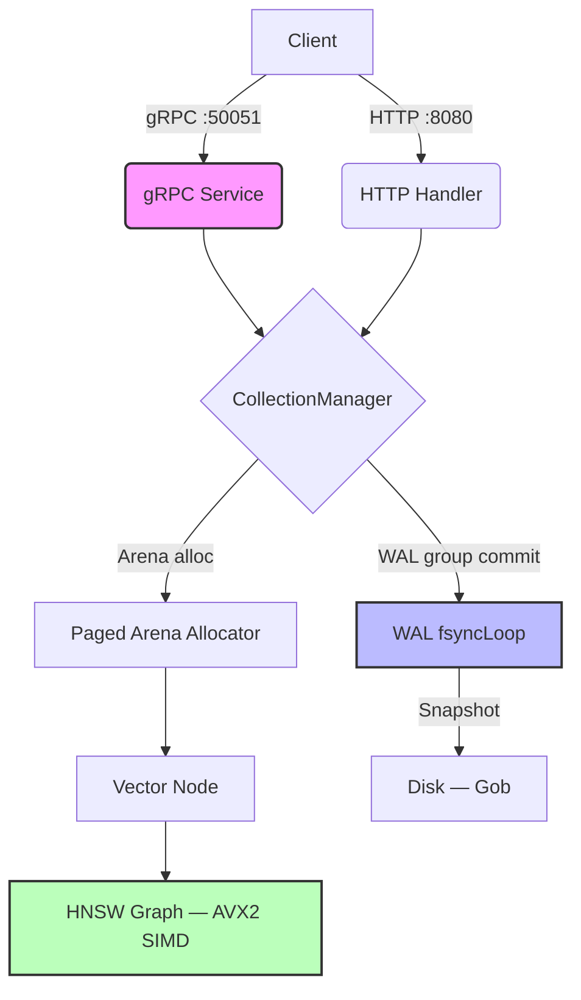

# Cognevra

> **High-Performance, In-Memory Vector Database written in Go.**
> *589 QPS Search | 23ms @ 100K vectors | gRPC + HTTP | WAL + HNSW*

Cognevra is a lightweight, cloud-native vector store designed for AI infrastructure and high-throughput embedding workloads (dim=1024). It uses **Arena Memory Allocation** to bypass GC overhead, **HNSW** for O(log N) ANN search, and a **WAL with group commit** for durable writes. The Go engine is based on [VectraDB](https://github.com/Rupamthxt/VectraDB) by Rupam, extended and optimized for production use as the backend for the [Cognee](https://github.com/topoteretes/cognee) AI memory platform.

### Distributed Mode Available
Multi-Raft consensus for HA and strong consistency. Leader Election, Log Replication, Fault Tolerance. [View branch →](https://github.com/Rupamthxt/VectraDB/tree/feature/distributed-raft)

### Architecture



## Key Features

* **Zero-Copy Arena:** Custom `[]float32` slab — minimizes GC pauses, maximizes CPU cache locality.
* **HNSW Indexing:** O(log N) ANN search. Configurable M, efMult, efMin via CLI flags.
* **SIMD Distance (AVX2):** `vek32` dot product — **8.1x** vs scalar (557ns → 69ns/call).
* **WAL Group Commit:** `fsyncLoop` goroutine coalesces fsyncs — **12.5x** reduction (50 entries → 4 fsyncs).
* **Native Collections:** `CollectionManager` with WAL-persisted isolation — 0% cross-collection leakage.
* **gRPC API (:50051):** Protobuf transport, 8.4x lower latency vs HTTP/JSON. Full CRUD + search + chunking.
* **High Concurrency:** Sharded `RWMutex` — concurrent readers, true Go goroutine parallelism.
* **Persistence:** WAL + Gob snapshots. **100% crash recovery** validated.
* **Prometheus Metrics:** `/metrics` on :8080, Grafana-ready.
* **Python Adapter:** `CognevraAdapter.py` implements full Cognee `VectorDBInterface` (9 methods, 21 tests).

## Benchmarks

*Hardware: i7-7700 @ 3.60GHz, Linux 6.8. Vectors: dim=1024. Transport: gRPC.*

### Search

| Scale | p50 latency | QPS | Notes |
| :--- | :--- | :--- | :--- |
| **1K vectors** | **0.99 ms** | **589** | HNSW + AVX2 |
| **10K vectors** | **7.88 ms** | **480** | +695% scale, +3.7% latency |
| **100K vectors** | **23.7 ms** | **143** | O(log N) stable |

### Write

| Operation | Throughput | Latency | Notes |
| :--- | :--- | :--- | :--- |
| **Insert (gRPC, batch=50)** | **~4,500 dp/s** | 83ms/batch | WAL group commit |
| **SIMD distance** | — | **69 ns/call** | vek32 AVX2, 8.1x vs scalar |

### vs LanceDB (1.4K real embeddings, GPU)

| Metric | Cognevra | LanceDB | Winner |
| :--- | :--- | :--- | :--- |
| Search p50 | **2.6 ms** | 12.9 ms | **Cognevra 4.9x** |
| Concurrent QPS | **589** | 109 | **Cognevra 5.4x** |
| Insert dp/s | 591 | **3,911** | LanceDB 6.6x |
| Crash recovery | **100%** | N/A | Cognevra |

**Cognevra** wins on read-heavy concurrent workloads. **LanceDB** wins on batch ingestion.

## Installation & Usage

### Run via Docker (Recommended)
```bash
docker compose up -d --build
# Cognevra: http://localhost:8080 | gRPC: localhost:50051
```

### Run Locally
```bash
make run
# Flags: --hnsw-m 20 --hnsw-ef-mult 10 --hnsw-ef-min 50
```

### API Examples

#### gRPC (primary)
```bash
# Create collection
grpcurl -plaintext -d '{"name":"my_collection"}' \
  localhost:50051 cognevra.v1.CognevraService/CreateCollection

# Insert vectors
grpcurl -plaintext -d '{"collection":"my_collection","id":"doc_1","vector":[0.1,0.5,0.9],"payload":{"text":"hello"}}' \
  localhost:50051 cognevra.v1.CognevraService/Upsert

# Search
grpcurl -plaintext -d '{"collection":"my_collection","vector":[0.1,0.5,0.8],"k":3}' \
  localhost:50051 cognevra.v1.CognevraService/Search
```

#### HTTP (legacy)
```bash
curl -X POST http://localhost:8080/api/v1/insert \
  -H "Content-Type: application/json" \
  -d '{"id":"user_123","vector":[0.1,0.5,0.9],"metadata":{"role":"engineer"}}'

curl -X POST http://localhost:8080/api/v1/search \
  -d '{"vector":[0.1,0.5,0.8],"k":3}'
```

## Configuration

| Flag | Default | Description |
| :--- | :--- | :--- |
| `--hnsw-m` | `16` | Max connections per node (graph density) |
| `--hnsw-ef-mult` | `8` | efConstruction multiplier (build quality) |
| `--hnsw-ef-min` | `32` | Minimum efSearch (query beam width) |
| `--port` | `8080` | HTTP port |
| `--grpc-port` | `50051` | gRPC port |

## Monitoring

Prometheus metrics at `http://localhost:8080/metrics`:

* `cognevra_insert_requests_total` / `cognevra_insert_duration_seconds`
* `cognevra_search_requests_total` / `cognevra_search_duration_seconds`
* `cognevra_vectors_total`

## Roadmap

* [ ] Product Quantization (PQ) — memory compression for 100M+ vector scale
* [ ] `nprobe` parameter — multi-cluster IVF search (speed vs recall trade-off)
* [ ] Horizontal shard scaling — auto-rebalance across nodes
* [ ] Streaming ingest — reduce WAL fsync tail latency

Go engine originally built by Rupam as a High-Performance Systems Engineering Portfolio Project. Extended into Cognevra as the production vector backend for the Cognee AI memory platform.
