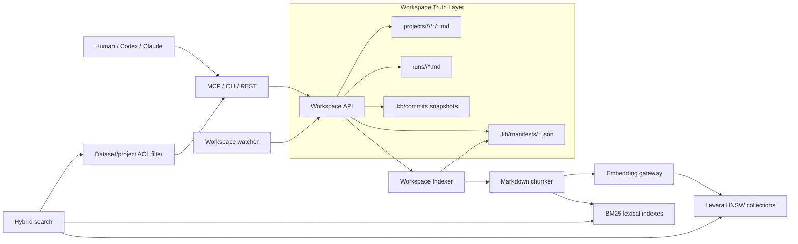
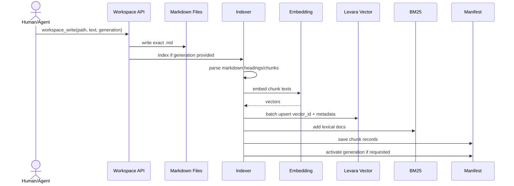

# Markdown-Native Workspace в Levara

Дата: 2026-05-11

Этот документ описывает markdown-native workspace слой Levara: архитектуру,
основные сценарии, работу одному человеку и командой, управление доступом,
быстрый поиск для Codex/Claude и синхронизацию изменений из Markdown в
векторный/BM25 индекс.

Короткая формула: **Markdown-файлы являются source of truth, Levara хранит
только derived search indexes**. Агент или человек всегда принимает решение на
основе точного чтения `.md` файла, а не только на основе embedding hit.

## 1. Зачем нужен markdown-native workspace

Обычная память агента хорошо подходит для отдельных фактов: решение, баг,
предпочтение, endpoint. Но проектные знания часто имеют другой формат:

- ADR и архитектурные решения.
- Runbooks и incident notes.
- API/DB/infra artifacts.
- Сводки agent runs.
- Командные заметки, которые должны жить в Git-подобной структуре.
- Документы, которые человек должен читать и редактировать напрямую.

Markdown-native workspace решает эту задачу так:

1. Человек или агент пишет `.md` файл в workspace.
2. Workspace сохраняет файл как каноническое состояние.
3. Indexer режет Markdown на структурные chunks.
4. Dense vectors пишутся в Levara collection.
5. Lexical BM25 sidecar получает те же chunks.
6. Manifest связывает `project_id`, `branch`, `generation`, `path`,
   `chunk_id`, `vector_id`, `file_digest`.
7. Codex/Claude ищут через MCP/REST, получают ranked hits и затем читают
   точный markdown path.

Главный принцип: **vector DB не редактирует знание сама**. Она помогает найти
релевантные места; запись изменений всегда идёт обратно в Markdown.

## 2. Архитектура



### Компоненты

| Компонент | Роль | Важное ограничение |
|---|---|---|
| Workspace API | Read/write/reindex/reconcile/commit/revert/gc | Не должен подменять source of truth индексом |
| Markdown files | Каноническое знание проекта | Редактируются человеком/агентом |
| Manifest | Durable карта chunks → vectors | Используется вместо delete-by-filter |
| VectorStoreAdapter | Граница между workspace и Levara HNSW | Позволяет менять dense backend |
| BM25 sidecar | Exact keyword retrieval | Нужен для hybrid search и коротких запросов |
| Watcher | Polling + debounce авто-reconcile | Оптимистический fast path, не единственный источник консистентности |
| Commit/revert | Снимки truth layer | Revert может сразу reindex-ить свежую generation |
| ACL filter | Project access enforcement | `project_id == dataset_id` |

## 3. Storage layout

Рабочая структура хранится под `WorkspacePath`, по умолчанию
`data/workspace`.

```text
data/workspace/
  projects/
    <project-id>/
      <branch>/
        docs/
        memory/
        artifacts/
        runs/
          <run-id>/
            metadata.md
            prompt.md
            command.md
            result.md
  .kb/
    manifests/
      <project-id>/
        <branch>.json
    commits/
      <project-id>/
        <branch>/
          <commit-id>/
            commit.json
            files/
    watch-status.json
```

Что здесь truth:

- `projects/<project>/<branch>/**/*.md`
- `runs/<run-id>/*.md`
- snapshots под `.kb/commits/.../files`

Что здесь derived/system state:

- `.kb/manifests/...`
- `.kb/watch-status.json`

Векторные collections и BM25 indexes не считаются source of truth. Их можно
перестроить из Markdown и manifest.

## 4. Индексация Markdown

### Что попадает в metadata chunk

Каждый workspace chunk получает metadata:

```json
{
  "text": "chunk text",
  "dataset_id": "payments",
  "project_id": "payments",
  "branch": "main",
  "generation": "gen-20260511",
  "path": "docs/runbooks/payment-service.md",
  "file_digest": "sha256...",
  "commit_hash": "",
  "document_id": "docs/runbooks/payment-service.md",
  "document_title": "payment-service.md",
  "heading_path": ["Incidents", "Timeouts"],
  "section": "Timeouts",
  "chunk_id": "chk_...",
  "room": "payments",
  "tags": ["latency", "incident"],
  "updated_at": "2026-05-11T..."
}
```

`dataset_id=project_id` сделан намеренно: workspace использует существующую
dataset-RBAC модель Levara.

### Chunking strategies

| Strategy | Когда использовать |
|---|---|
| `merged` | Default для обычной документации; объединяет абзацы до целевого размера |
| `paragraph` | Для тестов, коротких заметок, run artifacts |
| `sentence` | Для dense facts и коротких записей |
| `sliding` | Для длинных документов, где нужна token-window устойчивость |

Практическое правило:

- ADR/runbook/spec: `merged`.
- Short memory note: `paragraph` или `sentence`.
- Long imported docs: `sliding`.
- Если важны exact terms, не полагаться только на dense search; использовать
  `HYBRID` или `CHUNKS_LEXICAL`.

## 5. Lifecycle MD → Vector

### Write path



Если индексирование падает, Markdown-файл уже записан, но generation помечается
failed/неактивной. Это нормально: truth layer не должен зависеть от временной
доступности embedding service.

### Reindex path

`workspace_reindex_paths` читает существующие `.md` файлы из disk truth и
индексирует их заново. Использовать, когда:

- поменялась chunking strategy;
- поменялась embedding model;
- нужно вручную восстановить индекс;
- watcher был выключен;
- после миграции metadata нужно пересобрать chunks.

### Reconcile path

`workspace_reconcile` сканирует текущий workspace filesystem и строит новую
generation из всех или выбранных `.md` paths.

Использовать, когда:

- после bulk edit нужно выровнять индекс;
- после revert нужно опубликовать свежую generation;
- после restart нужно восстановить BM25/vector derived state;
- нужно authoritative state из Markdown, а не из watcher events.

### Watcher path

Watcher включается переменной:

```bash
LEVARA_WORKSPACE_WATCH=1
```

Опциональные настройки:

```bash
LEVARA_WORKSPACE_WATCH_INTERVAL=2s
LEVARA_WORKSPACE_WATCH_DEBOUNCE=1500ms
LEVARA_WORKSPACE_WATCH_CHUNK_STRATEGY=merged
LEVARA_WORKSPACE_WATCH_MIN_CHARS=80
LEVARA_WORKSPACE_WATCH_MAX_CHARS=600
```

Watcher:

1. Poll-ит `projects/<project>/<branch>`.
2. Находит изменения markdown fingerprints.
3. Debounce-ит burst edits.
4. Запускает reconcile для affected project/branch.
5. Публикует новую active generation.
6. Сохраняет aggregate и per-branch status в `.kb/watch-status.json`.

Watcher не заменяет commit/reconcile. Это fast path для свежего поиска.
Authoritative consistency всё равно обеспечивается явным reconcile.

Каждый `reindex`/`reconcile` дополнительно пишет durable job под
`.kb/jobs/<project>/<branch>/`. Job хранит operation, generation, paths,
attempts, status, `next_run_at`, `dead_letter_at` и `last_error`. Статусы:
`pending`, `running`, `completed`, `failed`, `dead_letter`. Через
`workspace_index_jobs` можно увидеть историю indexing attempts, через
`workspace_enqueue_index_job` поставить durable async-задачу, а через
`workspace_retry_index_job` повторить сохранённый failed/dead-letter payload
после устранения причины ошибки.

По умолчанию REST/MCP `reindex` и `reconcile` остаются синхронными: caller
получает результат сразу, а durable job служит audit/retry записью. Для
production fast path можно включить worker:

```bash
LEVARA_WORKSPACE_INDEX_WORKER=1
LEVARA_WORKSPACE_INDEX_WORKER_INTERVAL=2s
LEVARA_WORKSPACE_INDEX_WORKER_BACKOFF=5s
LEVARA_WORKSPACE_INDEX_WORKER_MAX_ATTEMPTS=3
```

Если дополнительно включить `LEVARA_WORKSPACE_WATCH_ASYNC_INDEX=1`, watcher не
индексирует прямо в polling loop, а только кладёт `reconcile` job в `.kb/jobs`.
В этом режиме worker должен быть запущен, иначе jobs останутся `pending`, а
`workspace_search.freshness` будет показывать потенциально устаревший индекс.

## 6. Поколения индекса

Generation - это именованная версия derived index для project/branch.

Пример:

```text
project_id: payments
branch: main
generation: watch-20260511T120001Z
collection: kb_payments_main_watch_20260511T120001Z
```

Активная generation хранится в manifest. Search обычно идёт по collection,
которую выбрал caller или agent context. GC удаляет stale generations:

- exclusive generation collections drop-аются полностью;
- shared collections чистятся exact vector IDs из manifest;
- BM25 entries удаляются теми же vector IDs.

## 7. Commit, log, revert

Workspace имеет VCS-подобный слой, но это не замена Git. Он нужен для durable
agent/human snapshots внутри Levara workspace.

```bash
levara workspace commit --project=payments --message="before timeout rewrite"
levara workspace log --project=payments
levara workspace revert <commit-id> --project=payments
```

Revert восстанавливает Markdown truth layer. Если нужно сразу обновить индекс:

```bash
levara workspace revert <commit-id> \
  --project=payments \
  --reindex \
  --generation=revert-20260511 \
  --collection=kb_payments_main_revert_20260511 \
  --chunk-strategy=merged
```

MCP/REST поддерживают тот же single-call режим через:

```json
{
  "project_id": "payments",
  "commit_id": "<commit-id>",
  "reindex": true,
  "generation": "revert-20260511",
  "activate_generation": true
}
```

## 8. Быстрый поиск и актуальная информация для Codex/Claude

### Правильный agent flow

Для Codex/Claude правильный flow такой:

1. `workspace_search` или `search`.
2. Получить ranked hits с `path`, `heading_path`, `text`.
3. `workspace_read` exact path.
4. Ответить или изменить Markdown через `workspace_write`.
5. При необходимости `workspace_commit`.

Почему так: retrieval approximate. Exact read deterministic.

### Search types

| Search type | Когда использовать |
|---|---|
| `CHUNKS_LEXICAL` | Быстрый keyword/BM25 поиск, не требует embedding |
| `CHUNKS` | Dense semantic search |
| `HYBRID` / `WEIGHTED_HYBRID` | Default для рабочих вопросов: dense + lexical fusion |
| `RAG_COMPLETION` | Когда нужен generated answer поверх найденных chunks |
| `GRAPH_COMPLETION` | Когда знания прошли graph/cognify pipeline |

Для markdown workspace default рекомендация:

- короткий exact запрос: `CHUNKS_LEXICAL`;
- вопрос на естественном языке: `HYBRID`;
- нужен максимальный semantic recall: `CHUNKS`;
- надо строго не пропустить термин/API/error code: `CHUNKS_LEXICAL` или
  `HYBRID` с большим `top_k`.

### MCP examples

Найти актуальную информацию по проекту:

```json
{
  "name": "workspace_search",
  "arguments": {
    "project_id": "payments",
    "branch": "main",
    "search_query": "payment timeout after deploy",
    "search_type": "HYBRID",
    "top_k": 8,
    "mode": "rag"
  }
}
```

`workspace_search` сам берёт `active_generation` из manifest, выбирает
соответствующую collection и возвращает `freshness`. Если `freshness.stale` или
`freshness.potentially_stale` равны `true`, агент должен сделать
`workspace_reconcile` или запросить актуализацию индекса перед ответом.

Прочитать точный markdown:

```json
{
  "name": "workspace_read",
  "arguments": {
    "project_id": "payments",
    "branch": "main",
    "path": "docs/runbooks/payment-service.md"
  }
}
```

Записать вывод агента:

```json
{
  "name": "workspace_write",
  "arguments": {
    "project_id": "payments",
    "branch": "main",
    "path": "memory/generated/2026-05-11-timeout-summary.md",
    "text": "# Payment timeout summary\n\n...",
    "generation": "agent-20260511",
    "collection": "kb_payments_main_agent_20260511",
    "chunk_strategy": "merged",
    "activate_generation": true
  }
}
```

### CLI examples

```bash
levara workspace write docs/runbooks/payment-service.md \
  --project=payments \
  --generation=gen-001 \
  --collection=kb_payments_main_gen_001 \
  --chunk-strategy=merged \
  --activate < docs/runbooks/payment-service.md

levara search "payment timeout after deploy" \
  --type=HYBRID \
  --collection=kb_payments_main_gen_001 \
  --top-k=8

levara workspace read docs/runbooks/payment-service.md --project=payments
```

## 9. Codex и Claude: host integration

Copyable packaging examples are available under `examples/agent-hosts/`:

- `claude-mcp.json`
- `cursor-mcp.json`
- `codex-config.toml`
- `workspace-agent-instructions.md`

### Generic MCP JSON

Для Claude Desktop/Claude Code/Cursor-подобных hosts:

```json
{
  "mcpServers": {
    "levara": {
      "url": "http://localhost:8080/mcp",
      "headers": {
        "Authorization": "Bearer ${LEVARA_TOKEN}"
      }
    }
  }
}
```

Если host использует command-based proxy, запускайте Levara отдельно и
прокидывайте HTTP MCP endpoint через соответствующий MCP transport/proxy.

### Codex TOML shape

Для Codex CLI/workspace конфигурации используйте тот же MCP server endpoint,
но TOML-синтаксис зависит от конкретного host. Базовая идея:

```toml
[mcp_servers.levara]
url = "http://localhost:8080/mcp"

[mcp_servers.levara.headers]
Authorization = "Bearer ${LEVARA_TOKEN}"
```

Если Codex environment использует stdio command servers, нужен тонкий wrapper,
который говорит с `http://localhost:8080/mcp`. Серверная логика Levara от этого
не меняется.

### Agent instructions

Для Codex/Claude в project instructions полезно добавить:

```markdown
Перед исследованием архитектуры ищи в Levara:

1. `search(search_query, search_type="HYBRID", collection="<project collection>")`
2. Потом `workspace_read(project_id, path)` для точного источника.
3. Решения и выводы записывай обратно через `workspace_write`.
4. После значимого изменения делай `workspace_commit`.
5. Не считай embedding hit источником истины без exact read.
```

## 10. Работа одному человеку

Solo workflow оптимизирован под скорость и низкую операционную сложность.

### Рекомендуемая схема

```text
project_id = repo/project name
branch = main или feature branch
collection = kb_<project>_<branch>_<active-generation>
watcher = enabled
ACL = можно не включать без production auth
```

### Типовой день

1. Открыть проект.
2. Агент делает `search` перед новым исследованием.
3. Заметки и выводы пишутся в `memory/generated/`.
4. Run artifacts пишутся в `runs/<run-id>/`.
5. В конце логического блока:

```bash
levara workspace commit --project=<project> --message="document decision X"
```

6. Если надо откатить:

```bash
levara workspace revert <commit-id> --project=<project> --reindex
```

### Что сохранять в workspace

Хорошо:

- ADR.
- Runbooks.
- Decision notes.
- Incident summaries.
- Long-lived context artifacts.
- Project-specific memory summaries.

Плохо:

- Временное reasoning агента.
- Полные логи команд, если они не нужны как durable artifact.
- Секреты, API keys, токены.
- То, что уже надёжно живёт в Git/source.

## 11. Работа командой

Командный режим требует явных project boundaries и access model.

### Project identity

`project_id` должен быть стабильным и совпадать с dataset id:

```text
payments
platform
mobile-app
customer-portal
```

Не используйте случайные generation IDs как project IDs. Generation меняется,
project остается стабильным.

### Branches

Рекомендуемый branch mapping:

| Source branch | Workspace branch |
|---|---|
| `main` | `main` |
| `release/2026-05` | `release_2026_05` |
| feature branches | только если нужен branch-specific knowledge |

Если команда маленькая, не нужно индексировать каждую feature branch.
Достаточно `main` + release branches + отдельные generated notes.

### Командные правила

1. Все shared decisions идут в `docs/adr/` или `docs/decisions/`.
2. Agent summaries идут в `memory/generated/`, пока человек не перенесёт их в
   canonical docs.
3. Run artifacts не заменяют документацию; они аудит trail.
4. Revert/reindex делает только тот, кто имеет write role.
5. Перед крупной миграцией делается `workspace_commit`.
6. Watcher включён на shared сервере, но release sync делается через explicit
   reconcile.

## 12. Управление доступами

Workspace ACL использует существующую RBAC модель Levara:

```text
workspace project_id == dataset id
```

Роли:

| Роль | Workspace read | Workspace write/reindex/revert/gc/commit | Search hits |
|---|---:|---:|---:|
| owner | yes | yes | yes |
| admin share | yes | yes | yes |
| editor share | yes | yes | yes |
| viewer share | yes | no | yes |
| no share | no | no | no |
| superuser | yes | yes | yes |

### Что защищается

REST:

- `workspace_access_check`
- `workspace_read`
- `workspace_write`
- `workspace_reindex`
- `workspace_reconcile`
- `workspace_revert`
- `workspace_commit/log`
- `workspace_runs`
- `workspace_gc`
- `workspace_manifest`
- `workspace_audit`
- `workspace_ops_status`

MCP:

- те же lifecycle tools;
- `workspace_context` для session-start bootstrap;
- `workspace_access_check` для preflight проверки `read/write`;
- `workspace_ops_status` для watcher/job/audit health;
- `workspace_audit_log` для чтения sanitized audit trail;
- search дополнительно фильтрует hits по `dataset_id/project_id`.

### Не раскрывать чужие данные

Если у пользователя нет доступа к project:

- read возвращает generic `workspace access denied`;
- response не содержит path;
- response не содержит file content;
- search возвращает пустой result set, а не частично замаскированный metadata.

### API key permissions

JWT/API-key user определяет project access. API key permissions дополнительно
ограничивают read/write режим:

- `read` может читать и искать;
- `read-write` может писать;
- `admin` считается write-capable.

### Audit trail

Workspace операции пишут best-effort audit events в:

```text
.kb/audit/<project>/audit-YYYY-MM.jsonl
```

Событие хранит `user_id`, `project_id`, `branch`, `operation`, `result`,
`status`, timestamp и безопасную metadata вроде `generation`, `collection`,
`path_count`, `query_provided`, `text_provided`. Оно не хранит markdown text,
search query, snippets или exact file path. Это позволяет команде отвечать на
вопросы "кто читал/искал/писал/откатывал проект" без копирования данных в
audit layer.

### Operational status and metrics

`workspace_ops_status` и `GET /workspace/ops/status` дают один health snapshot
для человека, дашборда или агента:

- watcher `pending_branches`, `error_count`;
- indexing jobs `by_status`, `dead_letter_count`, `max_lag_seconds`;
- timestamps: oldest pending, newest job update, oldest dead-letter;
- audit summary: total events, files scanned, source/result counts.

Вызов может быть scoped по `project_id` и `branch`. Prometheus metrics при
этом остаются global для процесса:

- `levara_workspace_index_jobs{status}`;
- `levara_workspace_index_job_max_lag_seconds`;
- `levara_workspace_index_dead_letters`;
- `levara_workspace_watcher_pending_branches`;
- `levara_workspace_watcher_errors`;
- `levara_workspace_audit_events_total{source,operation,result}`;
- `levara_workspace_audit_stored_events`.

### Agent bootstrap

Codex/Claude должны начинать workspace-сессию с:

```json
{
  "name": "workspace_context",
  "arguments": {
    "project_id": "payments",
    "branch": "main"
  }
}
```

Ответ содержит доступные projects/branches, `active_generation`,
`active_collection`, watcher status, indexing jobs by status,
`recommended_search_type: HYBRID` и `exact_read_required: true`. Если manifest
ещё не создан, branch получает `initialization_path`: `workspace_write` →
`workspace_reconcile` → `workspace_search` → `workspace_read`.

### Context artifacts

Structured project context lives in `.kb/context-artifacts.json`:

```json
{
  "version": 1,
  "includes": [
    {
      "project_id": "payments",
      "branch": "main",
      "glob": "artifacts/api/**/*.yaml",
      "kind": "openapi",
      "room": "api",
      "tags": ["payments"]
    }
  ]
}
```

Use `workspace_context_artifacts` to list resolved artifacts and
`workspace_reindex_artifacts` to publish OpenAPI, DDL, Terraform, ADR, and
runbook files into the same generation/search surface as Markdown notes.

### Answer citations

`workspace_search` returns `answer_contract` and each result has `citation`.
The citation includes `source_uri`, `path`, `heading_path`, `generation`,
`collection`, `file_digest`, `chunk_id`, `vector_id`, and `read_args`.
Codex/Claude must pass `citation.read_args` to `workspace_read` before using a
hit as source of truth. `workspace_read` returns file-level and chunk-level
citations so final answers can cite exact sources.

### Team conflict model

The conflict policy is explicit: filesystem truth wins; writes are
last-writer-wins unless the caller supplies `expected_file_digest`;
`workspace_commit` snapshots meaningful states; `workspace_reconcile` publishes
a fresh active generation; `workspace_revert` should use `reindex=true` or be
followed by reconcile.

Use `workspace_conflicts` before team write/revert/reconcile workflows. It
reports:

- `dirty_paths`: file digest differs from active generation;
- `unindexed_paths`: Markdown exists but is absent from active generation;
- `missing_indexed_paths`: active generation references a deleted/moved file;
- watcher and job context for pending reconcile or dead-letter failures.

## 13. Синхронизация изменений из Markdown в vector

Есть четыре способа синхронизации.

### 1. Inline write + index

Подходит для agent writes:

```bash
levara workspace write docs/adr/001.md \
  --project=payments \
  --generation=agent-001 \
  --collection=kb_payments_main_agent_001 \
  --activate < docs/adr/001.md
```

Плюсы: сразу searchable.

Минусы: если embedding service недоступен, write пройдет, index нет.

### 2. Watcher

Подходит для локального editing loop:

```bash
LEVARA_WORKSPACE_WATCH=1 levara-server
```

Плюсы: не надо вручную reindex-ить каждый save.

Минусы: polling/debounce означает небольшую задержку; watcher не заменяет
explicit reconcile перед важным release.

### 3. Reindex paths

Подходит для контролируемой переиндексации:

```bash
levara workspace reindex docs/runbooks/payment-service.md \
  --project=payments \
  --generation=manual-20260511 \
  --collection=kb_payments_main_manual_20260511 \
  --chunk-strategy=merged \
  --activate
```

### 4. Reconcile all

Подходит для authoritative rebuild:

```bash
levara workspace reconcile \
  --project=payments \
  --generation=reconcile-20260511 \
  --collection=kb_payments_main_reconcile_20260511 \
  --chunk-strategy=merged
```

## 14. Freshness и index status

Для наблюдения:

```bash
levara workspace watch-status
levara workspace manifest --project=payments
levara workspace context --project=payments --branch=main
levara workspace ops-status --project=payments --branch=main
levara workspace conflicts --project=payments --branch=main
# MCP/REST operational health:
# workspace_ops_status(project_id="payments", branch="main")
# GET /workspace/ops/status?project_id=payments&branch=main
```

Что проверять:

- `active_generation`
- `last_reconcile_at`
- `last_error`
- `pending_branches`
- per-branch `pending`, `last_reconcile_at`, `last_error`
- job `by_status`, `dead_letter_count`, `max_lag_seconds`
- audit `total_events`, `by_source`, `by_result`
- `chunks_count`
- наличие collection для active generation

Если агент отвечает устаревшим контекстом:

1. Проверить `workspace_ops_status`.
2. Проверить manifest active generation.
3. Сделать explicit reconcile.
4. Повторить search.
5. Прочитать exact file через `workspace_read`.

## 15. Failure modes

| Симптом | Вероятная причина | Действие |
|---|---|---|
| Search ничего не находит | Неактивная или неверная collection | `workspace manifest`, затем search с active collection |
| Lexical search находит, dense нет | Embedder/collection stale | `workspace reconcile` |
| Dense search находит старый текст | Active generation не переключилась или старая collection | Reconcile с `activate_generation=true`, затем GC |
| Watcher не обновляет | `LEVARA_WORKSPACE_WATCH` выключен или last_error | `workspace_ops_status`, затем `workspace watch-status` |
| Jobs копятся или уходят в `dead_letter` | Worker выключен или embed/read/upsert падает | `workspace_ops_status`, `workspace_index_jobs`, fix root cause, retry |
| Write rejected by digest conflict | Файл изменился после чтения агентом | `workspace_read`, review diff, retry with new `expected_file_digest` |
| `workspace_conflicts` показывает dirty/unindexed | Active generation отстаёт от filesystem truth | `workspace reconcile --generation=<fresh> --activate` |
| Пользователь не видит проект | Нет dataset share для `project_id` | Grant viewer/editor/admin |
| Агент видел чужой hit | Metadata без `dataset_id/project_id` или anonymous dev mode | Включить auth, reindex workspace |
| Revert восстановил файлы, но search старый | Revert без `reindex=true` | `workspace revert --reindex` или `workspace reconcile` |

## 16. Security notes

- Не хранить secrets в Markdown.
- В production включать auth (`--require-auth`) и JWT/API keys.
- Для команд использовать project shares вместо общих tokens.
- После ACL metadata change пересобрать workspace index, чтобы chunks получили
  `dataset_id=project_id`.
- Legacy chunks без `dataset_id/project_id` считаются orphan и могут проходить
  фильтр для backward compatibility. Для строгой изоляции выполнить reindex.

## 17. Рекомендуемый минимальный production setup

```text
Levara server
  - HTTP REST :8080
  - MCP /mcp
  - Postgres/SQLite metadata DB
  - Levara collections path
  - WorkspacePath on durable disk
  - Watcher enabled for local/shared workspace
  - Auth required

Codex / Claude
  - MCP endpoint http://<levara>/mcp
  - JWT/API key
  - project instructions: search first, exact read second, write markdown third
```

## 18. Quickstart

```bash
# 1. Start Levara with watcher and async index worker
LEVARA_WORKSPACE_WATCH=1 \
LEVARA_WORKSPACE_INDEX_WORKER=1 \
LEVARA_WORKSPACE_WATCH_ASYNC_INDEX=1 \
LEVARA_WORKSPACE_WATCH_CHUNK_STRATEGY=merged \
levara-server --require-auth

# 2. Write and index a markdown doc
levara workspace write docs/adr/payment-timeouts.md \
  --project=payments \
  --generation=gen-001 \
  --collection=kb_payments_main_gen_001 \
  --chunk-strategy=merged \
  --activate < docs/adr/payment-timeouts.md

# 3. Search
levara search "payment timeout mitigation" \
  --type=HYBRID \
  --collection=kb_payments_main_gen_001 \
  --top-k=8

# 4. Read exact source
levara workspace read docs/adr/payment-timeouts.md --project=payments

# 5. Snapshot
levara workspace commit --project=payments --message="document payment timeout ADR"
```

## 19. Operational checklist

Перед использованием командой:

- [ ] Выбраны stable `project_id`.
- [ ] `project_id` создан как dataset id/owner scope.
- [ ] Настроены shares: viewer/editor/admin.
- [ ] Включён auth для REST/MCP.
- [ ] Agents используют MCP token конкретного пользователя/бота.
- [ ] Agents вызывают `workspace_context` на старте сессии.
- [ ] Agents вызывают `workspace_access_check` перед write/revert/gc workflow.
- [ ] Agents используют `workspace_search` citation → `workspace_read` before answer.
- [ ] Для team writes используется `expected_file_digest` или preflight
      `workspace_conflicts`.
- [ ] `.kb/context-artifacts.json` описывает OpenAPI/DDL/Terraform/ADR/runbooks,
      если такие файлы должны попадать в search.
- [ ] `.kb/audit` включён в backup/retention policy.
- [ ] Настроен watcher или documented manual reconcile.
- [ ] Если watcher работает в async mode, включён
      `LEVARA_WORKSPACE_INDEX_WORKER=1` и мониторится `.kb/jobs`.
- [ ] Дашборд/alert rules используют `/workspace/ops/status` или
      `levara_workspace_*` Prometheus metrics.
- [ ] Prometheus/Grafana examples из `examples/ops/` адаптированы под окружение.
- [ ] Есть naming convention для generations/collections.
- [ ] Есть правило: search hit → exact `workspace_read` before answer.
- [ ] Есть правило: generated notes сначала в `memory/generated/`.
- [ ] Есть periodic GC stale generations.

## 20. Когда использовать старые Levara flows

Markdown workspace не заменяет все существующие возможности Levara.

Используйте `cognify/add/search` classic flow, когда:

- нужно ingest-ить произвольные raw files/URLs;
- нужен graph extraction;
- нужна memory palace запись фактов/решений;
- документ не должен жить как редактируемый Markdown truth.

Используйте workspace flow, когда:

- знание должно быть редактируемым `.md`;
- надо видеть историю runs/commits;
- агент должен читать и изменять проектные документы;
- команда должна работать с тем же knowledge surface.

В идеале они дополняют друг друга: durable project docs живут в workspace,
короткие memories и graph facts живут в memory/graph слоях Levara.
