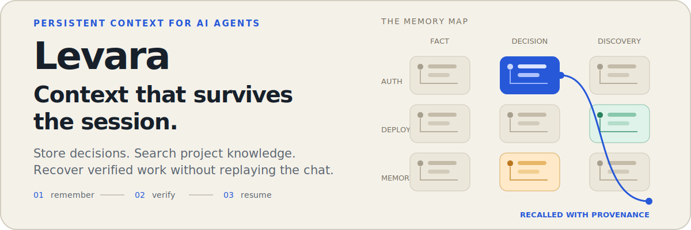
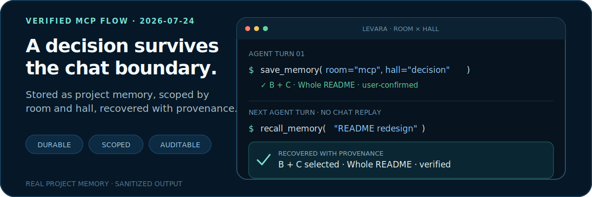
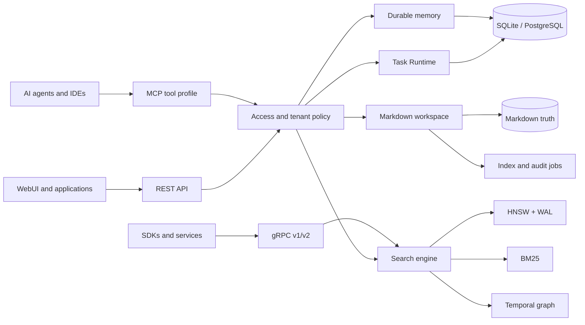

<p align="center">
  
</p>

<p align="center">
  <a href="https://go.dev/"></a>
  <a href="./docs/api-contract.md"></a>
  <a href="./docs/profile-presets.md"></a>
  <a href="./LICENSE"></a>
</p>

<p align="center">
  <a href="./README_RU.md">Русский</a> ·
  <a href="#quick-start">Quick start</a> ·
  <a href="#capability-map">Capabilities</a> ·
  <a href="#how-it-works">Architecture</a> ·
  <a href="#operations-and-webui">Operations</a> ·
  <a href="./docs/api-contract.md">API contract</a>
</p>

Levara is local-first context infrastructure for AI agents. It combines durable
memory, hybrid search, a temporal knowledge graph, a verifiable Markdown
workspace, synchronization, observability, and scoped long-running tasks in one
Go binary.

<p align="center">
  
</p>

The flow above is based on a real project memory used while redesigning this
README: the visual direction was stored as a scoped `decision`, then recovered
in the next agent turn without replaying the previous chat. Levara keeps the
record in SQL and maintains searchable index sidecars; the conversation itself
is not the source of truth.

## Why Levara

AI agents are powerful inside one prompt window and forgetful outside it. Chat
history is noisy, vector search alone loses provenance, and shared agent
workspaces need explicit access, audit, and recovery semantics.

Levara gives agents a context control plane:

- **Remember deliberately** — facts, decisions, events, preferences, advice,
  and discoveries are stored under a project-specific `room × hall` taxonomy.
- **Recover only what matters** — wake-up briefings, filtered recall, hybrid
  search, temporal graph queries, and bounded task bootstraps keep context small.
- **Keep work inspectable** — Markdown remains the workspace source of truth;
  indexes are disposable derivatives that can be reconciled or rebuilt.
- **Prove long-running work** — the alpha Task Runtime connects Definition of
  Done criteria to steps, leases, immutable receipts, checkpoints, and
  deterministic validation.
- **Scale the operating model** — the same engine supports a local developer,
  a multi-device setup, a shared team, or enterprise adapter boundaries.

## Capability map

| Area | Implemented capabilities |
|---|---|
| **Agent memory** | `save_memory`, filtered recall, wake-up briefings, pins, room × hall routing, per-agent diaries, chat recall, deletion, consolidation and revert, provenance-preserving supersession |
| **Search and knowledge** | WAL-backed HNSW, BM25, hybrid RRF, rerank routing, RAG and graph search, temporal validity, path queries, communities, structured filters, Git-aware analysis |
| **Ingestion** | Add/list/prune data, Cognify and Codify pipelines, status tracking, deduplication, embeddings, graph extraction, drift checks |
| **Verifiable workspace** | Markdown context and artifacts, search/read/write/commit/revert/delete, manifests, conflicts, access checks, audit log, watch mode, indexing and reindexing jobs, retries, reconciliation and GC |
| **Long-Horizon Task Runtime** | Scoped tasks, Definition of Done, versioned plans, dependent steps, atomic leases, immutable receipts, checkpoints, blockers, crash recovery, risk-based reviewer policy, deterministic completion and verified-memory promotion |
| **Operations** | Doctor checks, runtime and ingestion snapshots, recent errors, heartbeat, memory-index health/retry, SQL↔vector reconciliation, workspace job/watch health, Prometheus metrics |
| **Sync and storage** | Mac/Pi and peer sync, scoped manifests and status, backup/restore tooling, SQLite or PostgreSQL metadata, local or S3-compatible raw-object storage |
| **Identity and governance** | JWT and API keys, dataset/project sharing, workspace ACL, tenant membership checks, audit export, OIDC verified-claims adapter, SSO/SCIM and storage/KMS seams |
| **Product surfaces** | MCP Streamable HTTP, REST, gRPC v1/v2, CLI tools, Next.js WebUI, notebooks, feedback and memory-behavior analytics |

The generated contract currently contains **79 canonical MCP tools**, **144 REST
routes**, and **45 gRPC methods**. The complete machine-derived inventory lives
in [docs/api-contract.md](docs/api-contract.md); the README groups the surface
by user outcome instead of reproducing every endpoint.

<details>
<summary><strong>MCP tool groups</strong></summary>

| Group | Tools | Responsibility |
|---|---:|---|
| Workspace | 25 | Context, artifacts, authoring, revisions, indexing, jobs and audit |
| Memory | 11 | Lifecycle, recall, consolidation, supersession and wake-up |
| Operations | 9 | Health, errors, reconciliation, indexing and runtime state |
| Task | 8 | Long-Horizon Task Runtime |
| Data | 5 | Add, list, drift, delete and prune |
| Search | 4 | Hybrid/graph search, entities and communities |
| Cognify | 3 | Cognify, Codify and run status |
| Chat | 3 | Save, recall and search chat records |
| Git | 3 | Commit analysis, Git search and graph pruning |
| Context | 2 | Project context selection and retrieval |
| Diary | 2 | Per-agent isolated notes |
| Feedback | 2 | Retrieval feedback and statistics |
| Sync | 2 | Cross-instance synchronization and status |

</details>

## Quick start

The Personal profile runs with SQLite and local files. PostgreSQL, Neo4j, an
LLM, and a reranker are not required for the first successful run.

```bash
git clone https://github.com/Stek0v/Levara.git
cd Levara

make build
cp deploy/profiles/personal.local.env.example .env
set -a && source .env && set +a

./levara-server -config-check
./levara-server -profile=standalone -port=8080 -grpc-port=0
```

Connect an MCP client:

```json
{
  "mcpServers": {
    "levara": {
      "url": "http://127.0.0.1:8080/mcp"
    }
  }
}
```

Then ask the agent to create its first durable record:

```text
Save the decision that this project uses PostgreSQL for shared state.
Record why, place it in the auth room, and recall existing auth decisions first.
```

Host-specific examples for Codex, Claude Code, Cursor, Cline, and other clients
live in [examples/agent-hosts](examples/agent-hosts).

> [!IMPORTANT]
> Personal mode does not require auth by default. Keep the listener on a trusted
> local network or enable authentication before exposing it to other machines.

### Docker

```bash
docker compose up -d --build
```

See [docs/profile-presets.md](docs/profile-presets.md) for production-shaped
Personal, Solo Pro, Team, and Enterprise configuration examples.

## How it works



Levara separates authoritative records from derived indexes:

- SQL stores memory, graph metadata, tasks, receipts, identity, and operational
  state.
- Markdown stores human-readable workspace truth.
- HNSW, BM25, and graph projections accelerate retrieval and can be rebuilt.
- Access policy sits above MCP and REST workspace/memory operations.
- Audit and adapter contracts stay outside the core search implementation.

## MCP tool profiles

`LEVARA_MCP_TOOLSET` reduces tool-schema cost by exposing only the surface an
agent needs:

| Tool profile | Intended use |
|---|---|
| `core` | Context selection, wake-up, memory recall/save, search and doctor |
| `memory` | Full memory lifecycle, consolidation, diaries and feedback |
| `workspace` | Core memory plus safe Markdown workspace authoring |
| `ops` | Health, errors, reconciliation, sync, audit and indexing operations |
| `long-horizon` | Scoped memory plus tasks, receipts, validation and completion |
| `full` | Backward-compatible canonical catalogue |

`light` remains a legacy alias for `memory`. Tool profiles are not authorization
boundaries; JWT/API-key and workspace policy checks still apply independently.

> [!WARNING]
> Long-Horizon Task Runtime is alpha and feature-flagged. Set
> `LEVARA_LONG_HORIZON_RUNTIME=1` and use the `long-horizon` MCP tool profile.
> The current alpha suite covers dependency handling, idempotent retries,
> concurrent claims, stale evidence, reviewer policy, crash recovery, bounded
> bootstrap relevance, and verified memory promotion. See
> [docs/long-horizon-alpha-report.md](docs/long-horizon-alpha-report.md).

## Runtime profiles

Levara uses three different profile controls:

| Control | Values | Purpose |
|---|---|---|
| `LEVARA_PROFILE` | `personal`, `solo_pro`, `team`, `enterprise` | Product and governance posture |
| `-profile` | `standalone`, `standalone-embed`, `full` | Functional server bootstrap |
| `LEVARA_MCP_TOOLSET` | `core`, `memory`, `workspace`, `ops`, `long-horizon`, `full` | MCP schema exposed to agents |

Product profiles share one core engine:

| Product profile | Default shape | What it adds |
|---|---|---|
| **Personal** | SQLite, local files, local MCP, optional auth | Durable memory and workspace for one developer |
| **Solo Pro** | SQLite or PostgreSQL, sync, backups, optional S3-compatible storage | Several devices or a Mac/Pi setup |
| **Team** | PostgreSQL, required auth, shared workspace, per-agent credentials | Project sharing, ACL, audit and async jobs |
| **Enterprise** | PostgreSQL, tenant enforcement, central identity/audit boundaries | Governance and adapter-based integration |

Strict validation is available with `LEVARA_PROFILE_STRICT=1`; unsafe Team and
Enterprise combinations fail before listeners are opened.

## Interfaces

| Surface | Default | Current contract | Best for |
|---|---:|---:|---|
| MCP Streamable HTTP | `/mcp` | 79 canonical tools | AI agents and IDE integrations |
| REST | `:8080` | 144 canonical routes | WebUI, applications and operations |
| gRPC v1/v2 | `:50051` | 45 canonical methods | Typed SDK and search clients |
| CLI | local binaries | server, client, backup, contract and host tooling | Operators and automation |
| WebUI | `:3000` in development | Next.js application | Users, operators and reviewers |

Defaults describe the normal deployment shape, not any specific developer
machine. For a verified local development snapshot, use
[docs/current-state.md](docs/current-state.md).

## Operations and WebUI

The WebUI is a real operating surface over the backend, not a separate data
store:

| Workflow | Screens |
|---|---|
| Knowledge | Datasets, collections, Cognify, search, chat and graph exploration |
| Memory | Memories, notebooks, memory behavior and scaffold proposals |
| Workspace | Manifest, artifacts, search, authoring, indexing jobs and audit |
| Operations | Dashboard, sync, analytics, administration and settings |

Operational APIs and MCP tools expose:

- dependency health, runtime configuration and collection statistics;
- active/recent ingestion runs, tracked errors and heartbeat history;
- memory SQL↔vector reconciliation and failed index-job retry;
- workspace watch state, conflicts, audit log, indexing and reindexing jobs;
- sync manifests, push/pull status and optional collection transfer;
- Prometheus metrics, JSONL audit export, backup/restore and macOS watchdog
  runbooks.

See [docs/webui-operations.md](docs/webui-operations.md) for setup, monitoring,
security notes, Playwright checks, and operational workflows.

## Security and enterprise boundaries

Implemented foundations include:

- transport-independent access policy and tenant membership checks;
- JWT, API keys, per-agent credentials, dataset sharing and workspace ACL;
- strict profile validation and tenant-safe SQL boundaries;
- asynchronous audit export with retry/backpressure and JSONL output;
- OIDC verified-claims mapping and identity/provisioning seams;
- storage metadata plus KMS/BYOK adapter contracts.

Still adapter or production-hardening work:

- concrete SAML and SCIM HTTP protocol surfaces;
- SIEM delivery adapters;
- production KMS/BYOK implementations;
- additional corporate object-store integrations and legal-hold enforcement.

The Enterprise preset validates governance requirements; it is not a claim that
every external enterprise adapter is already implemented. See
[docs/product-ladder.md](docs/product-ladder.md) for the exact boundary.

## Development

```bash
# Focused every-commit gate
git diff --check
make test-commit

# Profile and public-contract gates
make profile-config-check
make contract-check

# Broader local release gate
make test-release-candidate
```

Useful references:

| Document | Purpose |
|---|---|
| [docs/api-contract.md](docs/api-contract.md) | Generated REST, gRPC, MCP and schema inventory |
| [docs/profile-presets.md](docs/profile-presets.md) | Runnable product-profile examples |
| [docs/product-ladder.md](docs/product-ladder.md) | Capability and enterprise boundary source of truth |
| [docs/webui-operations.md](docs/webui-operations.md) | WebUI setup, monitoring and workflows |
| [docs/current-state.md](docs/current-state.md) | Verified local development snapshot |
| [docs/security-diff-checklist.md](docs/security-diff-checklist.md) | Review checklist for security-sensitive changes |
| [docs/long-horizon-alpha-report.md](docs/long-horizon-alpha-report.md) | Task Runtime acceptance and recovery evidence |

## Contributing

Read [CONTRIBUTING.md](CONTRIBUTING.md), keep public contract changes explicit,
and run the relevant gates before opening a pull request. Profile claims should
stay aligned with the product ladder; MCP/REST/gRPC changes should regenerate
and validate the canonical contract.

## License

MIT. See [LICENSE](LICENSE).
