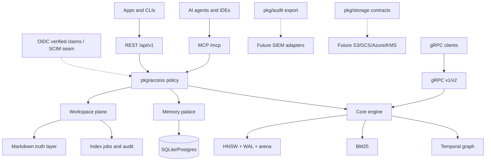

# Levara

> Persistent memory, search, and workspace infrastructure for AI agents, built as one Go binary.

[](https://go.dev/)
[](docs/marketing/personal.md)
[](docs/profile-presets.md)
[](LICENSE)

Levara is the memory layer for humans working with AI agents. It combines an
in-process HNSW vector engine, BM25, temporal knowledge graph storage, MCP tools,
workspace-aware Markdown indexing, sync, audit, and runtime profile validation so
an assistant can remember project facts, decisions, files, and team boundaries
across sessions.

<CardGroup cols={2}>
  <Card title="For one developer" icon="user" href="docs/marketing/personal.md">
    Local SQLite, local files, MCP, memory palace, and no required auth by default.
  </Card>
  <Card title="For teams" icon="users" href="docs/marketing/team.md">
    Postgres, required auth, dataset/project sharing, workspace ACL, audit, and per-agent credentials.
  </Card>
</CardGroup>

> [!NOTE]
> This README uses MDX-friendly structure (`<CardGroup>`, `<Card>`, `<Tabs>`,
> `<Accordion>`) while remaining readable as plain Markdown on GitHub.

> [!IMPORTANT]
> For the verified local Mac runtime, use
> [docs/current-state.md](docs/current-state.md). As of the latest check, the
> running server is `standalone-embed` on `:8081`, gRPC is disabled, vectors are
> `256`-dim `potion-code-16M`, PostgreSQL and the local LLM are connected,
> Neo4j/rerank are disabled, and doctor reports `8/9 ok` with one BM25 warning.

## Why Levara

AI agents are only useful when they keep the right context. Chat history is too
noisy, vector search alone loses provenance, and corporate teams need auth,
tenant isolation, and audit before they can trust agent memory. Levara packages
those layers together:

| Layer | What it does | Key packages |
|---|---|---|
| Core engine | WAL-backed HNSW, arena storage, BM25, graph search, hybrid/rerank routing | `internal/store`, `pkg/bm25`, `pkg/vectorstore`, `pkg/graphstore`, `pkg/graphrank`, `pkg/router` |
| Agent memory | MCP tools, memory palace, wake-up briefings, diaries, chat recall | `internal/http/mcp.go`, `pkg/mcp`, `pkg/consolidate` |
| Workspace plane | Markdown-as-source-of-truth, workspace search/read/write/commit, audit, jobs | `pkg/workspace`, `internal/http/workspace*.go` |
| Identity and access | JWT/API keys, RBAC, tenant membership, policy facade, OIDC verified-claims adapter | `pkg/access`, `pkg/auth`, `internal/http/auth.go` |
| Enterprise adapters | Audit export, storage/KMS contracts, SSO/SCIM seams | `pkg/audit`, `pkg/storage`, `pkg/access` |

## Highlights

- **Agent memory that survives sessions**: `save_memory`, `recall_memory`,
  `wake_up`, pins, room x hall taxonomy, and per-agent diaries.
- **Verifiable workspace**: Markdown files are the source of truth; vector/graph
  indexes are disposable derivatives with commit, conflict, audit, and reindex
  flows.
- **Search stack**: HNSW vector search, BM25 full text, hybrid RRF, graph-aware
  reranking, temporal edges, NL-to-Cypher, and structured filters.
- **MCP-first integration**: one `/mcp` endpoint for Claude Code, Cursor, Codex,
  Cline, and other MCP clients.
- **Product profiles**: `personal`, `solo_pro`, `team`, and `enterprise` model
  the same codebase for different audiences.
- **Enterprise boundaries without core pollution**: access policy, audit export,
  OIDC verified claims, storage metadata, and KMS/BYOK hooks are adapter seams,
  not logic embedded in search handlers.
- **Operational shape**: Prometheus metrics, JSONL audit export, backup/restore,
  sync, config validation, Docker, ARM64 build, and release gates.

## Product Profiles

<Tabs>
  <Tab title="Personal">

Use when a single developer wants local AI memory.

```bash
cp deploy/profiles/personal.local.env.example .env
./levara-server -config-check
./levara-server -profile=standalone -dim=768 -port=8080 -grpc-port=0
```

Default posture: SQLite, local filesystem, MCP/workspace enabled, auth optional.

  </Tab>
  <Tab title="Solo Pro">

Use when one power user syncs memory across a laptop, home server, or Raspberry Pi.

```bash
cp deploy/profiles/solo_pro.sync.env.example .env
# set LEVARA_SYNC_REMOTE_URL and LEVARA_TOKEN
./levara-server -config-check
```

Default posture: local + sync, backups, optional S3-compatible storage, basic
observability.

  </Tab>
  <Tab title="Team">

Use when humans and agents share projects.

```bash
cp deploy/profiles/team.postgres.env.example .env
# set POSTGRES_DSN and a stable JWT_SECRET
./levara-server -require-auth -config-check
./levara-server -require-auth
```

Default posture: Postgres, required auth, dataset/project sharing, workspace ACL,
audit, and async indexing jobs.

  </Tab>
  <Tab title="Enterprise">

Use for tenant governance, central identity, audit export, and adapter-based
corporate integration.

```bash
cp deploy/profiles/enterprise.strict.env.example .env
# configure Postgres, auth/SSO bridge, tenant enforcement, and audit sink
./levara-server -require-auth -config-check
```

Implemented: tenant policy, strict profile validation, audit export boundary,
OIDC verified-claims adapter, SCIM-shaped provisioning seam, storage/KMS adapter
contracts.

Still adapter work: SAML, SCIM HTTP surface, SIEM sink, concrete KMS/BYOK
backends, legal-hold enforcement in production object stores.

  </Tab>
</Tabs>

See [docs/profile-presets.md](docs/profile-presets.md) and
[docs/product-ladder.md](docs/product-ladder.md) for the full product ladder.

## Quick Start

### From Source

```bash
git clone https://github.com/Stek0v/Levara.git
cd Levara

go test ./pkg/profile ./cmd/server
make build

cp deploy/profiles/personal.local.env.example .env
./levara-server -config-check
./levara-server -profile=standalone -dim=768 -port=8080 -grpc-port=0
```

Local Mac development currently runs a richer profile:

```bash
./levara-server \
  -profile=standalone-embed \
  -dim=256 \
  -port=8081 \
  -grpc-port=0 \
  -data-dir=/Users/stek0v/src/levara/data \
  -node-id=mac1 \
  -require-auth=false \
  -embed-endpoint=http://127.0.0.1:9101/v1/embeddings \
  -embed-model=potion-code-16M \
  -llm-upstream=http://localhost:11434/v1 \
  -pg-url='postgres://stek0v@localhost:5432/levara?sslmode=disable' \
  -embed-keepalive-interval=5m
```

See [docs/current-state.md](docs/current-state.md) before using local ports,
model names, or launchd commands in automation.

### With Docker

```bash
cd Levara
docker compose up -d --build
```

### Connect an MCP Client

```json
{
  "mcpServers": {
    "levara": {
      "url": "http://localhost:8080/mcp",
      "headers": {
        "Authorization": "Bearer ${LEVARA_TOKEN}"
      }
    }
  }
}
```

Example host configs live in [examples/agent-hosts](examples/agent-hosts).

## Interfaces

| Surface | Default | Purpose | Where to inspect |
|---|---:|---|---|
| HTTP REST | `:8080` | Datasets, ingest, search, auth, tenants, workspace, sync, notebooks, ops | `internal/http/api.go`, `internal/http/routes.go`, `docs/api-reference.md` |
| MCP Streamable HTTP | `/mcp` | AI-agent tools for memory, search, workspace, sync, audit, observability | `internal/http/mcp.go`, `pkg/mcp` |
| gRPC v1/v2 | `:50051` | Vector/search/cognify client API | `internal/grpc`, `proto/` |
| CLI tools | local binaries | Server, backup, contract validation, host config install, load tests | `cmd/` |
| Web UI | app package | Next.js operator/user UI | `webui/`, `docs/webui-operations.md` |

Defaults are compile/runtime defaults, not the current Mac launchd deployment.
The verified local instance uses HTTP/MCP on `:8081` and disables gRPC with
`-grpc-port=0`.

<Accordion title="Representative REST groups">

- `/api/v1/datasets`, `/api/v1/add`, `/api/v1/cognify`, `/api/v1/search/text`
- `/api/v1/memories`, `/api/v1/sync/*`, `/api/v1/tenants/*`, `/api/v1/acl`
- `/api/v1/workspace/*` for context, read, write, commit, audit, jobs, conflicts
- `/api/v1/notebooks/*`, `/api/v1/ontologies`, `/api/v1/feedback`, `/metrics`

</Accordion>

<Accordion title="Representative MCP tools">

- Memory: `save_memory`, `recall_memory`, `list_memories`, `pin_memory`, `wake_up`, `diary_write`, `diary_read`
- Search/graph: `search`, `cross_search`, `query_entity`, `list_communities`, `git_search`, `analyze_commits`
- Workspace: `workspace_context`, `workspace_read`, `workspace_write`, `workspace_commit`, `workspace_search`, `workspace_audit_log`
- Ops: `doctor`, `runtime_stats`, `recent_errors`, `sync_status`, `workspace_ops_status`

</Accordion>

## Architecture



## Repository Map

```text

  cmd/
    server/          HTTP + gRPC + MCP server, profile/config validation
    cli/             Levara CLI
    backup/          backup/restore command
    contract/        REST/gRPC/MCP contract generation and drift checks
    agent-hosts/     MCP host config installer
    loadtest/        load testing utilities
  internal/
    store/           HNSW, WAL, mmap arena, collection manager
    http/            Fiber REST API, MCP endpoint, auth, workspace, sync, RBAC
    grpc/            gRPC v1/v2 services and interceptors
    cluster/         optional Raft sharding/replication
    metrics/         Prometheus metrics
    contract/        generated contract inventory types
  pkg/
    access/          policy, tenant membership, identity bridges, OIDC adapter
    audit/           audit sink/export contracts and JSONL exporter
    bm25/            full-text index and hybrid retrieval
    graphstore/      graph persistence
    mcp/             MCP tool descriptors and tool implementations
    orchestrator/    cognify pipeline: chunk -> extract -> dedup -> embed -> write
    storage/         local/S3 storage plus enterprise metadata/KMS contracts
    workspace/       Markdown workspace model and indexing helpers
    profile/         runtime profile validation
    llm/, embed/     LLM and embedding provider clients
  deploy/profiles/   audience-specific env presets
  docs/              API, architecture, product ladder, testing, marketing
  proto/             protobuf definitions
  webui/             Next.js 16 Web UI
```

## Configuration

### Runtime Profiles

```bash
LEVARA_PROFILE=personal|solo_pro|team|enterprise
LEVARA_PROFILE_STRICT=1   # fail fast on unsafe team/enterprise configs
```

`-config-check` validates the resolved profile and exits before listeners, DB
connections, or network services start.

```bash
./levara-server -config-check
make profile-config-check
```

### Common Environment Variables

| Variable | Purpose |
|---|---|
| `DB_PROVIDER` / `POSTGRES_DSN` / `DB_PATH` | Select Postgres or SQLite storage |
| `JWT_SECRET` | Stable HS256 signing secret for auth-enabled deployments |
| `LEVARA_TOKEN` | Sync/MCP bearer token in examples and sync flows |
| `LEVARA_DATA_DIR` | Root data directory when `-data-dir` is not set |
| `LEVARA_TENANT_ENFORCED` | Required for enterprise tenant isolation strict mode |
| `LEVARA_WORKSPACE_AUDIT_EXPORT` / `_DIR` / `_RETENTION_DAYS` | Workspace audit export controls |
| `LEVARA_WORKSPACE_WATCH` / `_INDEX_WORKER` | Workspace watcher and async index worker |
| `EMBED_URL` / `EMBEDDING_ENDPOINT` / `EMBEDDING_MODEL` | Embedding service configuration |
| `LLM_PROVIDER`, `LLM_ENDPOINT`, `LLM_MODEL`, `LLM_API_KEY` | LLM provider configuration. The current Mac runtime uses `LLM_PROVIDER=openai`, `LLM_ENDPOINT=http://localhost:11434/v1`, `LLM_MODEL=gemma4:e2b`. |
| `RERANK_ENDPOINT`, `RERANK_MODEL`, `RERANK_BUDGET_MS` | Cross-encoder reranker configuration |
| `STORAGE_BACKEND`, `S3_BUCKET`, `STORAGE_PATH` | Raw object storage backend controls |
| `LANGFUSE_PUBLIC_KEY` | Optional tracing integration |

### Server Flags

```bash
./levara-server \
  -profile=standalone-embed \
  -dim=256 \
  -port=8081 \
  -grpc-port=0 \
  -data-dir=./data \
  -require-auth=false \
  -embed-endpoint=http://127.0.0.1:9101/v1/embeddings \
  -embed-model=potion-code-16M \
  -llm-upstream=http://localhost:11434/v1 \
  -hnsw-m=16 \
  -hnsw-ef-mult=8 \
  -hnsw-ef-min=64
```

This block mirrors the current local shape. Use `-profile=standalone -dim=768
-port=8080 -grpc-port=0` for a minimal dependency-light local run.

## Development

```bash
# Focused every-commit gate
git diff --check
make test-commit

# Profile/config gate without external services
make profile-config-check

# Release-candidate local gate
make test-release-candidate

# Contract validation for REST/gRPC/MCP inventories
make contract-check
```

For security-sensitive changes, use
[docs/security-diff-checklist.md](docs/security-diff-checklist.md). It covers
access, tenant isolation, audit export, storage/KMS, and MCP memory ownership.

For app-wide QA/user-story tracking, use
[docs/feature-audit-tracker.md](docs/feature-audit-tracker.md). It explains the
canonical workbook, current automated gate status, known extraction limitations,
and follow-up testing backlog.

For local macOS error notifications, use
[docs/macos-levara-watchdog.md](docs/macos-levara-watchdog.md). It installs a
launchd watchdog that checks health, tracked errors, and panic/error log lines.

## Marketing and Product Docs

| Document | Audience |
|---|---|
| [docs/marketing/personal.md](docs/marketing/personal.md) | One developer using local AI agents |
| [docs/marketing/solo-pro.md](docs/marketing/solo-pro.md) | Power user with several machines |
| [docs/marketing/team.md](docs/marketing/team.md) | Small team with humans and agents |
| [docs/marketing/enterprise.md](docs/marketing/enterprise.md) | Organizations with governance and audit needs |
| [docs/product-ladder.md](docs/product-ladder.md) | Engineering/product source of truth for tier boundaries |
| [docs/profile-presets.md](docs/profile-presets.md) | Concrete env presets and strict-mode behavior |
| [docs/webui-operations.md](docs/webui-operations.md) | WebUI setup, connection, monitoring, solo/team operations |

## Roadmap Honesty

Implemented foundations include local/solo/team profiles, access policy, tenant
membership checks, workspace audit, async audit export, OIDC verified-claims
adapter, SCIM-shaped provisioning seam, storage metadata contracts, and KMS/BYOK
hook contracts.

Still future adapter work: concrete SAML, SCIM HTTP routes, SIEM sinks,
production KMS/BYOK implementations, corporate object-store backends, and legal
hold enforcement in those backends.

## Contributing

1. Read [docs/product-ladder.md](docs/product-ladder.md) before changing profile
   behavior or product claims.
2. Keep public REST/MCP/gRPC contract changes explicit; run `make contract-check`.
3. Keep policy decisions in `pkg/access`, not scattered through HTTP handlers.
4. Add tests at the layer boundary you touch.
5. Run `make test-commit` before opening a PR.

## License

MIT. See [LICENSE](LICENSE).
