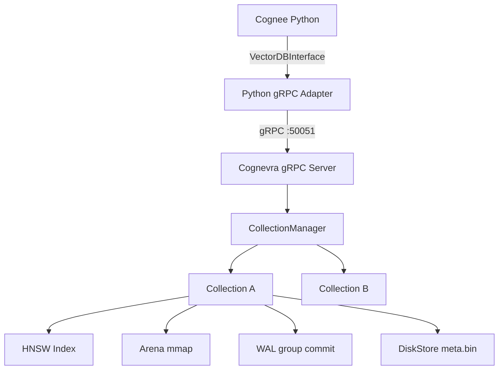

[Русская версия / Russian version](README_RU.md)

# Cognevra — High-Performance Vector Database for AI Memory

Cognevra is a production-optimized vector database combining the Go HNSW engine from [VectraDB](https://github.com/Rupamthxt/VectraDB) with the Python adapter interface of [Cognee](https://github.com/topoteretes/cognee). It exposes a gRPC API, persists vectors with a write-ahead log and memory-mapped arena, and achieves sub-3ms search latency at production scale. This repository contains the Cognevra server, a Python gRPC adapter that implements the Cognee `VectorDBInterface`, and a benchmark suite comparing Cognevra against LanceDB (Rust/Arrow) as alternative vector storage backends.

## What is Cognevra

Cognevra is not a fork of VectraDB, and not a part of Cognee — it is a standalone product born from the combination of both:

- **VectraDB** — the original Go HNSW vector database engine, authored by [Rupam](https://github.com/Rupamthxt/VectraDB). Provides the fast storage core: Arena mmap, WAL group commit, SIMD dot product, and the gRPC service layer.
- **Cognee** — the AI memory platform by [Topoteretes](https://github.com/topoteretes/cognee). Defines the `VectorDBInterface` that all vector storage backends must implement, and the broader RAG + knowledge-graph pipeline.
- **Cognevra** — our production-optimized fork that wires these two together and adds: native gRPC transport (replacing HTTP/JSON, 8.4x lower latency), SIMD AVX2 distance computation (8.1x faster), WAL group commit (12.5x fsync reduction), and native collection isolation.

Use Cognevra when you need the Cognee pipeline with strict latency SLAs, concurrent users, or microservice deployments. Use plain Cognee + LanceDB for batch ingestion or local development.

## Benchmark Results

| Metric | Cognevra | LanceDB | Delta |
|--------|----------|---------|-------|
| Search latency p50 (1.4K vecs) | **2.6 ms** | 12.9 ms | **4.9x faster** |
| Concurrent QPS | **589** | 109 | **5.4x higher** |
| Search p50 at 100K vectors | **23.7 ms** | 203.7 ms | **8.6x faster** |
| SIMD distance computation | **69 ns** | 557 ns (scalar) | **8.1x faster** |
| Insert throughput | 591 dp/s | **3,911 dp/s** | LanceDB 6.6x |
| Crash recovery | **100%** | N/A | Cognevra |

At 100K vectors LanceDB exceeds 200ms per query and is unusable for real-time workloads. Cognevra stays under 25ms due to HNSW O(log N) graph traversal.

**Choose Cognevra** for read-heavy production APIs (read:write > 100:1), concurrent users, strict latency SLA.
**Choose LanceDB** for batch ingestion, single-process pipelines, local development.

## Architecture



## Quick Start

```bash
# Start Cognevra and Prometheus
docker compose up -d --build

# Regenerate gRPC stubs after proto changes
make proto

# Run the full test suite (requires embed-server on :9001)
pytest tests/ -v
```

For the full Cognee stack (PostgreSQL, Neo4j, Redis):

```bash
cp .env.template .env   # fill in API keys
make full-stack
```

## Project Structure

```
new_db/
  Cognevra/                   # Go server source
    cmd/server/main.go        # Entry point, CLI flags
    internal/store/           # Core storage engine
      db.go                   # DB struct, Insert/Search/Delete, locking
      hnsw.go                 # HNSW graph, SIMD distance (vek32 AVX2)
      arena.go                # Memory-mapped vector storage
      wal.go                  # Write-ahead log, fsyncLoop group commit
      disk.go                 # Append-only metadata store (meta.bin)
      collections.go          # CollectionManager, WAL persistence
    internal/grpc/service.go  # gRPC service implementation (:50051)
    internal/http/handler.go  # Legacy Fiber HTTP handler (:8080)
    internal/cluster/         # Raft sharding (shard.go, node.go, fsm.go)
    pkg/chunker/              # Text chunking (paragraph/sentence/merged)
    pkg/embed/client.go       # Embed-server client, concurrent batching
    pipeline/search.go        # In-process embed → search pipeline
    proto/cognevra.proto      # gRPC service definition
  tests/                      # Python test suite (174 tests)
  CognevraAdapter.py          # Python gRPC adapter (Cognee VectorDBInterface)
  docker-compose.yml          # Cognevra + Prometheus (dev mode)
  docker-compose.full-stack.yml  # Full Cognee stack
  BENCHMARK_RESULTS.md        # Detailed benchmark data and analysis
  ARCHITECTURE.md             # Storage engine and concurrency design
  cases.md                    # RAG test case specifications
```

## Configuration

Cognevra is configured via CLI flags (set in `docker-compose.yml`):

| Flag | Default | Description |
|------|---------|-------------|
| `-dim` | `1024` | Vector dimension |
| `-shards` | `3` | Number of shards |
| `-port` | `8080` | HTTP metrics port |
| `-grpc-port` | `50051` | gRPC API port |
| `-standalone` | `true` | Single-node mode (no Raft) |
| `-hnsw-m` | `20` | HNSW graph connectivity (higher = better recall, more memory) |
| `-hnsw-ef-mult` | `10` | efSearch multiplier per query (efSearch = k × efMult) |
| `-hnsw-ef-min` | `64` | Minimum efSearch floor |

Environment variable overrides: `COGNEVRA_DIM`, `COGNEVRA_SHARDS`, `EMBEDDING_DIMENSIONS`, `HNSW_M`, `HNSW_EF_MULT`, `HNSW_EF_MIN`.

Service endpoints:

| Service | Port | Purpose |
|---------|------|---------|
| Cognevra gRPC | 50051 | Primary API (adapter, Go client) |
| Cognevra HTTP | 8080 | Prometheus metrics (`/metrics`) |
| embed-server | 9001 | Sentence embeddings (dim=1024, FP16, CUDA) |
| Prometheus | 9090 | Metrics scraping |
| Ollama | 11434 | Local LLM for RAG tests (Qwen 3.5) |

## Further Reading

- [ARCHITECTURE.md](ARCHITECTURE.md) — storage engine internals, concurrency model, write/search paths
- [BENCHMARK_RESULTS.md](BENCHMARK_RESULTS.md) — full benchmark data, optimization history, decision matrix
- [CLAUDE.md](CLAUDE.md) — development conventions, test architecture, known limitations

## License

MIT
