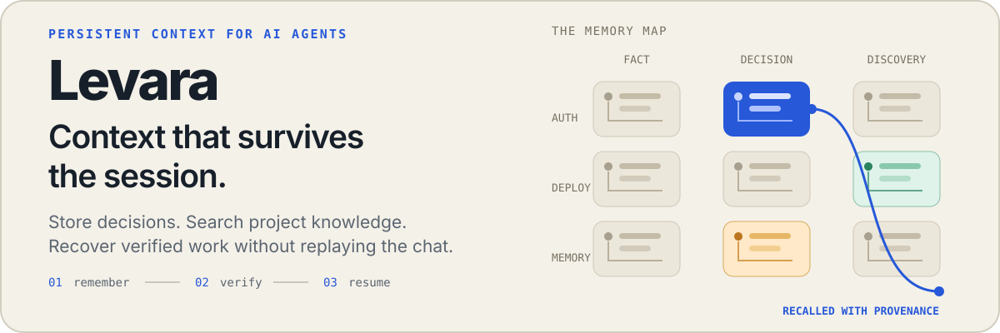
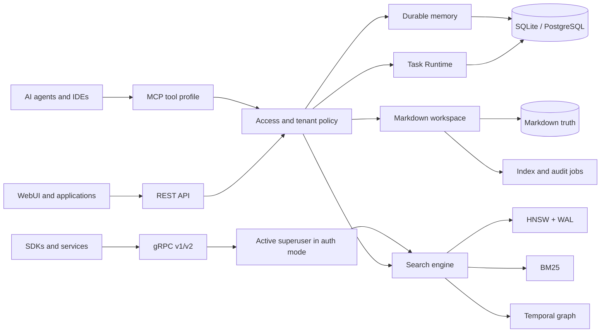

<p align="center">
  
</p>

<p align="center">
  <a href="https://go.dev/"></a>
  <a href="./docs/api-contract.md"></a>
  <a href="./docs/profile-presets.md"></a>
  <a href="./LICENSE"></a>
</p>

<p align="center">
  <a href="./README_RU.md">Русский</a> ·
  <a href="#quick-start">Quick start</a> ·
  <a href="#capability-map">Capabilities</a> ·
  <a href="#how-it-works">Architecture</a> ·
  <a href="#operations-and-webui">Operations</a> ·
  <a href="./docs/README.md">Docs</a> ·
  <a href="./docs/api-contract.md">API contract</a>
</p>

Levara is local-first context infrastructure for AI agents. It combines durable
memory, hybrid search, a temporal knowledge graph, a verifiable Markdown
workspace, synchronization, observability, and scoped long-running tasks in one
Go server binary. The optional WebUI runs as a separate Next.js service.

## Why Levara

AI agents are powerful inside one prompt window and forgetful outside it. Chat
history is noisy, vector search alone loses provenance, and shared agent
workspaces need explicit access, audit, and recovery semantics.

Levara gives agents a context control plane:

- **Deliberate memory** — facts, decisions, preferences, advice and discoveries
  are stored under a project-specific `room × hall` taxonomy and survive
  across sessions, agents and machines.
- **Small, correct recall** — wake-up briefings and filtered recall return the
  knowledge that matters, with provenance-preserving supersession instead of
  silently stale vectors.
- **One engine, four scales** — the same core serves a local developer, a
  multi-device setup, a team and enterprise governance boundaries as opt-in
  layers.

One SQLite file. One MCP URL. 13 tools out of the box — durable project
memory your agents share across sessions, agents, and machines.

## Quick start

Three commands to the first agent wake-up — no PostgreSQL, no LLM, no
embeddings required:

```bash
git clone https://github.com/Stek0v/Levara.git && cd Levara
make build && cp deploy/profiles/personal.local.env.example .env && set -a && source .env && set +a
./levara-server -profile=standalone -port=8080 -grpc-port=0
```

Connect an MCP client:

```json
{
  "mcpServers": {
    "levara": {
      "url": "http://127.0.0.1:8080/mcp"
    }
  }
}
```

Then ask the agent to wake up and remember:

```text
Wake up on this project, then save the decision that we use PostgreSQL for
shared state. Put it in the auth room and recall existing auth decisions first.
```

`wake_up`, `save_memory` and `recall_memory` work without an embedding
endpoint (SQL-backed recall). Vector semantic recall, document search and
cognify activate once you configure `EMBEDDING_ENDPOINT` (any
OpenAI-compatible service or the local embed server). With
`LEVARA_PROFILE=personal` the server advertises the 13-tool `core` set;
the full surface is listed in [docs/capability-map.md](docs/capability-map.md).
Check what your server advertises:

```bash
curl -s http://127.0.0.1:8080/admin/mcp/summary | jq '{toolset, advertised_tools}'
# {"toolset":"core","advertised_tools":13}
```

Host-specific configs for Codex, Claude Code, Cursor and Cline live in
[examples/agent-hosts](examples/agent-hosts).

> [!IMPORTANT]
> Personal mode does not require auth by default. Keep the listener on a
> loopback address or enable authentication before exposing it to other machines.

### Docker

Choose loopback port publishing or authenticated network access before starting
Compose. The base compose file publishes host ports on all interfaces and leaves
auth disabled by default. Follow the [Docker recipe](docs/deployment.md#docker)
with explicit settings.

See [docs/profile-presets.md](docs/profile-presets.md) for production-shaped
Personal, Solo Pro, Team, and Enterprise configuration examples.

## Verification and quality

[Testing results and commands](docs/testing.md) record the 2026-09-05 run:
backend regressions with SQLite/PostgreSQL, real parsers for seven document
formats, and 42 Chromium WebUI tests with mocked APIs. The guide identifies
the revision, local changes, coverage limits and scenarios needing a separate
integration environment.

Historical benchmark JSON remains available as raw evidence. Its pass labels
do not establish authenticated owner isolation, independent-node sync convergence
or OCR accuracy. The [CI workflow](.github/workflows/go-ci.yml) defines checks;
a result belongs to a particular run.

## Capability map

The full capability, product-surface and MCP tool-group inventory lives in
[docs/capability-map.md](docs/capability-map.md). The generated API inventory
is [docs/api-contract.md](docs/api-contract.md); bootstrap identity endpoints
are described in the [API reader guide](docs/api-reference.md).

## Work with documents and colleagues

Upload a document through WebUI or CLI, check extraction and indexing status,
then verify an answer against its source. Use [document management](docs/document-management.md)
for the complete workflow and [acceptance scenarios](docs/document-workflow-scenarios.md)
for partial failures, retries and access checks.

To share one document, open its Access panel or use `levara documents` to grant
a tenant user or group a viewer/editor/admin role. The recipient sees direct
grants under “Documents shared directly with you”; the rest of the dataset stays
closed. For AD, LDAP and SSO deployment choices, start with
[enterprise identity](docs/enterprise-identity.md).

## How it works


```mermaid
flowchart LR
  Agents[AI agents and IDEs] --> MCP[MCP tool profile]
  WebUI[WebUI and applications] --> REST[REST API]
  SDKs[SDKs and services] --> GRPC[gRPC v1/v2]

  MCP --> Policy[Access and tenant policy]
  REST --> Policy
  GRPC --> Admin[Active superuser in auth mode]
  Admin --> Search[Search engine]

  Policy --> Memory[Durable memory]
  Policy --> Workspace[Markdown workspace]
  Policy --> Tasks[Task Runtime]
  Policy --> Search

  Memory --> SQL[(SQLite / PostgreSQL)]
  Workspace --> Markdown[(Markdown truth)]
  Workspace --> Jobs[Index and audit jobs]
  Tasks --> SQL

  Search --> HNSW[HNSW + WAL]
  Search --> BM25[BM25]
  Search --> Graph[Temporal graph]
```

Levara separates authoritative records from derived indexes:

- SQL stores memory, graph metadata, tasks, receipts, identity, and operational
  state.
- Markdown stores human-readable workspace truth.
- HNSW, BM25, and graph projections accelerate retrieval and can be rebuilt.
- Access policy sits above MCP and REST workspace/memory operations.
- Audit and adapter contracts stay outside the core search implementation.

## MCP tool profiles

`LEVARA_MCP_TOOLSET` reduces tool-schema cost by exposing only the surface an
agent needs:

| Tool profile | Intended use |
|---|---|
| `core` | Context selection, wake-up, memory recall/save, search and doctor |
| `memory` | Full memory lifecycle, consolidation, diaries and feedback |
| `workspace` | Core memory plus safe Markdown workspace authoring |
| `ops` | Health, errors, reconciliation, sync, audit and indexing operations |
| `long-horizon` | Scoped memory plus tasks, receipts, validation and completion |
| `full` | Backward-compatible canonical catalogue |

With `LEVARA_PROFILE=personal` and no explicit `LEVARA_MCP_TOOLSET`, the
server advertises `core`; the effective name and source are visible in
`/admin/mcp/summary` and the startup log. `light` remains a legacy alias for
`memory`. Tool profiles are not authorization boundaries; JWT/API-key and
workspace policy checks still apply independently.

Task Runtime is opt-in with `LEVARA_LONG_HORIZON_RUNTIME=1` and the
`long-horizon` tool profile. It manages steps and evidence; the WebUI provides
read-only task inspection. The built-in worker uses a logging/no-op executor;
a separate executor must perform actions. Authority manifests bind a digest
at claim time but do not by themselves sandbox tool, file or network execution.
See the [runtime guide](docs/long-horizon-runtime.md) and [tests](docs/testing.md).

## Runtime profiles

Levara uses three different profile controls:

| Control | Values | Purpose |
|---|---|---|
| `LEVARA_PROFILE` | `personal`, `solo_pro`, `team`, `enterprise` | Product and governance posture |
| `-profile` | `standalone`, `standalone-embed`, `full` | Functional server bootstrap |
| `LEVARA_MCP_TOOLSET` | `core`, `memory`, `workspace`, `ops`, `long-horizon`, `full` | MCP schema exposed to agents |

Product profiles share one core engine:

| Product profile | Default shape | What it adds |
|---|---|---|
| **Personal** | SQLite, local files, local MCP, optional auth | Durable memory and workspace for one developer |
| **Solo Pro** | SQLite or PostgreSQL, sync, backups, optional S3-compatible storage | Several devices or a Mac/Pi setup |
| **Team** | PostgreSQL, required auth, shared workspace, per-agent credentials | Project sharing, ACL, audit and async jobs |
| **Enterprise** | PostgreSQL, tenant enforcement, central identity/audit boundaries | Governance and adapter-based integration |

`LEVARA_PROFILE_STRICT=1` checks required Team/Enterprise configuration before
opening listeners. It does not validate IdP connectivity or the entire deployment.

## Interfaces

| Surface | Default | Current contract | Best for |
|---|---:|---:|---|
| MCP Streamable HTTP (latest) | `/mcp/2026-07-28` | stateless, per-request metadata | Hermes and current MCP clients |
| MCP Streamable HTTP (legacy) | `/mcp` | session-based compatibility | Existing AI agents and IDE integrations |
| REST | `:8080` | [Generated route inventory](docs/api-contract.md) | WebUI, applications and operations |
| gRPC v1/v2 | `:50051` | v1 document upload/cognify/status; privileged raw storage | Scoped v1 document RPCs use JWT and live tenant/document permissions; raw RPCs require active superuser with auth |
| CLI | local binaries | server, client, backup, contract and host tooling | Operators and automation |
| WebUI | `:3000` in development | Next.js application | Users, operators and reviewers |

Configure addresses, SQL and model endpoints using the
[deployment guide](docs/deployment.md).

## Operations and WebUI

The WebUI is a real operating surface over the backend, not a separate data
store:

| Workflow | Screens |
|---|---|
| Knowledge | Datasets, collections, Cognify, search, chat and graph exploration |
| Memory | Memories, notebooks, memory behavior and scaffold proposals |
| Workspace | Manifest, artifacts, search, authoring, indexing jobs and audit |
| Operations | Dashboard, sync, analytics, administration and settings |

Operational APIs and MCP tools expose:

- dependency health, runtime configuration and collection statistics;
- active/recent ingestion runs, tracked errors and heartbeat history;
- memory SQL↔vector reconciliation and failed index-job retry;
- workspace watch state, conflicts, audit log, indexing and reindexing jobs;
- sync manifests, push/pull status and optional collection transfer;
- Prometheus metrics, JSONL audit export, backup/restore and macOS watchdog
  runbooks.

See [docs/webui-operations.md](docs/webui-operations.md) for setup, monitoring,
security notes, Playwright checks, and operational workflows.

## Security and enterprise boundaries

JWT/API keys, individual dataset grants, workspace access checks, tenant
membership checks, strict startup validation and audit export are available.
`room` and `hall` organize memory; they do not grant or restrict access.

Enterprise identity includes LDAP/LDAPS/StartTLS, browser and bearer OIDC,
SAML SP flows, SCIM Users/Groups and stable SSO identity linking. Document
user/group grants are available through REST, CLI and WebUI. A real AD/IdP
deployment still needs an explicit acceptance test; an Enterprise preset alone
does not establish it.
See [enterprise identity](docs/enterprise-identity.md) for supported operations,
route prefixes and lifecycle limits, and [document management](docs/document-management.md)
for individual sharing and its current boundaries.

SIEM delivery, production KMS/BYOK backends, corporate object-store controls
and legal-hold enforcement remain adapter work. Local storage does not imply
local inference: embedding, extraction, LLM, tracing and sync destinations
follow configuration. Offline operation requires local providers and models.
See the [product ladder](docs/product-ladder.md) and
[profile presets](docs/profile-presets.md) before choosing a deployment.

## Development

```bash
# Focused every-commit gate
git diff --check
make test-commit

# Profile and public-contract gates
make profile-config-check
make contract-check

# Broader local release gate
make test-release-candidate
```

Useful references:

| Document | Purpose |
|---|---|
| [docs/api-contract.md](docs/api-contract.md) | Generated REST, gRPC, MCP and schema inventory |
| [docs/testing.md](docs/testing.md) | Results, reproduction commands and coverage limits |
| [docs/profile-presets.md](docs/profile-presets.md) | Runnable product-profile examples |
| [docs/product-ladder.md](docs/product-ladder.md) | Capability and enterprise boundary source of truth |
| [docs/product/unimplemented-roadmap.md](docs/product/unimplemented-roadmap.md) | Open acceptance items and decisions, with statuses |
| [docs/webui-operations.md](docs/webui-operations.md) | WebUI setup, monitoring and workflows |
| [docs/memory-workflow-skill.md](docs/memory-workflow-skill.md) | Install and operate the automatic Levara memory workflow skill |
| [docs/long-horizon-runtime.md](docs/long-horizon-runtime.md) | Task Runtime setup, lifecycle, evidence and recovery guide |

## Contributing

Read [CONTRIBUTING.md](CONTRIBUTING.md), keep public contract changes explicit,
and run the relevant gates before opening a pull request. Profile claims should
stay aligned with the product ladder; MCP/REST/gRPC changes should regenerate
and validate the canonical contract.

## License

MIT. See [LICENSE](LICENSE).
