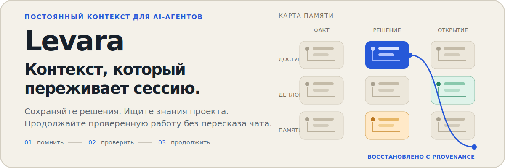
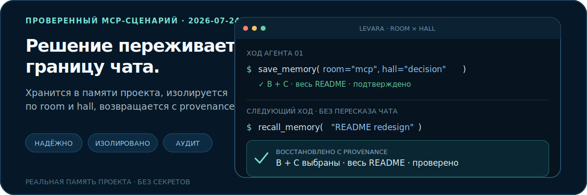
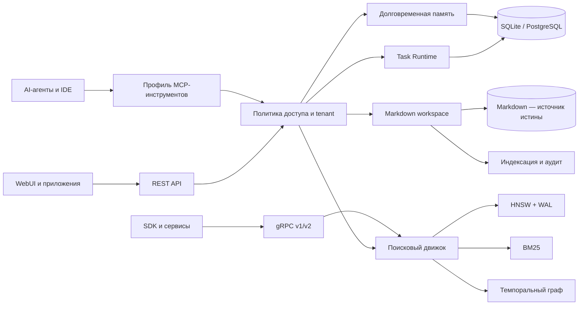

<p align="center">
  
</p>

<p align="center">
  <a href="https://go.dev/"></a>
  <a href="./docs/api-contract.md"></a>
  <a href="./docs/profile-presets.md"></a>
  <a href="./LICENSE"></a>
</p>

<p align="center">
  <a href="./README.md">English</a> ·
  <a href="#быстрый-старт">Быстрый старт</a> ·
  <a href="#карта-возможностей">Возможности</a> ·
  <a href="#как-это-работает">Архитектура</a> ·
  <a href="#эксплуатация-и-webui">Эксплуатация</a> ·
  <a href="./docs/api-contract.md">Контракт API</a>
</p>

Levara — локальная инфраструктура контекста для AI-агентов. Она объединяет
долговременную память, гибридный поиск, темпоральный граф знаний, проверяемый
Markdown workspace, синхронизацию, наблюдаемость и ограниченные по полномочиям
долгие задачи в одном Go-бинарнике.

<p align="center">
  
</p>

Сценарий выше основан на реальной памяти проекта, использованной при редизайне
этого README: визуальное направление было сохранено как ограниченное по
контексту `decision`, а на следующем ходе агента восстановлено без повторного
чтения предыдущего чата. Levara хранит запись в SQL и поддерживает поисковые
индексы-сайдкары; сам разговор не является источником истины.

## Зачем нужна Levara

AI-агенты сильны внутри одного контекстного окна и забывчивы за его пределами.
История чата шумна, один только векторный поиск теряет provenance, а общим
рабочим пространствам агентов нужны явные правила доступа, аудита и
восстановления.

Levara даёт агентам плоскость управления контекстом:

- **Запоминать осознанно** — факты, решения, события, предпочтения, советы и
  открытия хранятся в проектной таксономии `room × hall`.
- **Восстанавливать только нужное** — стартовые сводки, фильтрованный recall,
  гибридный поиск, темпоральные запросы к графу и ограниченный bootstrap задач
  удерживают контекст компактным.
- **Оставлять работу проверяемой** — Markdown остаётся источником истины
  workspace; индексы являются производными и могут быть сверены или
  перестроены.
- **Доказывать выполнение долгих задач** — alpha-версия Task Runtime связывает
  критерии Definition of Done с шагами, lease-захватами, неизменяемыми
  квитанциями, checkpoint-состояниями и детерминированной валидацией.
- **Масштабировать модель эксплуатации** — одно ядро поддерживает локального
  разработчика, несколько устройств, общую командную среду и границы
  enterprise-адаптеров.

## Карта возможностей

| Область | Реализованные возможности |
|---|---|
| **Память агента** | `save_memory`, фильтрованный recall, стартовые сводки, pins, маршрутизация room × hall, дневники отдельных агентов, recall чатов, удаление, консолидация и откат, supersession с сохранением provenance |
| **Поиск и знания** | HNSW с WAL, BM25, гибридный RRF, маршрутизация rerank, RAG и поиск по графу, темпоральная валидность, запросы путей, сообщества, структурные фильтры, Git-анализ |
| **Загрузка данных** | Добавление, перечисление и очистка данных, пайплайны Cognify и Codify, статусы, дедупликация, embeddings, извлечение графа, проверки drift |
| **Проверяемый workspace** | Markdown-контекст и артефакты, поиск/чтение/запись/commit/revert/delete, манифесты, конфликты, проверки доступа, журнал аудита, watch-режим, задачи индексации и переиндексации, retry, reconciliation и GC |
| **Long-Horizon Task Runtime** | Изолированные задачи, Definition of Done, версионированные планы, зависимые шаги, атомарные leases, неизменяемые receipts, checkpoints, blockers, восстановление после сбоя, reviewer policy по риску, детерминированное завершение и продвижение проверенной памяти |
| **Эксплуатация** | Doctor-проверки, снимки runtime и ingestion, последние ошибки, heartbeat, состояние/повтор индексации памяти, SQL↔vector reconciliation, здоровье workspace jobs/watch, метрики Prometheus |
| **Синхронизация и хранение** | Sync Mac/Pi и peer-инстансов, ограниченные манифесты и статусы, backup/restore, SQLite или PostgreSQL для метаданных, локальное или S3-совместимое raw-object storage |
| **Идентификация и governance** | JWT и API-ключи, sharing dataset/project, workspace ACL, проверки tenant membership, экспорт аудита, адаптер проверенных OIDC claims, границы SSO/SCIM, storage и KMS |
| **Продуктовые интерфейсы** | MCP Streamable HTTP, REST, gRPC v1/v2, CLI-инструменты, Next.js WebUI, notebooks, feedback и аналитика поведения памяти |

Сгенерированный контракт сейчас содержит **79 канонических MCP-инструментов**,
**144 REST-маршрута** и **45 gRPC-методов**. Полный машинно-сформированный
инвентарь находится в [docs/api-contract.md](docs/api-contract.md); README
группирует интерфейс по пользовательским задачам, а не повторяет каждый
endpoint.

<details>
<summary><strong>Группы MCP-инструментов</strong></summary>

| Группа | Инструменты | Ответственность |
|---|---:|---|
| Workspace | 25 | Контекст, артефакты, авторинг, ревизии, индексация, jobs и аудит |
| Memory | 11 | Жизненный цикл, recall, консолидация, supersession и wake-up |
| Operations | 9 | Здоровье, ошибки, reconciliation, индексация и состояние runtime |
| Task | 8 | Long-Horizon Task Runtime |
| Data | 5 | Добавление, список, drift, удаление и prune |
| Search | 4 | Гибридный/графовый поиск, сущности и сообщества |
| Cognify | 3 | Cognify, Codify и состояние запусков |
| Chat | 3 | Сохранение, recall и поиск записей чатов |
| Git | 3 | Анализ commit, Git-поиск и очистка графа |
| Context | 2 | Выбор и получение контекста проекта |
| Diary | 2 | Изолированные заметки отдельных агентов |
| Feedback | 2 | Feedback поиска и статистика |
| Sync | 2 | Синхронизация инстансов и статус |

</details>

## Быстрый старт

Профиль Personal работает с SQLite и локальными файлами. Для первого успешного
запуска не нужны PostgreSQL, Neo4j, LLM или reranker.

```bash
git clone https://github.com/Stek0v/Levara.git
cd Levara

make build
cp deploy/profiles/personal.local.env.example .env
set -a && source .env && set +a

./levara-server -config-check
./levara-server -profile=standalone -port=8080 -grpc-port=0
```

Подключите MCP-клиент:

```json
{
  "mcpServers": {
    "levara": {
      "url": "http://127.0.0.1:8080/mcp"
    }
  }
}
```

Затем попросите агента создать первую долговременную запись:

```text
Сохрани решение, что этот проект использует PostgreSQL для общего состояния.
Запиши причину, помести его в room auth и сначала найди существующие решения по auth.
```

Примеры для Codex, Claude Code, Cursor, Cline и других клиентов находятся в
[examples/agent-hosts](examples/agent-hosts).

> [!IMPORTANT]
> В режиме Personal аутентификация по умолчанию не требуется. Оставляйте
> listener в доверенной локальной сети или включите аутентификацию, прежде чем
> открывать доступ другим машинам.

### Docker

```bash
docker compose up -d --build
```

Production-подобные примеры конфигурации Personal, Solo Pro, Team и Enterprise
смотрите в [docs/profile-presets.md](docs/profile-presets.md).

## Как это работает



Levara отделяет авторитетные записи от производных индексов:

- SQL хранит память, метаданные графа, задачи, receipts, идентификацию и
  эксплуатационное состояние.
- Markdown хранит человекочитаемый источник истины workspace.
- HNSW, BM25 и проекции графа ускоряют поиск и могут быть перестроены.
- Политика доступа находится над операциями памяти/workspace в MCP и REST.
- Контракты аудита и адаптеров остаются вне ядра поиска.

## Профили MCP-инструментов

`LEVARA_MCP_TOOLSET` уменьшает стоимость схем инструментов, открывая только
нужную агенту поверхность:

| Профиль инструментов | Назначение |
|---|---|
| `core` | Выбор контекста, wake-up, recall/save памяти, поиск и doctor |
| `memory` | Полный жизненный цикл памяти, консолидация, diaries и feedback |
| `workspace` | Базовая память и безопасный авторинг Markdown workspace |
| `ops` | Здоровье, ошибки, reconciliation, sync, аудит и индексация |
| `long-horizon` | Изолированная память, задачи, receipts, валидация и завершение |
| `full` | Обратно совместимый канонический каталог |

`light` остаётся устаревшим псевдонимом `memory`. Профили инструментов не
являются границами авторизации; проверки JWT/API key и workspace policy
применяются независимо.

> [!WARNING]
> Long-Horizon Task Runtime находится в alpha и включается feature flag.
> Установите `LEVARA_LONG_HORIZON_RUNTIME=1` и используйте профиль MCP
> `long-horizon`. Текущий alpha-набор проверяет зависимости, идемпотентные
> retries, конкурентные claims, устаревшие evidence, reviewer policy,
> восстановление после сбоя, релевантность ограниченного bootstrap и
> продвижение проверенной памяти. См.
> [docs/long-horizon-alpha-report.md](docs/long-horizon-alpha-report.md).

## Профили исполнения

Levara использует три разных переключателя профилей:

| Переключатель | Значения | Назначение |
|---|---|---|
| `LEVARA_PROFILE` | `personal`, `solo_pro`, `team`, `enterprise` | Продуктовая и governance-модель |
| `-profile` | `standalone`, `standalone-embed`, `full` | Функциональный bootstrap сервера |
| `LEVARA_MCP_TOOLSET` | `core`, `memory`, `workspace`, `ops`, `long-horizon`, `full` | MCP-схема, доступная агентам |

Продуктовые профили используют одно ядро:

| Продуктовый профиль | Форма по умолчанию | Что добавляет |
|---|---|---|
| **Personal** | SQLite, локальные файлы, локальный MCP, auth опционально | Долговременная память и workspace одного разработчика |
| **Solo Pro** | SQLite или PostgreSQL, sync, backups, опциональное S3-совместимое хранилище | Несколько устройств или связка Mac/Pi |
| **Team** | PostgreSQL, обязательный auth, общий workspace, отдельные credentials агентов | Project sharing, ACL, аудит и async jobs |
| **Enterprise** | PostgreSQL, tenant enforcement, центральные границы identity/audit | Governance и интеграция через адаптеры |

Строгая валидация доступна через `LEVARA_PROFILE_STRICT=1`; небезопасные
комбинации Team и Enterprise завершаются ошибкой до открытия listener.

## Интерфейсы

| Поверхность | По умолчанию | Текущий контракт | Для чего |
|---|---:|---:|---|
| MCP Streamable HTTP | `/mcp` | 79 канонических инструментов | AI-агенты и интеграции IDE |
| REST | `:8080` | 144 канонических маршрута | WebUI, приложения и эксплуатация |
| gRPC v1/v2 | `:50051` | 45 канонических методов | Типизированные SDK и поисковые клиенты |
| CLI | Локальные бинарники | server, client, backup, contract и host tooling | Операторы и автоматизация |
| WebUI | `:3000` в разработке | Приложение Next.js | Пользователи, операторы и reviewers |

Значения по умолчанию описывают обычную форму развёртывания, а не конкретную
машину разработчика. Проверенный снимок локальной среды разработки находится
в [docs/current-state.md](docs/current-state.md).

## Эксплуатация и WebUI

WebUI — реальная эксплуатационная поверхность над backend, а не отдельное
хранилище данных:

| Процесс | Экраны |
|---|---|
| Знания | Datasets, collections, Cognify, поиск, чат и исследование графа |
| Память | Memories, notebooks, поведение памяти и scaffold proposals |
| Workspace | Manifest, artifacts, поиск, авторинг, indexing jobs и аудит |
| Эксплуатация | Dashboard, sync, analytics, administration и settings |

Эксплуатационные API и MCP-инструменты открывают:

- здоровье зависимостей, runtime-конфигурацию и статистику коллекций;
- активные/недавние ingestion runs, зарегистрированные ошибки и heartbeat;
- SQL↔vector reconciliation памяти и повтор неудачных index jobs;
- watch-состояние workspace, конфликты, журнал аудита, задачи индексации и
  переиндексации;
- sync-манифесты, состояние push/pull и опциональный перенос коллекций;
- метрики Prometheus, экспорт аудита JSONL, backup/restore и runbooks
  watchdog для macOS.

Настройку, мониторинг, заметки по безопасности, Playwright-проверки и рабочие
процессы смотрите в
[docs/webui-operations.md](docs/webui-operations.md).

## Безопасность и enterprise-границы

Реализованная основа:

- независимые от транспорта access policy и проверки tenant membership;
- JWT, API keys, отдельные credentials агентов, sharing datasets и workspace
  ACL;
- строгая валидация профилей и tenant-safe границы SQL;
- асинхронный экспорт аудита с retry/backpressure и JSONL-выводом;
- mapping проверенных OIDC claims и seams для identity/provisioning;
- metadata хранилища и контракты адаптеров KMS/BYOK.

Что остаётся адаптерной или production-hardening работой:

- конкретные HTTP-интерфейсы протоколов SAML и SCIM;
- адаптеры доставки в SIEM;
- production-реализации KMS/BYOK;
- дополнительные интеграции корпоративных object storage и enforcement
  legal hold.

Enterprise preset проверяет governance-требования, но это не означает, что
каждый внешний enterprise-адаптер уже реализован. Точная граница описана в
[docs/product-ladder.md](docs/product-ladder.md).

## Разработка

```bash
# Узкий gate для каждого commit
git diff --check
make test-commit

# Gates профилей и публичного контракта
make profile-config-check
make contract-check

# Расширенный локальный gate релиз-кандидата
make test-release-candidate
```

Полезные документы:

| Документ | Назначение |
|---|---|
| [docs/api-contract.md](docs/api-contract.md) | Сгенерированный инвентарь REST, gRPC, MCP и схем |
| [docs/profile-presets.md](docs/profile-presets.md) | Рабочие примеры продуктовых профилей |
| [docs/product-ladder.md](docs/product-ladder.md) | Источник истины возможностей и enterprise-границ |
| [docs/webui-operations.md](docs/webui-operations.md) | Настройка WebUI, мониторинг и процессы |
| [docs/current-state.md](docs/current-state.md) | Проверенный снимок локальной среды разработки |
| [docs/security-diff-checklist.md](docs/security-diff-checklist.md) | Checklist review изменений, важных для безопасности |
| [docs/long-horizon-alpha-report.md](docs/long-horizon-alpha-report.md) | Доказательства acceptance и recovery для Task Runtime |

## Участие в разработке

Прочитайте [CONTRIBUTING.md](CONTRIBUTING.md), явно фиксируйте изменения
публичного контракта и запускайте соответствующие gates перед pull request.
Заявления о профилях должны соответствовать product ladder, а изменения
MCP/REST/gRPC — регенерировать и проверять канонический контракт.

## Лицензия

MIT. См. [LICENSE](LICENSE).
