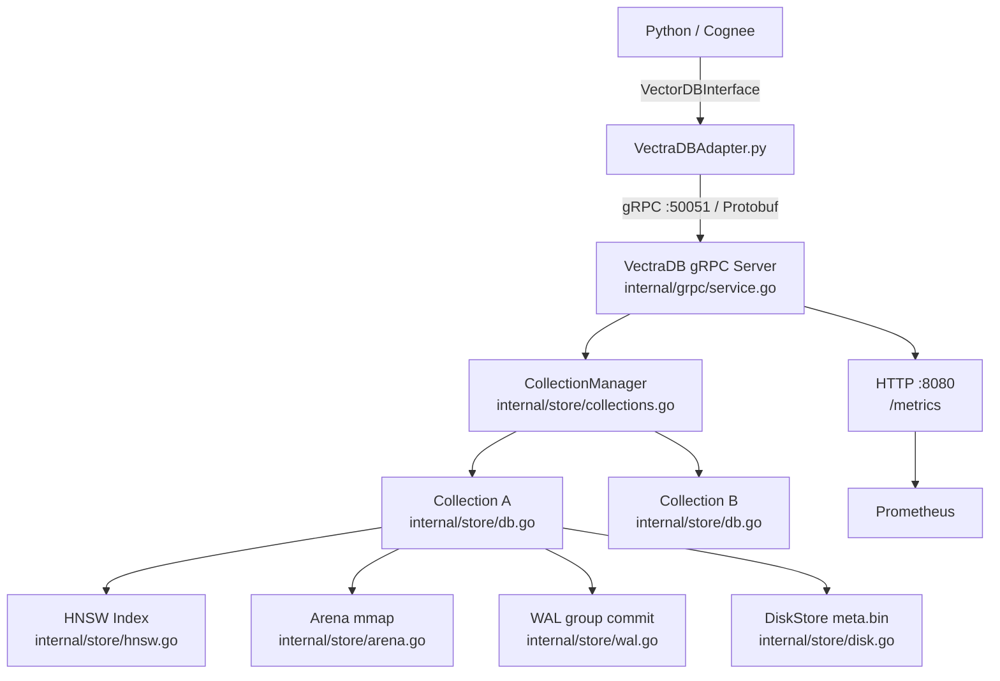

# VectraDB — Высокопроизводительная векторная база данных для AI-памяти

[English version](README.md)

VectraDB — это векторная база данных на Go с HNSW-индексом, разработанная как производительный backend для платформы AI-памяти [Cognee](https://github.com/topoteretes/cognee). Предоставляет gRPC API, хранит векторы с write-ahead log и memory-mapped arena, обеспечивает поиск за менее чем 3 мс при production-нагрузке. Создана для команд, которым нужна низкая задержка при высокой конкурентности: RAG API, чатботы, многопользовательские системы — везде, где read:write > 100:1 и важен SLA на поиск.

## Результаты бенчмарков

| Метрика | VectraDB | LanceDB | Разница |
|---------|----------|---------|---------|
| Задержка поиска p50 (1.4K векторов) | **2.6 мс** | 12.9 мс | **4.9x быстрее** |
| Конкурентный QPS | **589** | 109 | **5.4x выше** |
| Поиск p50 при 100K векторах | **23.7 мс** | 203.7 мс | **8.6x быстрее** |
| SIMD вычисление расстояния | **69 нс** | 557 нс (скалярное) | **8.1x быстрее** |
| Скорость записи | 591 dp/s | **3 911 dp/s** | LanceDB в 6.6x |
| Восстановление после сбоя | **100%** | N/A | VectraDB |

При 100K векторах LanceDB превышает 200 мс на запрос и становится непригодным для real-time сценариев. VectraDB остаётся в пределах 25 мс благодаря HNSW с O(log N) обходом графа.

### Масштабирование: 1K → 100K векторов

| Масштаб | VectraDB p50 | LanceDB p50 | Преимущество | VectraDB QPS | LanceDB QPS |
|---------|--------------|-------------|-------------|-------------|-------------|
| 1 000 | **0.99 мс** | 9.81 мс | **9.9x** | **589** | 98 |
| 10 000 | **7.88 мс** | 55.83 мс | **7.1x** | **480** | 20 |
| 100 000 | **23.66 мс** | 203.71 мс | **8.6x** | **143** | 5 |

VectraDB масштабируется как O(log N) (HNSW граф). LanceDB деградирует как O(N) (сканирование Arrow файлов). При 100K векторах LanceDB **непригоден для real-time** (>200 мс), VectraDB остаётся под 25 мс.

## Почему VectraDB

### Когда VectraDB — лучший выбор

| Сценарий | Рекомендация | Почему |
|----------|-------------|--------|
| RAG API для 100+ пользователей | VectraDB | 5.4x выше QPS, Go goroutines, sub-3ms latency |
| Поиск по 100K+ векторам в реальном времени | VectraDB | 8.6x быстрее, LanceDB >200 мс (непригоден) |
| Микросервисная архитектура (K8s) | VectraDB | gRPC API, Prometheus metrics, 100% crash recovery |
| SLA < 10 мс на поиск | VectraDB | p50=2.6 мс, p95=3.5 мс — запас для LLM-обработки |
| Высокая конкурентность (чатбот, multi-user) | VectraDB | Go goroutines + RWMutex, нет GIL |

### Когда лучше Cognee + LanceDB

| Сценарий | Рекомендация | Почему |
|----------|-------------|--------|
| Batch-загрузка 100K+ документов | LanceDB | 6.6x быстрее на запись (Arrow columnar) |
| Прототипирование / MVP | LanceDB | pip install, без Docker, zero-ops |
| Точный поиск (recall = 1.000) | LanceDB | IVF/PQ — exact search, HNSW ≈ 0.994 |
| Графовые запросы + семантический поиск | Cognee | Граф (Neo4j/Kuzu) + векторы + LLM pipeline |
| Single-process embedding pipeline | LanceDB | In-process, 0 мс транспорт |

### Матрица принятия решений

```
                    Много записей            Много чтений
                    (ETL, CRUD)              (API, чатбот)
                  +------------------+---------------------+
  Простой деплой  |    LanceDB       |    LanceDB          |
  (один сервер)   |    (лучший)      |    (достаточно)     |
                  +------------------+---------------------+
  Production      |    LanceDB       |    VectraDB         |
  (микросервис)   |    (запись)      |    (лучший)         |
                  +------------------+---------------------+
```

## Архитектура



Каждая коллекция — независимый стек HNSW + Arena + WAL + DiskStore. Python-адаптер реализует все 9 методов интерфейса `VectorDBInterface` Cognee через gRPC/Protobuf. Транспортный overhead — около 0.3 мс на запрос (против 2.6 мс при HTTP/JSON — снижение в 8.4x).

## Быстрый старт

```bash
# Запустить VectraDB и Prometheus
docker compose up -d --build

# Пересобрать gRPC-стабы после изменений proto
make proto

# Запустить тесты (требуется embed-server на :9001)
pytest tests/ -v
```

Для полного стека Cognee (PostgreSQL, Neo4j, Redis):

```bash
cp .env.template .env   # заполнить API-ключи
make full-stack
```

## Структура проекта

```
new_db/
  VectraDB/                   # Go-сервер
    cmd/server/main.go        # Точка входа, CLI-флаги
    internal/store/           # Ядро хранилища
      db.go                   # Insert/Search/Delete, блокировки
      hnsw.go                 # HNSW граф, SIMD-расстояния (vek32 AVX2)
      arena.go                # Memory-mapped хранилище векторов
      wal.go                  # Write-ahead log, group commit
      disk.go                 # Append-only метаданные (meta.bin)
      collections.go          # CollectionManager, WAL persistence
    internal/grpc/service.go  # gRPC-сервис (:50051)
    internal/http/handler.go  # HTTP для метрик (:8080)
    proto/vectradb.proto      # Определение gRPC-сервиса
  tests/                      # Python-тесты (174 теста)
  VectraDBAdapter.py          # Python gRPC-адаптер
  docker-compose.yml          # VectraDB + Prometheus
  BENCHMARK_RESULTS.md        # Детальные данные бенчмарков
  ARCHITECTURE.md             # Устройство движка и модель конкурентности
```

## Конфигурация

VectraDB настраивается через CLI-флаги (задаются в `docker-compose.yml`):

| Флаг | По умолчанию | Описание |
|------|-------------|---------|
| `-dim` | `1024` | Размерность векторов |
| `-shards` | `3` | Количество шардов |
| `-port` | `8080` | HTTP-порт метрик |
| `-grpc-port` | `50051` | gRPC API порт |
| `-standalone` | `true` | Single-node режим (без Raft) |
| `-hnsw-m` | `20` | Связность HNSW-графа (выше = лучше recall, больше памяти) |
| `-hnsw-ef-mult` | `10` | Множитель efSearch на запрос |
| `-hnsw-ef-min` | `64` | Минимальный порог efSearch |

Переменные окружения: `VECTRADB_DIM`, `VECTRADB_SHARDS`, `HNSW_M`, `HNSW_EF_MULT`, `HNSW_EF_MIN`.

| Сервис | Порт | Назначение |
|--------|------|-----------|
| VectraDB gRPC | 50051 | Основной API |
| VectraDB HTTP | 8080 | Prometheus метрики (`/metrics`) |
| embed-server | 9001 | Эмбеддинги (dim=1024, FP16, CUDA) |
| Prometheus | 9090 | Сбор метрик |
| Ollama | 11434 | Локальная LLM для RAG-тестов |

## Оптимизации

Все внедрённые оптимизации и их результаты:

| Оптимизация | Изменение | Результат |
|------------|----------|----------|
| gRPC вместо HTTP/JSON | Protobuf 4KB/вектор vs JSON 15KB | **8.4x** снижение транспортной задержки |
| SIMD расстояния (vek32 AVX2) | AVX2 dot product, dim=1024 | **8.1x** ускорение (557 нс → 69 нс) |
| WAL group commit | fsyncLoop коалесцирует fsync | **12.5x** уменьшение syscall'ов (50 записей → 4 fsync) |
| JSON marshal вне блокировки | Marshal до захвата db.mu | -3…15 мс времени удержания блокировки |
| HNSW M=20, efMult=10 | Более плотный граф | Recall 0.93 → **0.994** |
| Concurrent embed batching | errgroup + semaphore | 2–3x пропускная способность батчинга |

## Документация

- [ARCHITECTURE.md](ARCHITECTURE.md) — устройство движка хранилища, модель конкурентности, пути записи и поиска
- [BENCHMARK_RESULTS.md](BENCHMARK_RESULTS.md) — полные данные бенчмарков, история оптимизаций, матрица решений
- [CLAUDE.md](CLAUDE.md) — соглашения разработки, архитектура тестов, известные ограничения
- [tests/](tests/) — набор из 174 Python-тестов

## Лицензия

MIT
