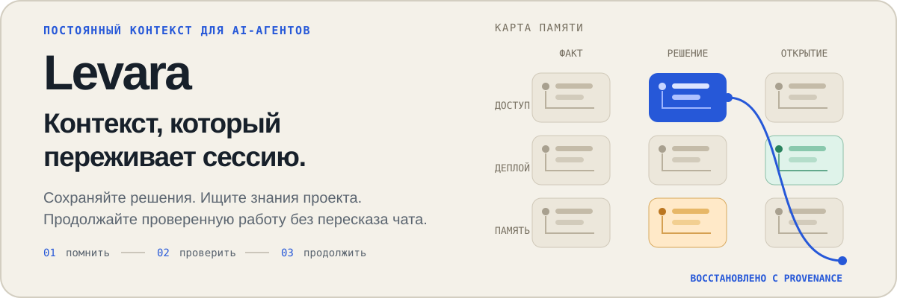
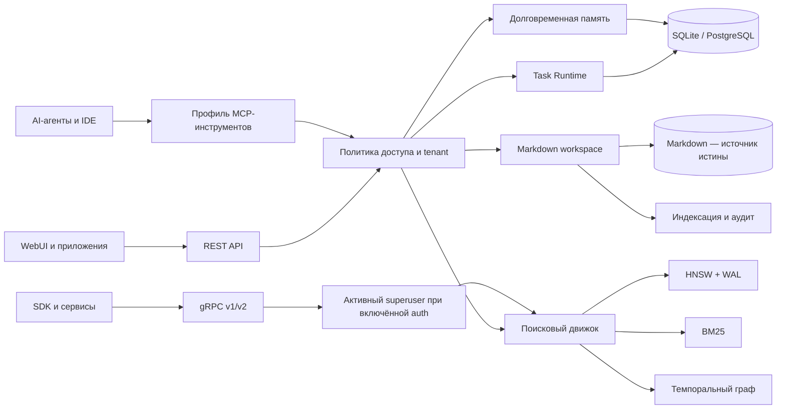

<p align="center">
  
</p>

<p align="center">
  <a href="https://go.dev/"></a>
  <a href="./docs/api-contract.md"></a>
  <a href="./docs/profile-presets.md"></a>
  <a href="./LICENSE"></a>
</p>

<p align="center">
  <a href="./README.md">English</a> ·
  <a href="#быстрый-старт">Быстрый старт</a> ·
  <a href="#карта-возможностей">Возможности</a> ·
  <a href="#как-это-работает">Архитектура</a> ·
  <a href="#эксплуатация-и-webui">Эксплуатация</a> ·
  <a href="./docs/README.md">Документация</a> ·
  <a href="./docs/api-contract.md">Контракт API</a>
</p>

Levara — локальная инфраструктура контекста для AI-агентов. Она объединяет
долговременную память, гибридный поиск, темпоральный граф знаний, проверяемый
Markdown workspace, синхронизацию, наблюдаемость и ограниченные по полномочиям
долгие задачи в одном серверном Go-бинарнике. Опциональный WebUI работает
отдельным сервисом Next.js.

## Зачем нужна Levara

AI-агенты сильны внутри одного контекстного окна и забывчивы за его пределами.
История чата шумна, один только векторный поиск теряет provenance, а общим
рабочим пространствам агентов нужны явные правила доступа, аудита и
восстановления.

Levara даёт агентам плоскость управления контекстом:

- **Запоминать осознанно** — факты, решения, события, предпочтения, советы и
  открытия хранятся в проектной таксономии `room × hall`.
- **Восстанавливать только нужное** — стартовые сводки, фильтрованный recall,
  гибридный поиск, темпоральные запросы к графу и ограниченный bootstrap задач
  удерживают контекст компактным.
- **Оставлять работу проверяемой** — Markdown остаётся источником истины
  workspace; индексы являются производными и могут быть сверены или
  перестроены.
- **Доказывать выполнение долгих задач** — Task Runtime связывает
  критерии Definition of Done с шагами, lease-захватами, неизменяемыми
  квитанциями, checkpoint-состояниями и детерминированной валидацией.
- **Масштабировать модель эксплуатации** — одно ядро поддерживает локального
  разработчика, несколько устройств, общую командную среду и границы
  enterprise-адаптеров.

## Проверки и качество

[Результаты и команды проверки](docs/testing.md) фиксируют прогон 2026-09-05:
backend-регрессии с SQLite/PostgreSQL, реальные парсеры семи форматов и
42 Chromium-теста WebUI с API-моками. Там указаны ревизия, локальные изменения,
границы покрытия и сценарии, требующие отдельного стенда.

Старые benchmark-JSON сохранены как исторические данные. Их статусы не
подтверждают изоляцию владельцев, сходимость независимых sync-узлов или
точность OCR. [CI workflow](.github/workflows/go-ci.yml) задаёт проверки;
результат относится к конкретному запуску.

## Карта возможностей

| Область | Реализованные возможности |
|---|---|
| **Память агента** | `save_memory`, фильтрованный recall, стартовые сводки, pins, маршрутизация room × hall, дневники отдельных агентов, recall чатов, удаление, консолидация и откат, supersession с сохранением provenance |
| **Поиск и знания** | HNSW с WAL, BM25, гибридный RRF, маршрутизация rerank, RAG и поиск по графу, темпоральная валидность, запросы путей, сообщества, структурные фильтры, Git-анализ |
| **Загрузка данных** | Добавление, перечисление и очистка данных, пайплайны Cognify и Codify, статусы, дедупликация, embeddings, извлечение графа, проверки drift |
| **Проверяемый workspace** | Markdown-контекст и артефакты, поиск/чтение/запись/commit/revert/delete, манифесты, конфликты, проверки доступа, журнал аудита, watch-режим, задачи индексации и переиндексации, retry, reconciliation и GC |
| **Long-Horizon Task Runtime** | Изолированные задачи, Definition of Done, версионированные планы, зависимые шаги, атомарные leases, неизменяемые receipts, checkpoints, blockers, восстановление после сбоя, reviewer policy по риску, детерминированное завершение и продвижение проверенной памяти |
| **Эксплуатация** | Doctor-проверки, снимки runtime и ingestion, последние ошибки, heartbeat, состояние/повтор индексации памяти, SQL↔vector reconciliation, здоровье workspace jobs/watch, метрики Prometheus |
| **Синхронизация и хранение** | Sync Mac/Pi и peer-инстансов, ограниченные манифесты и статусы, backup/restore, SQLite или PostgreSQL для метаданных, локальное или S3-совместимое raw-object storage |
| **Идентификация и governance** | JWT и API-ключи, индивидуальный доступ к датасетам, workspace ACL, tenant membership, экспорт аудита, OIDC bearer, SAML SP, ограниченный SCIM Users API, контракты storage/KMS |
| **Продуктовые интерфейсы** | MCP Streamable HTTP, REST, gRPC v1/v2, CLI-инструменты, Next.js WebUI, notebooks, feedback и аналитика поведения памяти |

Актуальный [сгенерированный каталог API](docs/api-contract.md) перечисляет
MCP tools и REST/gRPC entries, включая aliases и операционные маршруты.
Отдельные bootstrap-маршруты идентичности описаны в [API guide](docs/api-reference.md).

<details>
<summary><strong>Группы MCP-инструментов</strong></summary>

| Группа | Инструменты | Ответственность |
|---|---:|---|
| Workspace | 25 | Контекст, артефакты, авторинг, ревизии, индексация, jobs и аудит |
| Memory | 14 | Жизненный цикл, recall, консолидация, supersession и wake-up |
| Operations | 9 | Здоровье, ошибки, reconciliation, индексация и состояние runtime |
| Task | 8 | Long-Horizon Task Runtime |
| Data | 5 | Добавление, список, drift, удаление и prune |
| Search | 4 | Гибридный/графовый поиск, сущности и сообщества |
| Cognify | 3 | Cognify, Codify и состояние запусков |
| Chat | 3 | Сохранение, recall и поиск записей чатов |
| Git | 3 | Анализ commit, Git-поиск и очистка графа |
| Context | 2 | Выбор и получение контекста проекта |
| Diary | 2 | Изолированные заметки отдельных агентов |
| Feedback | 2 | Feedback поиска и статистика |
| Sync | 2 | Синхронизация инстансов и статус |

</details>

## Быстрый старт

Профиль Personal работает с SQLite и локальными файлами. Для первого успешного
запуска не нужны PostgreSQL, Neo4j, LLM или reranker.

```bash
git clone https://github.com/Stek0v/Levara.git
cd Levara

make build
cp deploy/profiles/personal.local.env.example .env
set -a && source .env && set +a

./levara-server -config-check
./levara-server -profile=standalone -port=8080 -grpc-port=0
```

Подключите MCP-клиент:

```json
{
  "mcpServers": {
    "levara": {
      "url": "http://127.0.0.1:8080/mcp"
    }
  }
}
```

Token-чувствительные агенты (например Hermes) могут использовать
`/mcp-light`: тот же session-транспорт, но сервер всегда объявляет и
применяет профиль `memory` (~3 раза меньше схем инструментов на вызов):

```json
{
  "mcpServers": {
    "levara-light": {
      "url": "http://127.0.0.1:8080/mcp-light"
    }
  }
}
```

Затем попросите агента создать первую долговременную запись:

```text
Сохрани решение, что этот проект использует PostgreSQL для общего состояния.
Запиши причину, помести его в room auth и сначала найди существующие решения по auth.
```

Примеры для Codex, Claude Code, Cursor, Cline и других клиентов находятся в
[examples/agent-hosts](examples/agent-hosts).

> [!IMPORTANT]
> В режиме Personal аутентификация по умолчанию не требуется. Оставляйте
> listener на loopback или включите аутентификацию, прежде чем
> открывать доступ другим машинам.

### Docker

Перед запуском Compose задайте публикацию портов на loopback либо включите
аутентификацию для сетевого доступа. В базовом compose-файле порты публикуются
на всех интерфейсах хоста, а auth по умолчанию выключена. Используйте
[рецепт Docker](docs/deployment.md#docker) с явными настройками.

Production-подобные примеры конфигурации Personal, Solo Pro, Team и Enterprise
смотрите в [docs/profile-presets.md](docs/profile-presets.md).

## Документы и совместная работа

Загрузите документ через WebUI или CLI, проверьте извлечение текста и
индексацию, затем сверьте ответ с источником. Полный процесс описан в
[управлении документами](docs/document-management.md), а ошибки, повторная
обработка и проверки доступа — в [приёмочных сценариях](docs/document-workflow-scenarios.md).

Для доступа к одному документу сейчас нужен отдельный датасет и индивидуальная
роль viewer/editor/admin. Групповых прав и независимого ACL документа пока нет.
Варианты подключения AD, LDAP и SSO разобраны в
[руководстве по корпоративному входу](docs/enterprise-identity.md).

## Как это работает


```mermaid
flowchart LR
  Agents[AI-агенты и IDE] --> MCP[Профиль MCP-инструментов]
  WebUI[WebUI и приложения] --> REST[REST API]
  SDKs[SDK и сервисы] --> GRPC[gRPC v1/v2]

  MCP --> Policy[Политика доступа и tenant]
  REST --> Policy
  GRPC --> Admin[Активный superuser при включённой auth]
  Admin --> Search[Поисковый движок]

  Policy --> Memory[Долговременная память]
  Policy --> Workspace[Markdown workspace]
  Policy --> Tasks[Task Runtime]
  Policy --> Search

  Memory --> SQL[(SQLite / PostgreSQL)]
  Workspace --> Markdown[(Markdown — источник истины)]
  Workspace --> Jobs[Индексация и аудит]
  Tasks --> SQL

  Search --> HNSW[HNSW + WAL]
  Search --> BM25[BM25]
  Search --> Graph[Темпоральный граф]
```

Levara отделяет авторитетные записи от производных индексов:

- SQL хранит память, метаданные графа, задачи, receipts, идентификацию и
  эксплуатационное состояние.
- Markdown хранит человекочитаемый источник истины workspace.
- HNSW, BM25 и проекции графа ускоряют поиск и могут быть перестроены.
- Политика доступа находится над операциями памяти/workspace в MCP и REST.
- Контракты аудита и адаптеров остаются вне ядра поиска.

## Профили MCP-инструментов

`LEVARA_MCP_TOOLSET` уменьшает стоимость схем инструментов, открывая только
нужную агенту поверхность:

| Профиль инструментов | Назначение |
|---|---|
| `core` | Выбор контекста, wake-up, recall/save памяти, поиск и doctor |
| `memory` | Полный жизненный цикл памяти, консолидация, diaries и feedback |
| `workspace` | Базовая память и безопасный авторинг Markdown workspace |
| `ops` | Здоровье, ошибки, reconciliation, sync, аудит и индексация |
| `long-horizon` | Изолированная память, задачи, receipts, валидация и завершение |
| `full` | Обратно совместимый канонический каталог |

`light` остаётся устаревшим псевдонимом `memory`. Эндпоинт `/mcp-light`
закрепляет этот профиль на уровне эндпоинта: один процесс одновременно
обслуживает full-клиентов на `/mcp` и memory-клиентов на `/mcp-light`,
сессии общие для обоих эндпоинтов, а закреплённый профиль не перекрывается
`LEVARA_MCP_TOOLSET`. Профили инструментов не
являются границами авторизации; проверки JWT/API key и workspace policy
применяются независимо.

Task Runtime включается через `LEVARA_LONG_HORIZON_RUNTIME=1` и профиль
`long-horizon`. Есть управление шагами и evidence, а WebUI показывает задачи
в режиме чтения. Встроенный worker использует logging/no-op executor;
для выполнения действий нужен внешний исполнитель. Манифест authority
привязывается по digest при claim, но сам по себе не обеспечивает изоляцию
выполнения инструментов, файловых и сетевых операций. См.
[руководство](docs/long-horizon-runtime.ru.md) и [проверки](docs/testing.md).

## Профили исполнения

Levara использует три разных переключателя профилей:

| Переключатель | Значения | Назначение |
|---|---|---|
| `LEVARA_PROFILE` | `personal`, `solo_pro`, `team`, `enterprise` | Продуктовая и governance-модель |
| `-profile` | `standalone`, `standalone-embed`, `full` | Функциональный bootstrap сервера |
| `LEVARA_MCP_TOOLSET` | `core`, `memory`, `workspace`, `ops`, `long-horizon`, `full` | MCP-схема, доступная агентам |

Продуктовые профили используют одно ядро:

| Продуктовый профиль | Форма по умолчанию | Что добавляет |
|---|---|---|
| **Personal** | SQLite, локальные файлы, локальный MCP, auth опционально | Долговременная память и workspace одного разработчика |
| **Solo Pro** | SQLite или PostgreSQL, sync, backups, опциональное S3-совместимое хранилище | Несколько устройств или связка Mac/Pi |
| **Team** | PostgreSQL, обязательный auth, общий workspace, отдельные credentials агентов | Project sharing, ACL, аудит и async jobs |
| **Enterprise** | PostgreSQL, tenant enforcement, центральные границы identity/audit | Governance и интеграция через адаптеры |

`LEVARA_PROFILE_STRICT=1` проверяет обязательную конфигурацию Team/Enterprise
до открытия listener. Она не проверяет доступность IdP или всю защиту окружения.

## Интерфейсы

| Поверхность | По умолчанию | Текущий контракт | Для чего |
|---|---:|---:|---|
| MCP Streamable HTTP (latest) | `/mcp/2026-07-28` | stateless, metadata в каждом запросе | современные MCP-клиенты |
| MCP Streamable HTTP (light) | `/mcp-light` | session-based, закреплённый профиль `memory` | token-чувствительные агенты; ~3 раза меньше схем инструментов |
| MCP Streamable HTTP (legacy) | `/mcp` | [Каталог инструментов](docs/api-contract.md) | AI-агенты и интеграции IDE |
| REST | `:8080` | [Каталог маршрутов](docs/api-contract.md) | WebUI, приложения и эксплуатация |
| gRPC v1/v2 | `:50051` | Привилегированный raw-storage API | SDK операторов; active superuser при включённой auth |
| CLI | Локальные бинарники | server, client, backup, contract и host tooling | Операторы и автоматизация |
| WebUI | `:3000` в разработке | Приложение Next.js | Пользователи, операторы и reviewers |

Настройка адресов, SQL и моделей описана в [руководстве по развёртыванию](docs/deployment.md).

## Эксплуатация и WebUI

WebUI — реальная эксплуатационная поверхность над backend, а не отдельное
хранилище данных:

| Процесс | Экраны |
|---|---|
| Знания | Datasets, collections, Cognify, поиск, чат и исследование графа |
| Память | Memories, notebooks, поведение памяти и scaffold proposals |
| Workspace | Manifest, artifacts, поиск, авторинг, indexing jobs и аудит |
| Эксплуатация | Dashboard, sync, analytics, administration и settings |

Эксплуатационные API и MCP-инструменты открывают:

- здоровье зависимостей, runtime-конфигурацию и статистику коллекций;
- активные/недавние ingestion runs, зарегистрированные ошибки и heartbeat;
- SQL↔vector reconciliation памяти и повтор неудачных index jobs;
- watch-состояние workspace, конфликты, журнал аудита, задачи индексации и
  переиндексации;
- sync-манифесты, состояние push/pull и опциональный перенос коллекций;
- метрики Prometheus, экспорт аудита JSONL, backup/restore и runbooks
  watchdog для macOS.

Настройку, мониторинг, заметки по безопасности, Playwright-проверки и рабочие
процессы смотрите в
[docs/webui-operations.md](docs/webui-operations.md).

## Безопасность и enterprise-границы

Доступны JWT/API-ключи, индивидуальные права на датасет, проверки доступа
к workspace и tenant membership, строгая проверка запуска и экспорт аудита.
`room` и `hall` упорядочивают память; они не назначают и не ограничивают права.

Для корпоративной идентичности есть проверка OIDC bearer-токенов, HTTP-процесс
SAML service provider и ограниченный SCIM Users API. Прямой LDAP/LDAPS,
браузерный OIDC-вход, связка SCIM с SSO и действующие права на группы/отдельные
документы не реализованы. Для AD нужны схема федерации и приёмочная проверка;
один Enterprise preset этого не обеспечивает.
[Руководство по корпоративному входу](docs/enterprise-identity.md) описывает
операции, адреса и ограничения жизненного цикла, а
[управление документами](docs/document-management.md) — индивидуальный доступ.

SIEM, production-бэкенды KMS/BYOK, корпоративные политики объектного хранилища
и исполнение legal hold остаются работой над адаптерами. Локальное хранение
не означает локальный inference: адреса embeddings, extraction, LLM, tracing
и sync определяются настройками. Для работы без сети нужны локальные модели
и провайдеры. Перед развёртыванием смотрите
[продуктовую лестницу](docs/product-ladder.md) и [пресеты](docs/profile-presets.md).

## Разработка

```bash
# Узкий gate для каждого commit
git diff --check
make test-commit

# Gates профилей и публичного контракта
make profile-config-check
make contract-check

# Расширенный локальный gate релиз-кандидата
make test-release-candidate
```

Полезные документы:

| Документ | Назначение |
|---|---|
| [docs/api-contract.md](docs/api-contract.md) | Сгенерированный инвентарь REST, gRPC, MCP и схем |
| [docs/testing.md](docs/testing.md) | Результаты, воспроизведение и ограничения проверок |
| [docs/profile-presets.md](docs/profile-presets.md) | Рабочие примеры продуктовых профилей |
| [docs/product-ladder.md](docs/product-ladder.md) | Источник истины возможностей и enterprise-границ |
| [docs/webui-operations.md](docs/webui-operations.md) | Настройка WebUI, мониторинг и процессы |
| [docs/memory-workflow-skill.ru.md](docs/memory-workflow-skill.ru.md) | Установка и использование skill автоматической памяти Levara |
| [docs/long-horizon-runtime.ru.md](docs/long-horizon-runtime.ru.md) | Настройка Task Runtime, жизненный цикл, evidence и восстановление |

## Участие в разработке

Прочитайте [CONTRIBUTING.md](CONTRIBUTING.md), явно фиксируйте изменения
публичного контракта и запускайте соответствующие gates перед pull request.
Заявления о профилях должны соответствовать product ladder, а изменения
MCP/REST/gRPC — регенерировать и проверять канонический контракт.

## Лицензия

MIT. См. [LICENSE](LICENSE).
