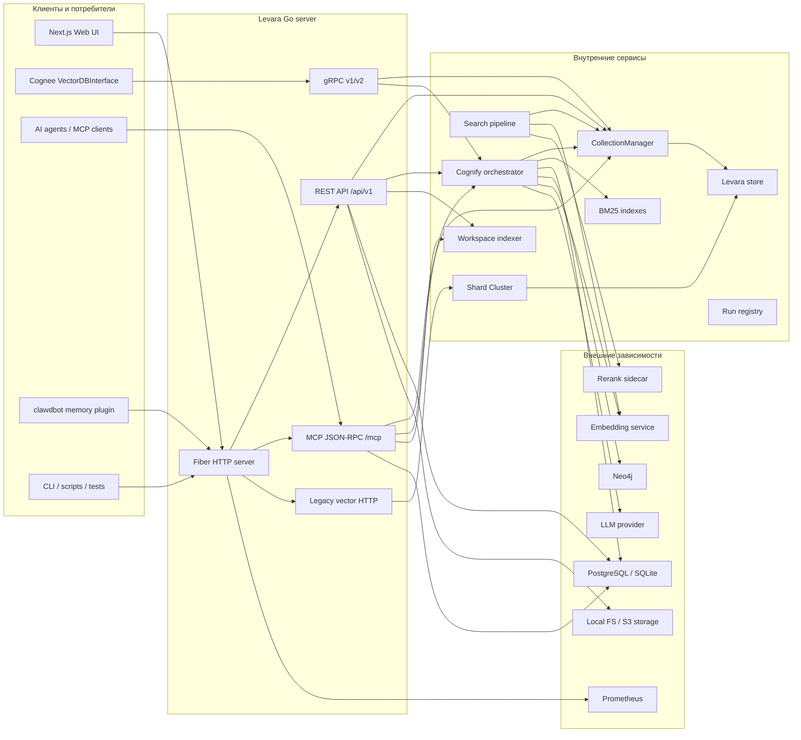
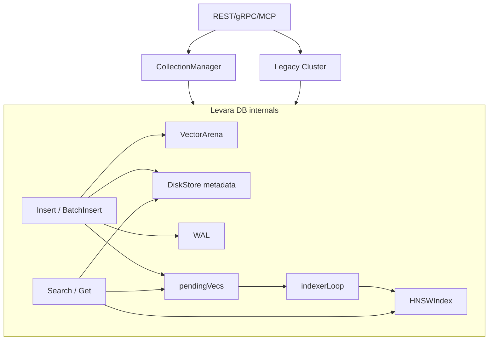
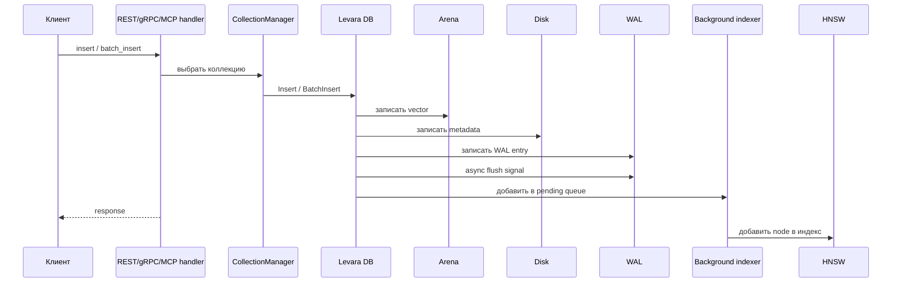
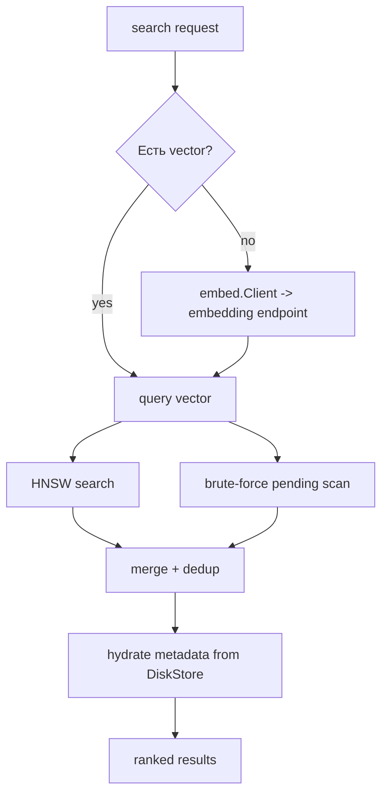
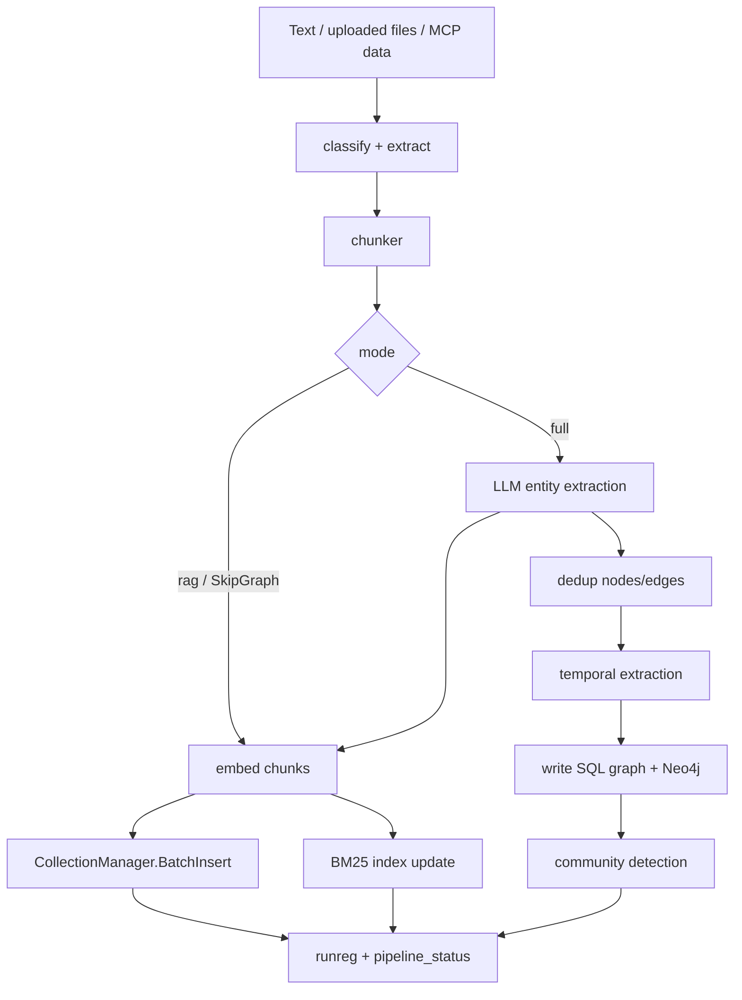
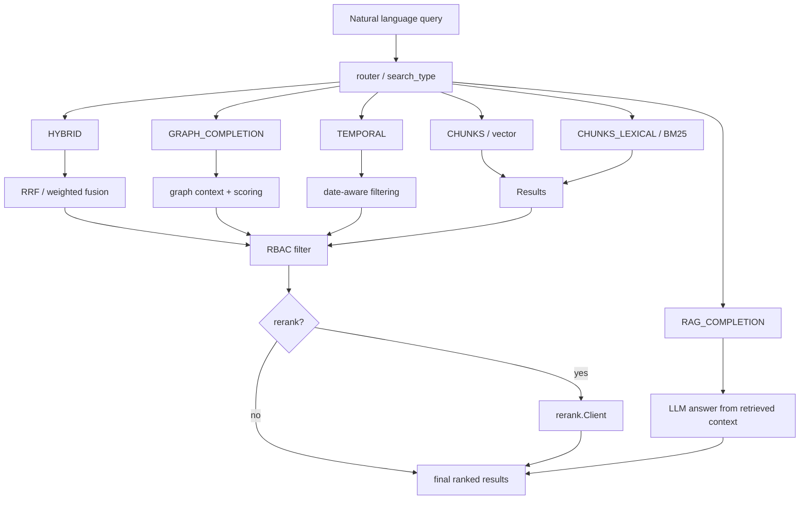
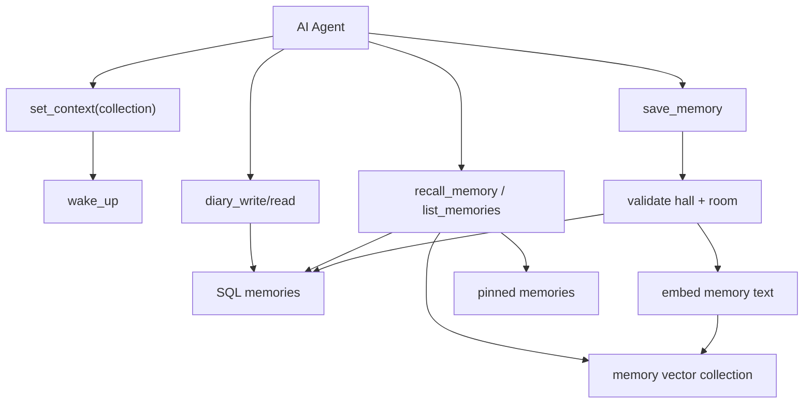
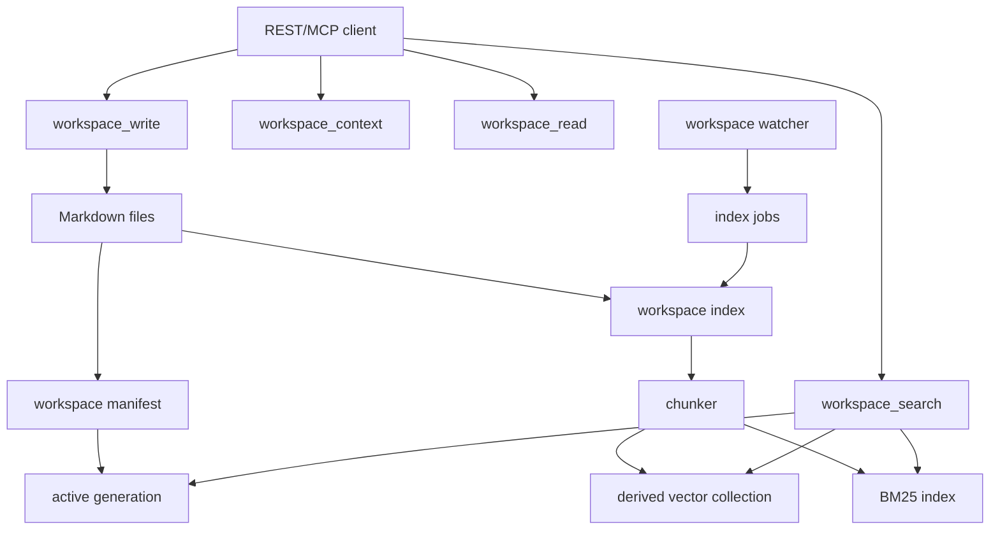
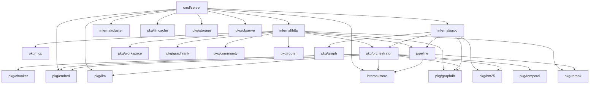
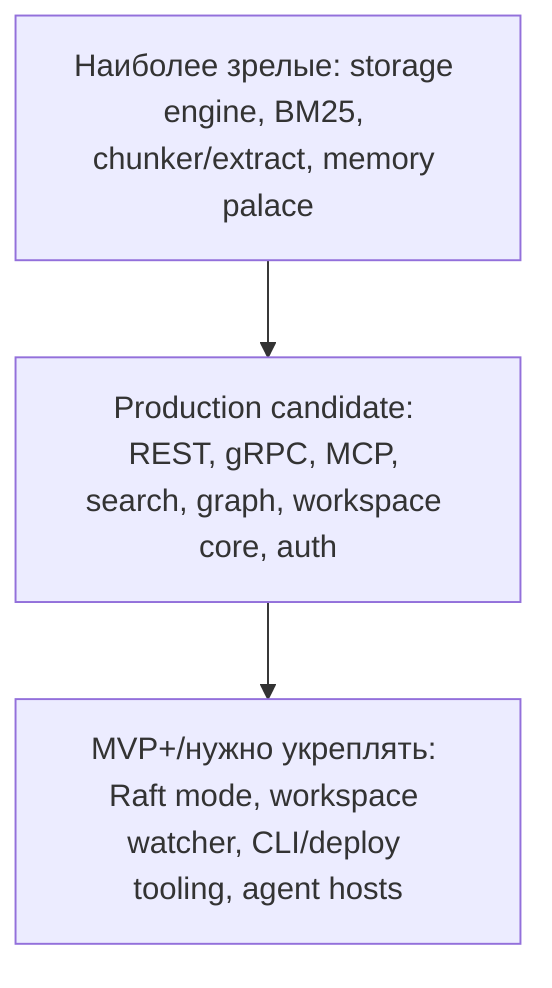

# Levara: подробный покомпонентный анализ кода

Дата анализа: 2026-05-16.

Область анализа: актуальная реализация в `Levara/`, Web UI в `Levara/webui/`,
внешние интеграции `cognee-plugin/` и `clawdbot/`. Каталог `Levara-legacy/`
является исторической реализацией и в основную архитектурную картину не входит.

## Краткая суть

Levara в текущем виде — это не просто HNSW-векторная база. Это серверная
платформа памяти для AI-агентов и RAG/KG-приложений. В одном Go-процессе
собраны:

- векторное хранилище с HNSW, WAL, append-only metadata store и коллекциями;
- REST API для Web UI и продуктовых сценариев;
- gRPC API для быстрых backend-интеграций и Cognee-адаптера;
- MCP Streamable HTTP API для AI-агентов;
- пайплайн `cognify`: chunking, embeddings, LLM extraction, graph write,
  BM25 indexing и прогресс через SSE/MCP;
- SQL-метаданные: пользователи, datasets, data, memories, graph mirror, RBAC,
  sync, feedback, notebooks, workspace;
- интеграции с Neo4j, embedding service, LLM-провайдерами, reranker sidecar,
  S3-compatible storage, Prometheus и Langfuse.

Иными словами, Levara — это композиция из трех крупных слоев:

1. **Storage/runtime ядро**: коллекции, HNSW, WAL, shard/cluster/replication.
2. **Memory/RAG/KG слой**: ingest, search, cognify, graph, memory palace,
   workspace.
3. **Интеграционные поверхности**: REST, gRPC, MCP, Web UI, Cognee adapter,
   clawdbot plugin.

## Общая схема системы

## Точка входа и bootstrap

Главная точка входа: `Levara/cmd/server/main.go`.

Этот файл является composition root: он не просто запускает сервер, а собирает
все зависимости и передает их в REST, gRPC и MCP слои.

На старте происходит следующее:

1. Читаются CLI flags: размерность embeddings, HTTP/gRPC порты, количество
   шардов, data directory, HNSW-параметры, auth, Neo4j, Raft/replica settings.
2. Создаются logger и error tracker из `pkg/observe`.
3. Инициализируется storage backend:
   - local filesystem по умолчанию;
   - S3-compatible backend при `STORAGE_BACKEND=s3`.
4. Формируется `store.HNSWConfig`.
5. Создаются shard handlers:
   - `cluster.DirectNode` в standalone-режиме;
   - `cluster.RaftNode` в Raft-режиме.
6. Создается `store.Cluster` для legacy shard path.
7. Поднимается WAL replication server, если доступен underlying DB.
8. Создается Fiber HTTP app, подключаются CORS, logger, `/metrics`,
   `/health`, `/version`, Swagger.
9. Создается `store.CollectionManager`, который является основным современным
   механизмом коллекций.
10. Открывается SQL DB:
   - SQLite при `DB_PROVIDER=sqlite`;
   - PostgreSQL при наличии `DB_HOST`;
   - если DB нет, часть функций работает в degraded mode.
11. Выполняется `MigrateSchema`.
12. Регистрируются auth endpoints.
13. После auth middleware регистрируются защищенные REST endpoints.
14. Создается gRPC service, его BM25 indexes передаются в REST/MCP.
15. Создаются LLM cache, LLM provider, adaptive router, run registry,
   shared embedding client, rerank config.
16. Регистрируется MCP endpoint `/mcp`.
17. Опционально запускаются workspace watcher и workspace index worker.
18. Стартуют gRPC server и Fiber HTTP server.

Главная особенность этого bootstrap: один процесс обслуживает сразу несколько
протоколов, но большая часть состояния общая: `CollectionManager`, SQL DB,
BM25 map, embedding client, run registry, LLM cache.

## Основные транспортные поверхности

### REST API

REST слой находится в `Levara/internal/http`.

Регистрация основной группы endpoint-ов происходит в `RegisterAPI`:
`Levara/internal/http/api.go`.

REST API нужен прежде всего для:

- Web UI;
- dataset/data CRUD;
- upload и ingest;
- search/chat workflows;
- auth, users, tenants, RBAC;
- memory CRUD;
- workspace lifecycle;
- sync между инстансами;
- feedback и telemetry;
- notebooks/settings/product features.

Основные группы endpoint-ов:

| Группа | Файлы | Назначение |
|---|---|---|
| Auth | `auth.go`, `users.go` | JWT, registration, login, API keys, current user |
| Datasets | `api_datasets.go`, `api_upload.go` | datasets, uploaded data, raw content, storage URLs |
| Legacy vector ops | `handler.go` | `/insert`, `/batch_insert`, `/search`, `/delete` |
| Search | `api_search.go`, `dualsearch.go`, `search_strategy.go` | semantic, lexical, graph, hybrid, rerank search |
| Cognify | `api_cognify.go` | background RAG/KG pipeline, status, SSE |
| Memify | `memify.go` | post-cognify graph enrichment |
| Collections | `collections.go`, `reembed.go` | collection metadata, re-embedding migration |
| Memory | `memories.go`, `memory_events.go` | project/user memories and SSE events |
| MCP bridge | `mcp.go`, `mcp_palace.go`, `mcp_doctor.go` | MCP endpoint and HTTP-specific tool wiring |
| Workspace | `workspace*.go` | markdown workspace index/read/write/reconcile/jobs |
| Sync | `sync.go` | export/import memories, interactions, graph, collections |
| Graph | `graph_search.go`, `api_graph_path.go`, `visualize.go` | graph search, path, visualization |
| RBAC/tenant | `rbac.go`, `tenants.go` | ACL, dataset sharing, tenant selection |
| Feedback | `feedback.go` | search feedback, stats, adaptive weights |
| Product UI | `notebooks.go`, `settings.go` | notebooks, settings |
| Ops | `observe_middleware.go`, `confidence.go`, `verify.go` | metrics, confidence, diagnostics |

REST слой достаточно широкий. Это не только HTTP wrappers, а фактически
application layer для UI и многих agent-facing сценариев.

### gRPC API

Основной код: `Levara/internal/grpc/service.go`.

gRPC API нужен для низколатентных backend-интеграций. Его использует
`cognee-plugin/levara_adapter/LevaraAdapter.py`.

Ключевые RPC:

- collections: `CreateCollection`, `DropCollection`, `ListCollections`,
  `HasCollection`;
- records: `Insert`, `BatchInsert`, `Delete`, `Search`, `GetByID`;
- text: `ChunkText`, `SearchByText`, `BatchSearchByText`;
- graph: `ProcessTriplets`, `BatchWriteGraph`, `GraphRead`,
  `GraphCompletionSearch`;
- pipeline: `PipelineCognify` streaming;
- lexical: `BM25Index`, `BM25Search`, `HybridSearch`;
- operations: `BatchEmbedAndIndex`, `ParallelWriteDataPoints`,
  `IngestData`, `ExtractText`, `TemporalSearch`;
- LLM cache: `LLMCacheGet`, `LLMCachePut`, `LLMCacheStats`;
- maintenance: `Compact`.

Есть `service_v2.go`, который оборачивает v1 и дает более компактную v2
поверхность с алиасами `Add`, `Save`, `Create`.

### MCP API

MCP endpoint: `POST /mcp`, `GET /mcp`, `DELETE /mcp`.

Код:

- HTTP transport: `Levara/internal/http/mcp.go`;
- tool descriptors и tool bodies: `Levara/pkg/mcp`;
- дополнительные HTTP-bound tools: `mcp_palace.go`, `mcp_doctor.go`,
  `workspace*.go`.

MCP слой делает Levara памятью для AI-агентов. Важная архитектурная граница:
`pkg/mcp.Deps`. Tool code не зависит напрямую от Fiber, а получает узкий набор
методов: DB, collections, embeddings, search pipeline, LLM provider, sync,
workspace и т.д.

Основные MCP tool families:

- **ingestion/search**: `cognify`, `cognify_status`, `search`,
  `cross_search`, `codify`;
- **data**: `add`, `list_data`, `delete`, `prune`;
- **memory palace**: `save_memory`, `recall_memory`, `list_memories`,
  `pin_memory`, `unpin_memory`, `wake_up`;
- **chat history**: `save_chat`, `recall_chat`, `search_chats`;
- **graph**: `query_entity`, `list_communities`, `check_drift`,
  `prune_graph`;
- **workspace**: context, access check, audit, search, read, write, index,
  reconcile, jobs, commit, revert, GC;
- **ops**: `doctor`, `heartbeat`, runtime stats, recent errors, sync status.

## Storage engine

Основное ядро: `Levara/internal/store`.

Компоненты:

- `Levara` DB: объект одной физической базы/коллекции;
- `CollectionManager`: map collection name -> `*Levara`;
- `Cluster`: legacy hash shard router;
- `VectorArena`: хранение нормализованных float32-векторов;
- `HNSWIndex`: approximate nearest neighbor index;
- `DiskStore`: append-only metadata store;
- `WAL`: write-ahead log с group flush;
- `pendingVecs`: векторы, уже записанные, но еще не добавленные в HNSW;
- `indexerLoop`: background goroutine для асинхронного HNSW indexing.

### Почему есть и CollectionManager, и Cluster

В коде есть два пути:

1. **Современный collection-aware path**: если request содержит `collection`,
   используется `CollectionManager`. Это основной путь для gRPC, REST search,
   MCP, cognify, memory.
2. **Legacy cluster path**: если `collection` не указан, legacy HTTP vector
   endpoints используют `store.Cluster`, который hash-роутит ID по шардам.

Это дает обратную совместимость, но создает важный архитектурный нюанс: новые
фичи должны явно работать с коллекциями, иначе легко попасть в legacy path.

### Write path

Важная особенность: HNSW indexing вынесен в background. Поэтому write latency
не зависит напрямую от стоимости graph insertion. Чтобы свежие записи не
терялись для поиска, search дополнительно сканирует `pendingVecs`.

### Search path

## Cognify pipeline

Основной код: `Levara/pkg/orchestrator/pipeline.go`.

`cognify` — это серверный pipeline, который превращает текст/файлы в:

- chunks;
- embeddings;
- vector records;
- BM25 records;
- graph nodes/edges;
- temporal facts;
- community summaries;
- pipeline status.

Поддерживаемые режимы:

- `rag`: только chunk + embed + vector/BM25, без LLM и graph;
- `full`: полный pipeline с entity extraction, graph write и temporal logic.

Chunking стратегии:

- `merged`;
- `paragraph`;
- `sentence`;
- `row`;
- `code`;
- `sliding`;
- `auto`;
- parent-child chunking.

Parent-child chunking нужен для баланса:

- child chunks дают точность поиска;
- parent chunks дают больше контекста при ответе.

## Search layer

Search существует в нескольких формах:

- REST: `internal/http/api_search.go`;
- gRPC: `SearchByText`, `HybridSearch`, `GraphCompletionSearch`;
- MCP: `pkg/mcp/tool_search.go`;
- shared in-process helpers: `Levara/pipeline`.

Поиск может использовать:

- vector search через `CollectionManager`;
- lexical BM25;
- hybrid fusion;
- graph traversal / graph rank;
- temporal filters;
- LLM completion;
- multi-query expansion;
- rerank sidecar.

Критически важное правило в коде: rerank должен запускаться после ACL-filter.
Иначе текст запрещенных документов может уйти во внешний reranker.

## SQL metadata layer

Миграция: `Levara/internal/http/schema.go`.

SQL DB используется как общая metadata-плоскость. Поддерживаются PostgreSQL и
SQLite.

Основные таблицы:

- `principals`, `users`, `api_keys`: пользователи, auth, API keys;
- `datasets`, `data`, `dataset_data`: каталог загруженных данных;
- `graph_nodes`, `graph_edges`: SQL-зеркало knowledge graph;
- `tenants`, `user_tenant`, `roles`, `user_role`, `acl`,
  `dataset_shares`: multi-tenant и RBAC;
- `interactions`: история пользовательских запросов/ответов;
- `memories`: memory palace / project memory;
- `ontologies`: загруженные ontology files;
- `notebooks`, `notebook_cells`: UI notebooks;
- `user_settings`: настройки пользователя;
- `feedback`: обратная связь по search results;
- workspace/sync/heartbeat таблицы добавляются дальнейшими migration
  statements в том же schema layer.

SQL слой важен не меньше vector store. Без него Levara теряет пользователей,
память, graph mirror, datasets, RBAC, sync и workspace state.

## Knowledge graph

Graph функциональность распределена по нескольким пакетам:

- `pkg/graph`: triplets, graph primitives, dedup, LSH, multi-query;
- `pkg/graphdb`: Neo4j writer/cached writer;
- `pkg/graphstore`: SQL-backed graph store;
- `pkg/graphrank`: graph proximity ranking;
- `pkg/community`: Louvain community detection;
- `pkg/temporal`: timestamp extraction and temporal search;
- `internal/http/api_graph_path.go`: REST graph path;
- `internal/http/visualize.go`: graph visualization.

Graph хранится в двух формах:

1. **Neo4j**: для graph visualization и graph traversal.
2. **SQL mirror**: для query_entity, sync, temporal validity, fallback search.

Temporal model:

- edge может иметь `valid_from` и `valid_until`;
- exclusive relationships могут supersede старые edges;
- `superseded_by` хранит связь на новый edge;
- можно запрашивать текущее состояние или состояние на дату.

## Memory palace

Memory palace — это агентская память поверх SQL + vector collections.

Модель `room × hall`:

- `room`: о чем факт, например `auth`, `deploy`, `mcp`, `workspace`;
- `hall`: тип факта из контролируемого словаря:
  `fact`, `event`, `decision`, `preference`, `advice`, `discovery`.

`pin_memory` используется для фактов, которые должны попадать в `wake_up`.

Отдельно есть `diary_write`/`diary_read` для subagent-local памяти через
`owner_id="agent:<name>"`.

## Workspace subsystem

Workspace — это markdown-native слой для работы агентов с проектными файлами.

Код:

- core manifest helpers: `pkg/workspace`;
- REST/MCP handlers: `internal/http/workspace*.go`;
- watcher: `workspace_watcher.go`;
- durable jobs: `workspace_jobs.go`;
- audit: `workspace_audit.go`;
- context artifacts: `workspace_artifacts.go`.

Workspace дает агенту:

- список доступных проектов/веток;
- active generation и active collection;
- поиск по workspace;
- exact read после search hit;
- write/reindex/reconcile;
- job retry/dead-letter;
- audit log без сохранения markdown snippets;
- conflict detection между filesystem truth и indexed generation.

## Auth, tenants, RBAC

Auth слой:

- JWT middleware;
- API keys;
- optional `RequireAuth`;
- current user через `c.Locals("user_id")`;
- `DBRef` wrapper для SQL DB, чтобы Fiber/fasthttp не закрыл connection pool
  при recycling request context.

Tenant/RBAC слой:

- tenant selection через header/user context;
- ACL grants;
- dataset sharing;
- `GetAllowedDatasetIDs` используется в search path;
- permissions учитываются в workspace и dataset operations.

С точки зрения безопасности, самый чувствительный путь — search + rerank:
сначала нужно отфильтровать данные по ACL, и только затем отправлять кандидаты
во внешний rerank service.

## External connectors

| Интеграция | Код | Протокол | Что делает |
|---|---|---|---|
| Cognee adapter | `cognee-plugin/levara_adapter` | Python gRPC | Реализует Cognee `VectorDBInterface` поверх Levara |
| clawdbot plugin | `clawdbot/extensions/memory-levara` | Node REST | Store/recall/forget через `/api/v1/memories`, fallback outbox |
| Embedding service | `pkg/embed` | HTTP | Batch/single embeddings |
| LLM provider | `pkg/llm` | HTTP | OpenAI-compatible, Ollama/vLLM, Anthropic |
| Reranker | `pkg/rerank`, `cmd/qwen3rerank` | HTTP | Cross-encoder reranking |
| Neo4j | `pkg/graphdb` | Bolt | KG write/read/visualization |
| SQL | `database/sql` | PostgreSQL/SQLite | metadata, memory, graph mirror, auth |
| S3 storage | `pkg/storage` | HTTP SigV4 | raw uploads and object storage |
| Prometheus | `internal/metrics` | scrape | metrics |
| Langfuse | `pkg/observe` | HTTP | LLM tracing |

## Web UI

Расположение: `Levara/webui`.

Stack:

- Next.js 16;
- React 19;
- TypeScript;
- React Query;
- D3;
- Tailwind;
- Playwright e2e.

API client: `Levara/webui/src/lib/api.ts`.

Основные страницы:

- login;
- dashboard;
- datasets;
- dataset detail;
- search;
- chat;
- graph;
- memories;
- collections;
- analytics;
- notebooks;
- settings.

Web UI не содержит основной domain logic. Он вызывает REST API и отображает
состояние backend-а.

## Пакеты и ответственность

| Пакет | Ответственность |
|---|---|
| `cmd/server` | Bootstrap, wiring, route registration, graceful shutdown |
| `cmd/cli` | HTTP CLI |
| `cmd/backup` | Backup tooling |
| `cmd/reconcile` | Workspace/server reconcile tooling |
| `cmd/qwen3rerank` | Rerank sidecar |
| `internal/store` | HNSW, Arena, WAL, DiskStore, CollectionManager, Cluster |
| `internal/cluster` | DirectNode, RaftNode, FSM, replication |
| `internal/grpc` | gRPC v1/v2 services, interceptors, metrics |
| `internal/http` | REST API, MCP transport, auth, sync, workspace, UI API |
| `internal/metrics` | Prometheus metrics |
| `pipeline` | In-process search pipeline and rerank application |
| `pkg/mcp` | MCP descriptors and transport-independent tool logic |
| `pkg/orchestrator` | Cognify pipeline |
| `pkg/embed` | Embedding client/cache |
| `pkg/llm` | LLM provider abstraction |
| `pkg/llmcache` | LLM response cache |
| `pkg/rerank` | Rerank client |
| `pkg/chunker` | Chunking strategies |
| `pkg/extract` | Text/code/audio extraction |
| `pkg/ingest` | Data ingest metadata and hashing |
| `pkg/bm25` | Lexical indexing/search |
| `pkg/graph` | Graph primitives, triplets, dedup |
| `pkg/graphdb` | Neo4j writer |
| `pkg/graphstore` | SQL graph store |
| `pkg/graphrank` | Graph ranking |
| `pkg/community` | Louvain communities |
| `pkg/temporal` | Temporal extraction/search |
| `pkg/router` | Search intent routing/adaptive weights |
| `pkg/workspace` | Workspace manifests and indexing primitives |
| `pkg/storage` | Local/S3 storage |
| `pkg/auth` | JWT helpers |
| `pkg/observe` | Logger, Langfuse, error tracker |
| `pkg/backup` | Backup helpers |
| `pkg/vectorstore` | Vector store helper abstraction |
| `pkg/fileio` | Hash and file walking |
| `pkg/fetch` | URL fetching |
| `pkg/audio` | Whisper-compatible transcription |
| `pkg/ontology` | Ontology parsing |
| `pkg/runreg` | Background run registry |
| `pkg/agenthosts` | Agent host installation helpers |

## Основные связи и зависимости

## Deployment modes

Из кода и compose-файлов видны несколько режимов:

1. **Standalone local/dev**
   - один процесс;
   - local data dir;
   - optional SQLite;
   - HTTP + gRPC + MCP.

2. **Full stack**
   - Levara;
   - PostgreSQL;
   - Neo4j;
   - embed server;
   - LLM/Ollama;
   - Prometheus;
   - optional rerank.

3. **Raspberry Pi**
   - SQLite-friendly path;
   - local storage;
   - отдельные scripts и compose под Pi.

4. **Primary/replica**
   - `/cluster/wal/stream`;
   - `/cluster/snapshot`;
   - replica client pulls WAL/snapshot.

5. **Raft mode**
   - Hashicorp Raft per shard;
   - FSM snapshot/restore;
   - legacy shard path.

6. **S3/object storage**
   - `STORAGE_BACKEND=s3`;
   - uploads mirrored to S3-compatible backend;
   - SQL metadata stores `storage://` locations.

## Оценка зрелости компонентов

Шкала зрелости:

| Уровень | Название | Значение |
|---|---|---|
| 1 | Прототип | Есть базовая реализация, но API/поведение еще легко меняются |
| 2 | Рабочий MVP | Основные сценарии работают, но мало изоляции, тестов или эксплуатационных гарантий |
| 3 | Production candidate | Есть тесты, понятные контракты, обработка ошибок, но остаются архитектурные риски |
| 4 | Production ready | Компонент покрыт тестами, имеет устойчивые контракты, observability и понятные failure modes |
| 5 | Mature / hardened | Компонент стабилен, хорошо изолирован, имеет нагрузочные/chaos/e2e проверки и низкий coupling |

Оценка ниже не равна качеству кода в целом. Это оценка инженерной зрелости:
насколько компонент стабилен как самостоятельный production-блок, насколько
понятны его контракты, насколько он покрыт тестами и насколько легко безопасно
менять его без каскадных эффектов.

### Сводная таблица

| Компонент | Зрелость | Оценка | Почему |
|---|---:|---|---|
| Storage engine: HNSW/Arena/WAL/DiskStore | 4/5 | Production ready | Есть отдельные unit/concurrency/recovery tests, понятная внутренняя модель, WAL и pending-indexing закрывают durability/freshness. До 5 не хватает более формализованных benchmark/chaos гарантий как обязательного CI-контракта. |
| CollectionManager | 3.5/5 | Production candidate+ | Основной современный путь, есть metadata и dimension handling. Зрелость снижает сосуществование с legacy `Cluster` path и риск misrouting без `collection`. |
| Legacy Cluster / shard router | 3/5 | Production candidate | Работает и тестируется, но это compatibility layer. Новая функциональность живет в collection-aware path, поэтому стратегически компонент менее зрелый как целевой API. |
| Raft mode | 2.5/5 | Рабочий MVP+ | Есть FSM/snapshot tests, но по архитектуре это отдельный HA-путь, не основной для collection manager. Требует отдельной deployment-матрицы и e2e multi-node проверок. |
| Primary/replica WAL streaming | 3/5 | Production candidate | Есть replication и chaos tests. Но это еще один HA-механизм рядом с Raft, поэтому зрелость ограничена неоднозначностью operational модели. |
| gRPC API v1 | 4/5 | Production ready | Широкий контракт, service/contract/rate/auth tests, используется Cognee adapter. Риск: очень широкий service.go, много функций в одном сервисе. |
| gRPC v2 wrapper | 3/5 | Production candidate | Простая обертка над v1, поэтому надежность наследуется от v1. Но собственная продуктовая роль v2 пока узкая. |
| REST API core | 3/5 | Production candidate | Много endpoint-ов, широкие тесты, auth/rate/metrics. Зрелость снижает большой `internal/http`, сильный coupling через `APIConfig`, множество optional режимов. |
| Legacy vector HTTP endpoints | 3/5 | Production candidate | Простые и стабильные, но это compatibility path. Новые сценарии должны идти через collections/search API. |
| MCP transport `/mcp` | 3.5/5 | Production candidate+ | Хорошая граница через `pkg/mcp.Deps`, много tool tests, session lifecycle. Риск: tool surface очень быстро выросла и зависит от широкого набора backend capability. |
| MCP memory palace | 4/5 | Production ready | Четкая room×hall модель, hall validation, save/recall/list/pin/wake tools, тесты. До 5 не хватает эксплуатационной политики cleanup/noise для pinned memories на уровне продукта. |
| MCP workspace tools | 3.5/5 | Production candidate+ | Богатая функциональность, audit/access/job tests. Зрелость снижает сложность сценариев и часть business logic в HTTP package. |
| Cognify orchestrator | 3/5 | Production candidate | Pipeline продвинутый: chunking, LLM extraction, graph, BM25, progress. Но много внешних зависимостей, много режимов, и failure modes зависят от LLM/embed/Neo4j/SQL. |
| RAG-only ingest path | 3.5/5 | Production candidate+ | Проще полного KG path: chunk + embed + vector/BM25. Меньше внешних зависимостей, поэтому зрелее полного cognify. |
| Search pipeline | 3.5/5 | Production candidate+ | Есть in-process search, rerank application, multi-query/dedup tests. Риск: много search modes и сложная комбинация ACL, rerank, graph, lexical, temporal. |
| BM25 lexical index | 4/5 | Production ready | Небольшой изолированный пакет, есть persist/index tests, понятный контракт. |
| Hybrid search / fusion | 3/5 | Production candidate | Рабочий слой поверх vector+BM25, но качество зависит от весов, router и feedback. Нужны стабильные eval-наборы. |
| Rerank client/sidecar | 3.5/5 | Production candidate+ | Есть budget/concurrency/default tests, Cohere-compatible contract, Qwen adapter. Риск: внешний сервис и обязательное соблюдение ACL-before-rerank. |
| Search router / adaptive weights | 3/5 | Production candidate | Есть intent/adaptive tests. Для зрелости 4 нужны измеримые offline evals и контроль регрессий маршрутизации. |
| SQL schema/migration layer | 3/5 | Production candidate | Поддерживает PostgreSQL и SQLite, много таблиц и compatibility logic. Риск: один общий schema stream для многих подсистем и высокая цена migration ошибок. |
| Auth/JWT/API keys | 3.5/5 | Production candidate+ | Есть тесты JWT/auth/API key flow, rate limiting. До 4 нужно больше security review/e2e вокруг tenant/API-key permissions. |
| Tenants/RBAC | 3/5 | Production candidate | Есть dataset sharing и RBAC search tests. Риск: dev-mode nil filtering, legacy/global rows, много мест, где фильтр должен применяться вручную. |
| Graph core (`pkg/graph`) | 3.5/5 | Production candidate+ | Triplets, dedup, LSH, semantic dedup, multi-query покрыты тестами. Зрелость снижает сложность интеграции с SQL/Neo4j/LLM extraction. |
| Neo4j writer (`pkg/graphdb`) | 3.5/5 | Production candidate+ | Есть cache/path/neo4j tests и schema bootstrap. Зависит от внешнего Neo4j и требует operational checks. |
| SQL graph mirror / temporal graph | 3/5 | Production candidate | Temporal validity модель продумана, есть query/path tests. Риск: graph truth распределен между SQL и Neo4j. |
| Community detection | 3.5/5 | Production candidate+ | Louvain и race tests есть. Но как продуктовая функция зависит от качества graph extraction. |
| Temporal extraction/search | 3.5/5 | Production candidate+ | Изолированный пакет с тестами. Интеграционная зрелость ниже, потому что temporal semantics зависят от graph upsert и query layer. |
| Workspace core (`pkg/workspace`) | 3.5/5 | Production candidate+ | Manifest/indexer/gc tests, понятная модель generation/collection. |
| Workspace HTTP/MCP lifecycle | 3/5 | Production candidate | Очень функциональный слой: access, audit, jobs, watcher, read/write/reconcile. Зрелость снижает высокая сложность и большое количество сценариев. |
| Workspace watcher/index worker | 2.5/5 | Рабочий MVP+ | Есть реализация и статусные endpoint-ы, но background watchers требуют больше soak/e2e/operational тестов. |
| Sync | 3/5 | Production candidate | Есть memory/graph sync tests и MCP sync tool. Риск: collection sync с re-embedding, dimension differences и partial failures. |
| Storage backend local/S3 | 3.5/5 | Production candidate+ | Есть local/S3 mock tests, простой интерфейс. До 4 нужно больше проверок больших файлов, retries и credential failure modes. |
| Ingest/file metadata | 3/5 | Production candidate | Есть ingest tests и SQL writer. Зависит от storage, extract, classify, DB availability. |
| Extract/chunker/classify | 4/5 | Production ready | Хорошо изолированные пакеты, много chunker tests, code/text extraction tests. |
| Embedding client/cache | 3.5/5 | Production candidate+ | Есть client/cache tests, shared client снижает latency. Зависит от внешнего embedding endpoint и dimension consistency. |
| LLM provider/structured output | 3/5 | Production candidate | Есть provider abstraction, tracing/rate/structured tests. Риск: разные OpenAI-compatible провайдеры, schema support и долгие timeouts. |
| LLM cache / proxy | 3.5/5 | Production candidate+ | Есть persistent cache tests и proxy contract tests. |
| Observability/metrics | 3.5/5 | Production candidate+ | Prometheus middleware, user bucket, error tracker, doctor tools. До 4 нужно формализовать SLO/alert rules. |
| Backup tooling | 3/5 | Production candidate | Есть backup tests, но восстановление и multi-backend сценарии нужно проверять end-to-end. |
| Web UI | 3/5 | Production candidate | Есть Next.js app и Playwright e2e набор. UI является consumer API, зрелость зависит от стабильности REST contracts. |
| Cognee adapter | 3.5/5 | Production candidate+ | Узкий и понятный gRPC adapter, соответствует VectorDBInterface. Нужны contract/e2e tests против live Levara в CI. |
| clawdbot plugin | 3/5 | Production candidate | Простая REST-интеграция с outbox fallback. Зрелость ограничена тем, что search/recall фильтрация в основном клиентская. |
| Agent hosts tooling | 2.5/5 | Рабочий MVP+ | Есть install helpers и tests, но это вспомогательный tooling, не core runtime. |
| CLI/scripts/deploy | 2.5/5 | Рабочий MVP+ | Полезны для эксплуатации, но зрелость ниже core: больше shell/env coupling, меньше contract tests. |

### Зрелость по слоям

### Главные выводы по зрелости

1. **Самое зрелое ядро — storage и локальные алгоритмические пакеты.**

   `internal/store`, `pkg/bm25`, `pkg/chunker`, `pkg/extract`, `pkg/temporal`
   выглядят наиболее изолированными и тестируемыми. Они ближе всего к уровню
   production-ready.

2. **MCP memory palace архитектурно удачен.**

   У него есть понятная модель `room × hall`, валидация hall vocabulary,
   отдельные инструменты recall/pin/wake_up и хорошая тестируемость через
   `pkg/mcp.Deps`.

3. **REST и MCP функционально богаты, но слишком связаны с composition root.**

   Их зрелость снижает не отсутствие функций, а ширина зависимостей:
   SQL, collections, embeddings, LLM, BM25, rerank, workspace, graph, sync.

4. **Search зрелый как набор возможностей, но требует eval-дисциплины.**

   Vector, BM25, hybrid, graph, temporal, rerank, multi-query — это сильный
   набор. Но для уровня 4/5 нужны регулярные retrieval evals, golden queries и
   regression tracking.

5. **Graph/KG слой мощный, но интеграционно сложный.**

   Graph extraction зависит от LLM, graph write зависит от SQL/Neo4j, graph
   search зависит от качества extracted edges. Поэтому отдельные пакеты зрелее,
   чем end-to-end KG продукт.

6. **Workspace — перспективный, но сложный продуктовый слой.**

   Manifest/generation модель хорошая, есть audit и jobs. Но watcher,
   reconcile, exact read/write, conflicts и MCP tools образуют большую матрицу
   сценариев; ей нужны soak/e2e тесты.

7. **HA/replication модель требует прояснения.**

   В коде одновременно есть Raft shards и primary/replica WAL streaming.
   Оба механизма полезны, но для maturity 4 нужно явно определить, какой режим
   является canonical для production.

### Что нужно сделать, чтобы поднять зрелость

| Цель | Компоненты | Что сделать |
|---|---|---|
| 3 -> 4 | REST, MCP, Search | Зафиксировать API contracts, добавить route/tool drift tests, golden response tests |
| 3 -> 4 | Search/router/rerank | Добавить offline retrieval evals, regression suite, ACL-before-rerank invariant tests |
| 3 -> 4 | SQL schema | Сгенерировать schema inventory, добавить migration compatibility tests PostgreSQL + SQLite |
| 3 -> 4 | Graph/KG | Ввести graph extraction evals, consistency checks SQL vs Neo4j, temporal edge invariants |
| 2.5 -> 3.5 | Raft/replication | Описать canonical HA modes, добавить multi-node e2e и recovery playbooks |
| 2.5 -> 3.5 | Workspace watcher | Добавить soak tests, crash/restart job recovery, filesystem race tests |
| 3 -> 4 | Web UI | Зафиксировать OpenAPI/typed client contract, расширить e2e на auth/RBAC/search/workspace |
| 3 -> 4 | Deploy scripts | Превратить critical scripts в проверяемые commands с dry-run и smoke checks |

## Архитектурные риски

1. **Большой composition root**

   `cmd/server/main.go` отвечает за слишком много подсистем. Это удобно для
   одного binary, но усложняет изменения: auth, storage, graph, MCP, workspace,
   LLM и gRPC связаны в одном startup flow.

2. **Два vector path**

   `CollectionManager` и legacy `Cluster` сосуществуют. Если request без
   `collection`, он может пойти не туда, куда ожидает новый код.

3. **Очень широкий `internal/http`**

   В одном пакете находятся REST API, MCP adapter, workspace, auth, sync,
   datasets, graph, search, notebooks. Логические границы есть по файлам, но
   package-level граница слабая.

4. **SQL DB как общий substrate**

   SQL содержит почти все metadata-состояние. Любые проблемы migration/schema
   могут затронуть сразу память, graph, auth, UI, workspace и sync.

5. **Optional external dependencies**

   Embed, LLM, Neo4j, rerank, S3 могут быть выключены. Код должен аккуратно
   обрабатывать nil/degraded mode.

6. **RBAC and external rerank**

   Внешний rerank получает тексты кандидатов. Поэтому ACL-filter до rerank —
   обязательное условие безопасности.

7. **Несколько HA/replication идей**

   В коде есть Raft shards, WAL primary/replica streaming и collection manager.
   Это разные уровни отказоустойчивости, и их границы стоит явно документировать.

## Рекомендуемые следующие шаги

1. Разделить bootstrap на модули:
   `initStorage`, `initSQL`, `initVector`, `initLLM`, `initREST`, `initMCP`,
   `initWorkspace`, `initGRPC`.

2. Зафиксировать canonical APIs:
   - collection-aware path как основной;
   - legacy vector endpoints как compatibility layer.

3. Разбить `pkg/mcp.Deps` на capability-интерфейсы:
   memory, search, workspace, sync, observability.

4. Сгенерировать отдельную schema inventory из migrations.

5. Выделить workspace business logic глубже в `pkg/workspace`, оставив в
   `internal/http` только parsing/response.

6. Добавить архитектурные тесты на route/tool drift:
   REST endpoints, MCP tool descriptors, gRPC proto должны расходиться только
   осознанно.

7. Составить отдельную deployment матрицу:
   standalone, full-stack, Pi, primary/replica, Raft, S3 mode.

## Статус реализации рекомендаций

Обновлено: 2026-05-17.

| Рекомендация | Статус | Что сделано |
|---|---|---|
| Разделить bootstrap | Частично реализовано | В `cmd/server/bootstrap.go` вынесены `initStorageBackend`, `initSQLRuntime`, `initVectorRuntime`, `initHTTPRuntime`, уже существующие `initLLMProvider`, `startGRPCServer`, LLM proxy, health details и shutdown helpers. `main.go` стал ближе к sequencing scaffold. |
| Зафиксировать canonical APIs | Реализовано как contract inventory | Добавлен `internal/http/routes.go` с `RESTRouteInventory()` и статусами `canonical`, `legacy_compat`, `alias`, `ops`. Legacy vector endpoints явно отмечены как compatibility layer. |
| Разбить `pkg/mcp.Deps` | Реализовано без изменения поведения | `Deps` разложен на capability-интерфейсы: `SQLDeps`, `CollectionDeps`, `StorageDeps`, `EmbedDeps`, `PipelineDeps`, `SearchDeps`, `SyncDeps`, `ObservabilityDeps`. |
| Schema inventory | Реализовано | Добавлен `internal/http/schema_inventory.go`, который строит inventory из migration statements, и документ `docs/schema-inventory.md`. |
| Workspace logic глубже в `pkg/workspace` | Начато | Вынесены runtime path defaults, safe workspace IDs, manifest/project paths, local project/branch discovery в `pkg/workspace`. Большие workflow-сценарии audit/jobs/watcher/reconcile остаются в `internal/http` и требуют отдельных итераций. |
| Route/tool/proto drift tests | Реализовано для базового контракта | Добавлены architecture contract tests для REST inventory, schema inventory, MCP descriptors и gRPC proto descriptor. |
| Deployment matrix | Реализовано | Добавлен `docs/deployment-matrix.md` с режимами standalone, full-stack, Pi, primary/replica, Raft, S3. |

Оставшиеся крупные итерации:

- вынести workspace jobs/audit/conflicts/reconcile business logic из
  `internal/http` в `pkg/workspace`;
- разбить `APIConfig` на capability-конфиги для REST modules;
- добавить generated/public REST inventory documentation из `RESTRouteInventory`;
- формализовать canonical HA mode: primary/replica vs Raft;
- добавить eval/regression contracts для search/router/rerank.
