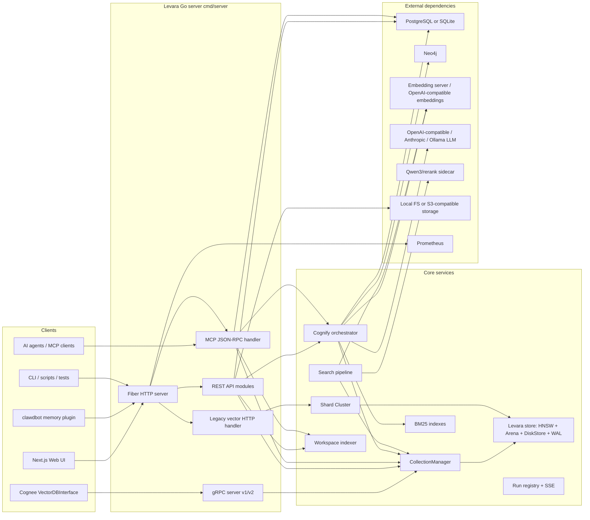
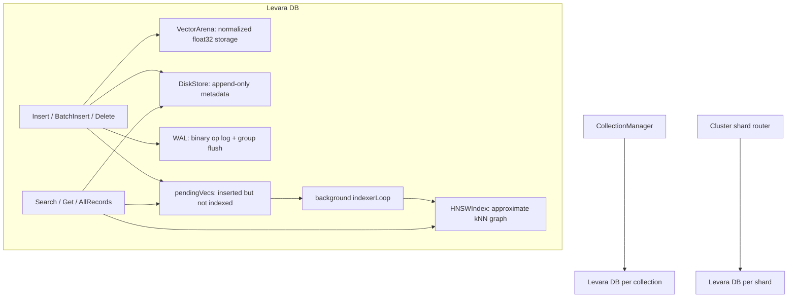
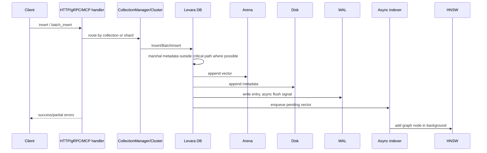
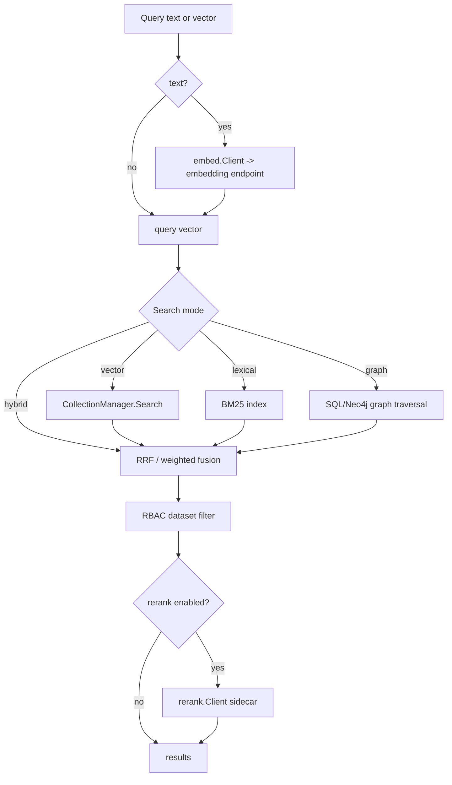
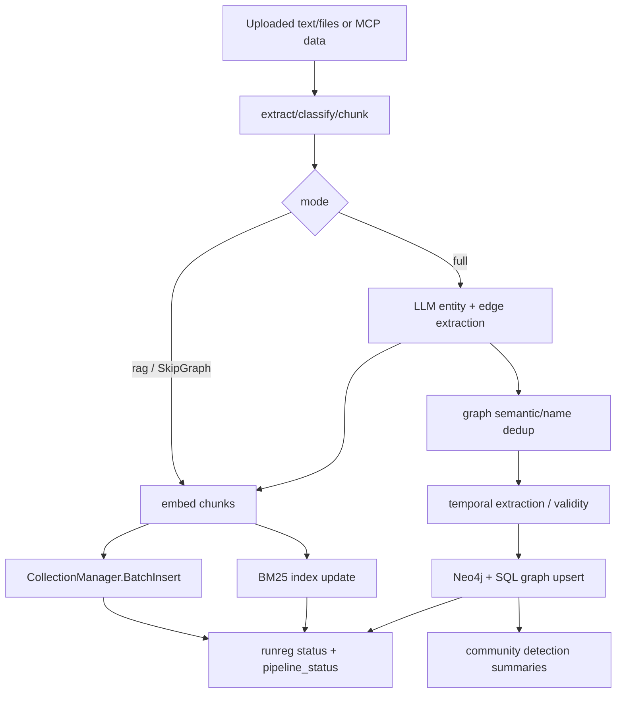
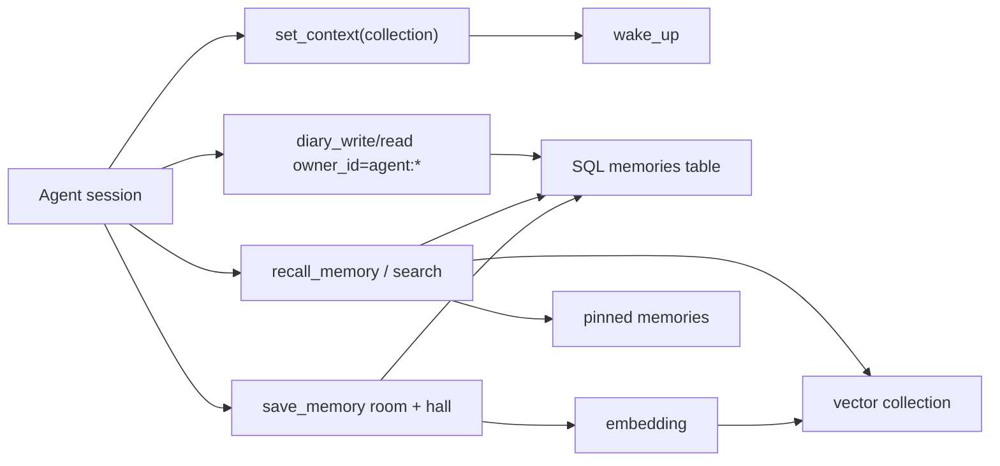
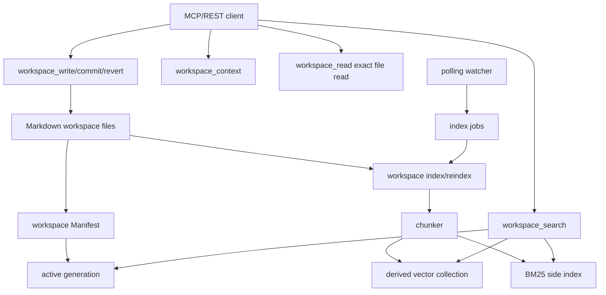

# Levara Codebase Component Analysis

Дата анализа: 2026-05-16.

Область: текущая кодовая база в `Levara/`, внешние адаптеры в `cognee-plugin/`,
расширение `clawdbot/`, Web UI в `Levara/webui/`. `Levara-legacy/` рассматривается
как историческая реализация и не включается в основную архитектуру.

## Executive Summary

Levara сейчас не только векторная БД. Это сервер памяти для AI-агентов с четырьмя
основными поверхностями:

- **gRPC v1/v2** для низколатентных операций: коллекции, vector search, chunking,
  batch embed/index, graph read/write, BM25/hybrid, pipeline cognify.
- **REST API `/api/v1`** для UI и интеграций: datasets, upload, cognify, search,
  memories, tenants/RBAC, sync, workspace, feedback, notebooks, auth.
- **MCP Streamable HTTP `/mcp`** для агентских клиентов: `cognify`, `search`,
  memory palace, graph query, workspace tools, sync, doctor, telemetry.
- **Web UI** на Next.js: dashboard, datasets, search/chat, graph, memories,
  collections, notebooks, settings.

Внутри сервер собирает несколько независимых подсистем: HNSW+WAL storage engine,
collection manager, SQL metadata store, Neo4j graph writer/reader, BM25 indexes,
LLM provider/cache, embedding client, reranker, workspace markdown indexer,
sync/import-export, observability.

## High-Level System Map

## Runtime Bootstrap

Entry point: `Levara/cmd/server/main.go`.

Startup sequence:

1. Parse flags: dimensions, ports, shard count, data dir, HNSW params, auth,
   Neo4j, Raft/replica mode, LLM proxy.
2. Initialize structured logger, error tracker, storage backend.
3. Create HNSW config and shard handlers.
4. Build `store.Cluster` over shards.
5. Optionally initialize primary/replica WAL streaming.
6. Create Fiber app, CORS, logging, `/metrics`, `/health`, `/version`, Swagger.
7. Create `CollectionManager`; wire it into legacy vector handler.
8. Open SQL DB: SQLite via `DB_PROVIDER=sqlite`, otherwise PostgreSQL if
   `DB_HOST` is set; run idempotent schema migration.
9. Register public endpoints: info, health, version, auth.
10. Install JWT/API-key middleware, per-user rate limiting, Prometheus
    instrumentation, tenant middleware.
11. Register protected legacy vector endpoints: insert, batch_insert, search,
    delete.
12. Create gRPC service and share its BM25 map with REST/MCP.
13. Initialize LLM cache, LLM provider, adaptive router, run registry,
    shared embedding client, rerank config.
14. Register REST API modules and MCP endpoint.
15. Optionally start workspace watcher/index worker.
16. Start gRPC server and Fiber HTTP server; install graceful shutdown.

## Transport Surfaces

### gRPC

Implementation: `Levara/internal/grpc/service.go`, `service_v2.go`.

Primary roles:

- Native collection lifecycle.
- Record insert/batch/delete/search/get.
- Server-side text chunking.
- File hash/list acceleration.
- Triplet processing and graph dedup.
- Batch embed + vector indexing.
- Neo4j batch graph writes.
- Search by text, batch text search, hybrid search.
- Graph read and graph completion search.
- Streaming `PipelineCognify`.
- LLM cache operations.
- BM25 index/search.
- Semantic dedup, multi-query search, ingest, extract text, temporal search.

v2 is a compatibility wrapper around v1 with aliased write names (`Add`,
`Save`, `Create`) and a smaller surface.

### REST `/api/v1`

Implementation registry: `Levara/internal/http/api.go`.

Functional groups:

| Group | Endpoints | Purpose |
|---|---|---|
| Auth/API keys | `/auth/login`, `/auth/register`, `/auth/me`, `/auth/keys` | JWT and API-key auth |
| Vector legacy | `/insert`, `/batch_insert`, `/search`, `/delete` | Direct vector ops |
| Datasets/data | `/datasets`, `/datasets/:id/data`, raw download URLs | Dataset metadata and data records |
| Upload/OCR | `/add`, `/ocr` | File/text ingestion and extraction |
| Cognify | `/cognify`, status, SSE stream | Background RAG/KG pipeline |
| Memify | `/memify`, status, SSE stream | Post-cognify graph enrichment |
| Search | `/search/text`, `/search`, `/search/dual` | Unified semantic/lexical/graph search |
| Collections | `/collections`, `/collections/:name/meta` | Collection metadata and lifecycle |
| Reembed | `/reembed`, status | Collection re-embedding migration |
| Memory | `/memories`, `/memories/:key`, stream | Project/user memory store |
| Sync | `/sync/export/*`, `/sync/import/*`, manifest | Cross-instance sync |
| Workspace | `/workspace/*` | Markdown workspace lifecycle |
| Feedback | `/feedback`, `/feedback/stats` | Search feedback and adaptive weights |
| Tenant/RBAC | `/tenants`, `/acl`, `/datasets/:id/shares` | Multi-user isolation |
| Graph | `/datasets/:id/graph`, `/graph/path`, `/visualize` | SQL/Neo4j graph reads and UI |
| Notebooks/settings/users | `/notebooks`, `/settings`, `/users/*` | UI product features |
| Ops | `/errors`, `/cache/stats`, `/heartbeats`, `/health/details` | Diagnostics |

### MCP `/mcp`

Implementation: `Levara/internal/http/mcp.go` plus tool bodies in
`Levara/pkg/mcp/tool_*.go` and HTTP-specific forwarders.

MCP exposes Levara as an agent memory substrate. The dependency boundary is
`pkg/mcp.Deps`; HTTP implements that boundary over `APIConfig`, which keeps
tool logic unit-testable and avoids importing Fiber into `pkg/mcp`.

Important tool families:

- Knowledge ingestion/search: `cognify`, `cognify_status`, `search`,
  `cross_search`, `codify`.
- Data management: `add`, `list_data`, `delete`, `prune`.
- Memory palace: `save_memory`, `recall_memory`, `list_memories`,
  `pin_memory`, `unpin_memory`, `wake_up`.
- Knowledge graph: `query_entity`, `list_communities`, `check_drift`,
  `prune_graph`.
- Chat history: `save_chat`, `recall_chat`, `search_chats`.
- Workspace: context, access check, audit log, search, read/write, index,
  reindex, reconcile, jobs, watcher, commits, revert, GC.
- Sync/ops: `sync`, `doctor`, `heartbeat`, runtime stats, ingestion status,
  recent errors, sync status.

## Storage Engine

Core package: `Levara/internal/store`.

Key properties:

- Vectors are normalized and stored in `VectorArena`.
- Metadata is append-only in `DiskStore`.
- WAL records mutations; group commit reduces fsync pressure.
- HNSW indexing is asynchronous. Pending vectors are brute-force scanned during
  search so fresh writes remain visible before indexing catches up.
- Deletes mark tombstones in HNSW and are WAL-backed.
- `CollectionManager` owns independent DB stacks per collection; `Cluster`
  routes legacy shard operations by ID hash.

## Write Path

## Search Path

Search entry points exist in REST (`api_search.go`), MCP (`tool_search.go`) and
gRPC (`SearchByText`, `HybridSearch`, `GraphCompletionSearch`,
`MultiQuerySearch`). The shared in-process path is `Levara/pipeline`.

## Cognify / Ingestion Pipeline

Core package: `Levara/pkg/orchestrator`.

The pipeline supports:

- chunk strategies: merged, paragraph, sentence, row, code, sliding, auto;
- parent/child chunking for precision/context split;
- document title/ID metadata;
- room/tags propagation for filtered recall;
- RAG-only mode without LLM/graph;
- structured LLM output when available;
- BM25 side-index update;
- SQL and Neo4j graph persistence;
- progress streaming through `runreg` and SSE/MCP status.

## SQL Metadata Schema

Migration: `Levara/internal/http/schema.go`.

Main tables:

- Auth and principals: `principals`, `users`, `api_keys`.
- Dataset/data catalog: `datasets`, `data`, `dataset_data`.
- Graph mirror: `graph_nodes`, `graph_edges` with `valid_from`,
  `valid_until`, `superseded_by`, confidence and dataset scoping.
- Multi-tenant/RBAC: `tenants`, `user_tenant`, `roles`, `user_role`, `acl`,
  `dataset_shares`.
- Product/UI: `notebooks`, `notebook_cells`, `user_settings`,
  `interactions`, `feedback`.
- Memory palace: `memories`, memory pins and chat/history related tables
  defined later in the schema file.
- Sync/ops/workspace support tables as added by later migration statements.

The code supports PostgreSQL and SQLite through `sqlcompat.go` and query
placeholder rewriting.

## Knowledge Graph

Graph functionality is split across:

- `pkg/graph`: in-memory graph primitives, triplets, dedup, LSH, multi-query.
- `pkg/graphdb`: Neo4j writer/cached writer and schema bootstrap.
- `pkg/graphstore`: SQL graph store abstraction.
- `pkg/graphrank`: graph-distance/proximity ranking.
- `pkg/community`: Louvain community detection, incremental store, pruning.
- `pkg/temporal`: timestamp extraction and time-aware search helpers.

Temporal validity model:

- Exclusive relationships such as assignment/status/ownership are superseded
  on insert.
- Edges have validity windows and can be queried as current or as-of snapshots.
- Search can mix vector hits with graph proximity and temporal filters.

## Memory Palace

Memory palace is exposed primarily through MCP and mirrored in REST memory
endpoints.

Controlled hall vocabulary is enforced in `internal/http/mcp_palace.go` /
`pkg/mcp` tool validation: `fact`, `event`, `decision`, `preference`,
`advice`, `discovery`.

## Workspace System

Workspace support is a separate markdown-native layer:

- Manifests in `pkg/workspace`.
- REST handlers in `internal/http/workspace*.go`.
- MCP tools forwarded from the same handlers.
- Optional watcher and durable index worker.
- Audit logs deliberately avoid storing markdown text and exact snippets.
- Search resolves project/branch/generation to derived vector/BM25 collections.

## External Connectors

| Connector | Code | Direction | Functionality |
|---|---|---|---|
| Cognee adapter | `cognee-plugin/levara_adapter` | Python -> gRPC | Implements Cognee `VectorDBInterface` over Levara collections/search |
| clawdbot memory plugin | `clawdbot/extensions/memory-levara` | Node -> REST | Store/recall/forget memories via `/api/v1/memories`, with NDJSON outbox |
| Embedding server | `pkg/embed`, `tools/embed_server.py` | Go -> HTTP | Batch and single text embeddings |
| LLM providers | `pkg/llm` | Go -> HTTP | OpenAI-compatible/Ollama/vLLM and Anthropic chat completions |
| Reranker | `pkg/rerank`, `cmd/qwen3rerank` | Go -> HTTP | Cross-encoder reranking with budget/gap gating |
| Neo4j | `pkg/graphdb` | Go -> Bolt | Graph visualization, graph completion, KG writes |
| PostgreSQL/SQLite | `internal/http/schema.go` | Go -> SQL | Metadata, users, memory, graph mirror, sync, RBAC |
| S3-compatible storage | `pkg/storage` | Go -> HTTP SigV4 | Raw uploads and object storage URLs |
| Prometheus | `internal/metrics` | scrape | HTTP/gRPC/search/LLM/storage metrics |
| Langfuse | `pkg/observe` | Go -> HTTP | Optional LLM tracing |

## Web UI

Location: `Levara/webui`.

Stack:

- Next.js 16, React 19, TypeScript.
- API client in `src/lib/api.ts`.
- Pages: login, dashboard, datasets, dataset detail, search, chat, graph,
  memories, collections, analytics, notebooks, settings.
- Uses `/api/v1/*`, with `NEXT_PUBLIC_API_URL` optional.
- E2E coverage in `webui/e2e`.

The UI is a consumer of the REST API, not a source of domain logic.

## Component Inventory

| Package | Responsibility |
|---|---|
| `cmd/server` | Process bootstrap, dependency wiring, route registration, shutdown |
| `cmd/cli` | Lightweight HTTP CLI |
| `cmd/backup` | Backup command |
| `cmd/reconcile` | Workspace/server reconcile tooling |
| `cmd/qwen3rerank` | Rerank sidecar server |
| `internal/store` | HNSW/Arena/WAL/DiskStore/collections/sharding primitives |
| `internal/cluster` | Direct node, Raft node, FSM snapshots, primary/replica WAL streaming |
| `internal/grpc` | gRPC v1/v2 service implementation, auth/rate/metrics interceptors |
| `internal/http` | REST/MCP HTTP layer, auth, API modules, workspace, sync, UI support |
| `internal/metrics` | Prometheus collectors and bounded user-label bucket |
| `pipeline` | In-process text/vector search helpers and rerank application |
| `pkg/mcp` | MCP tool descriptors and transport-independent tool bodies |
| `pkg/orchestrator` | Streaming cognify pipeline |
| `pkg/embed` | Embedding HTTP client, cache, local/auto embedder abstraction |
| `pkg/llm` | Provider abstraction, structured output, rate limit, tracing wrapper |
| `pkg/llmcache` | In-memory and JSONL persistent LLM response cache |
| `pkg/rerank` | Rerank HTTP client, normalization and ordering |
| `pkg/chunker` | Paragraph/sentence/row/code/sliding/parent-child chunking |
| `pkg/extract` | Text extraction from files, code, audio/OCR-related flows |
| `pkg/ingest` | File metadata writer, hash/classify/save pipeline pieces |
| `pkg/bm25` | Lexical index, persistence, hybrid helper |
| `pkg/graph` | Triplets, graph scoring, dedup, LSH, multi-query utilities |
| `pkg/graphdb` | Neo4j writer and cached writer |
| `pkg/graphstore` | SQL-backed graph store |
| `pkg/graphrank` | Graph proximity ranking |
| `pkg/community` | Louvain communities, summaries, pruning |
| `pkg/temporal` | Date/time extraction and temporal search |
| `pkg/router` | Search intent routing and adaptive weights |
| `pkg/workspace` | Markdown workspace manifest/index primitives |
| `pkg/storage` | Local/S3 storage interface |
| `pkg/auth` | JWT signing/verification helpers |
| `pkg/observe` | Structured logs, Langfuse, error tracker |
| `pkg/backup` | Tar/gzip backup and restore helper code |
| `pkg/vectorstore` | Adapter-like vector store helper over internal store |
| `pkg/fileio` | Hash and directory walk acceleration |
| `pkg/fetch` | URL fetching/extraction |
| `pkg/audio` | Whisper-compatible audio transcription client |
| `pkg/ontology` | Ontology parsing and matching |
| `pkg/runreg` | Background run status registry |
| `pkg/agenthosts` | Agent host install/config helpers |

## Deployment Shapes

Common modes inferred from code and compose files:

- **Standalone dev/local**: Fiber + gRPC + local data dir, optional SQLite.
- **Full stack**: Levara + PostgreSQL + Neo4j + Redis/other services +
  embed server + Ollama/LLM.
- **Raspberry Pi**: SQLite/local storage optimized path, setup scripts under
  `Raspberry/` and `scripts/setup-embed-pi.sh`.
- **Primary/replica**: WAL stream and snapshot endpoints under `/cluster/*`.
- **Raft mode**: Hashicorp Raft per shard, currently separate from collection
  manager path.
- **Object storage mode**: `STORAGE_BACKEND=s3`, raw data mirrored to S3-style
  backend with `storage://` metadata.

## Main Coupling Points

1. `cmd/server/main.go` is the composition root. Most dependencies are created
   there and passed through `APIConfig` or gRPC service constructors.
2. `APIConfig` is broad. It carries SQL DB, collections, embedding, LLM, BM25,
   rerank, storage, run registry, workspace watcher, logger, adaptive weights.
3. MCP depends on `pkg/mcp.Deps`; HTTP implements the interface. This is a good
   boundary despite many methods.
4. BM25 indexes are owned by gRPC service and shared into REST/MCP via
   `grpcSvc.BM25Indexes()`.
5. Run registry is shared between REST and MCP so background jobs are visible
   across transports.
6. `CollectionManager` is the central vector store for modern paths. Legacy
   no-collection HTTP still routes through `store.Cluster`.
7. SQL schema is shared by UI, MCP memory, graph mirror, auth/RBAC, sync and
   workspace ops, so migration compatibility is critical.

## Notable Risks / Complexity

- **Composition root size**: `cmd/server/main.go` wires many unrelated concerns.
  It is functional, but changes in one subsystem can easily affect startup.
- **Dual vector paths**: collection manager and legacy cluster/shard path coexist.
  This is useful for compatibility, but easy to misroute if `collection` is
  omitted.
- **Broad HTTP package**: `internal/http` contains REST, MCP adapters, workspace,
  auth, sync, search, datasets and UI product features. Boundaries are logical
  by file, not by package.
- **SQL as shared substrate**: memory, graph, users, tenants, sessions, feedback
  and workspace all share one DB handle and schema migration stream.
- **External service optionality**: Embed/LLM/Neo4j/rerank/S3 are all optional
  or env-driven. Handlers must keep nil/disabled cases robust.
- **RBAC + rerank leakage risk**: code comments explicitly note rerank must run
  after ACL prefiltering because sending forbidden text to reranker leaks data.
- **Raft vs replication vs collection manager**: there are multiple HA concepts:
  Raft shards, direct-node WAL replication, and collection-level storage.

## Suggested Next Architectural Moves

1. Split `cmd/server` wiring into small bootstrap builders:
   storage, SQL, vector, graph, LLM, REST, MCP, workspace.
2. Keep `pkg/mcp.Deps` as the agent boundary, but group methods into embedded
   interfaces by capability: memory, search, workspace, sync, observability.
3. Document which endpoints are legacy and which are canonical. Prefer
   collection-aware paths for all new features.
4. Add an architecture test that fails when REST/MCP/gRPC route registries drift
   from generated documentation.
5. Create a schema inventory generated from migration statements so SQL tables
   stay discoverable.
6. Treat workspace as a first-class package boundary if it keeps growing:
   move more workspace HTTP helper logic into `pkg/workspace`.

