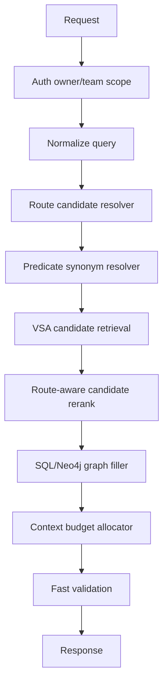

# DCD Route Narrowing Before VSA Implementation Plan

Date: 2026-06-18

Status: design plan.

## Goal

Add a DCD-style routing layer before VSA retrieval, so Levara can narrow graph
and document search by semantic domain and collection before running
VSA-before-SQL.

The target order is:

```text
owner/team scope
  -> query normalization
  -> domain/collection route candidates
  -> predicate synonym expansion
  -> VSA candidate set inside route scope
  -> SQL/Neo4j graph filler for selected candidates
  -> rerank inside candidate set
  -> context budget allocation
  -> answer/result validation
```

This keeps the current VSA-before-SQL ordering intact. The optimization happens
inside the VSA candidate set and in the route scope used before VSA retrieval.

## Source Ideas

The DCD article describes three relevant ideas:

- Organize knowledge as `Domain -> Collection -> Document`.
- Route queries through that hierarchy before retrieval.
- Use metadata filtering, reranking, structured chunk metadata, and evaluation
  against naive/global RAG baselines.

For Levara, the useful adaptation is not an LLM-only router. It is a hybrid
route candidate layer that can use deterministic metadata, predicate synonym
hints, VSA/BM25 route indexes, and optional LLM fallback.

## Baseline Before Any Implementation

Before changing code, run and persist a baseline report. This is mandatory
because the main claim is quantitative improvement.

### Baseline Modes

Run the same test corpus through these modes:

| Mode | Meaning |
|---|---|
| `global_sql_graph` | SQL/Neo4j graph context without VSA route narrowing. |
| `global_vsa_first` | Current VSA-before-SQL architecture, no DCD route filter. |
| `global_vsa_rerank` | Current VSA candidate set with existing predicate/rerank logic. |
| `oracle_route_vsa` | Uses ground-truth domain/collection labels as an upper bound. |
| `wrong_route_vsa` | Forces an incorrect route to measure failure behavior. |
| `empty_route_vsa` | No route candidates; must degrade to global VSA safely. |

`oracle_route_vsa` is not a production mode. It gives the maximum possible
quality lift from perfect routing and shows whether implementing the router is
worth the complexity.

### Baseline Datasets

Use two datasets:

1. Existing synthetic graph fixtures in Levara:
   - `context_budget`
   - `fanout`
   - `predicate_specific`
   - `distractor_heavy`
   - mixed production-like graph context cases

2. DCD-like external benchmark import:
   - 15 domains
   - 5 collections per domain
   - document-level labels
   - QA rows with expected `domain`, `collection`, `document`, answer, and
     supporting context

The external dataset should be normalized into Levara fixtures rather than used
as a runtime dependency in ordinary tests.

### Baseline Metrics

Retrieval quality:

- `domain_accuracy@1`
- `domain_recall@3`
- `collection_accuracy@1`
- `collection_recall@3`
- `document_recall@k`
- `fact_recall@k`
- `MRR`
- `nDCG@k`
- `predicate_precision@k`
- `context_recall`
- `distractor_rate`
- `tenant_leak_rate`
- `expired_leak_rate`

Generation/answer quality, when answer generation is enabled:

- factual accuracy
- answer relevance
- answer completeness
- unsupported claim rate
- citation/context coverage

Performance:

- p50/p95/p99 latency for route, VSA, SQL filler, rerank, total handler
- throughput QPS
- route cache hit rate
- memory allocated/op
- SQL query count/request
- VSA predicate probes/request
- context tokens used vs useful facts included

### Baseline Outputs

Add deterministic report files:

```text
benchmark/results/dcd_vsa_baseline_latest.json
docs/dcd-vsa-baseline-report.md
```

The JSON report must include:

- git SHA
- timestamp
- mode
- scenario
- case ID
- query
- expected domain/collection/document
- selected route candidates
- final context item IDs
- quality metrics
- latency breakdown

The markdown report should contain aggregate tables and a short interpretation.

### Baseline Commands

Proposed commands:

```bash
go test ./internal/http -run TestDCDVSABaselineEval -count=1 -v
LEVARA_WRITE_DCD_VSA_BASELINE_REPORT=1 go test ./internal/http -run TestDCDVSABaselineEval -count=1 -v
LEVARA_HEAVY_DCD_VSA_EVAL=1 go test ./internal/http -run TestDCDVSABaselineEval -count=1 -v
```

For load-only baseline:

```bash
LEVARA_DCD_VSA_LOAD_CASES=10000 go test ./internal/http -run TestDCDVSALoadBaseline -count=1 -v
```

Do not enforce strict performance budgets in regular CI. Record speed metrics
always, and enforce budgets only with:

```bash
LEVARA_ENFORCE_PERF_BUDGETS=1
```

## Target Architecture



### Core Types

```go
type routeCandidate struct {
    DomainID     string
    CollectionID string
    DocumentID   string
    Confidence   float64
    Source       string // metadata, bm25, vsa, llm, oracle-test
    Reason       string
}

type routePolicy struct {
    MaxDomains       int
    MaxCollections   int
    MaxDocuments     int
    MinConfidence    float64
    AllowGlobalFallback bool
}

type routedSearchScope struct {
    OwnerID       string
    TeamID        string
    DatasetIDs    []string
    DomainIDs     []string
    CollectionIDs []string
    DocumentIDs   []string
}
```

### Data Model

Add route metadata without breaking existing collection semantics:

```text
knowledge_domains
  id
  owner_id
  team_id
  dataset_id
  name
  description
  aliases_json
  embedding_ref
  created_at
  updated_at

knowledge_collections
  id
  domain_id
  owner_id
  team_id
  dataset_id
  name
  description
  aliases_json
  embedding_ref
  created_at
  updated_at

knowledge_documents
  id
  collection_id
  domain_id
  owner_id
  team_id
  dataset_id
  source_document_id
  title
  description
  aliases_json
  created_at
  updated_at
```

Chunk/document metadata should include:

- `domain_id`
- `collection_id`
- `document_id`
- `section_path`
- `chunk_index`
- `prev_chunk_id`
- `next_chunk_id`
- `owner_id`
- `team_id`
- `dataset_id`

Graph edge/fact metadata should include the same route fields when known.

### Router Strategy

The router should be hybrid and cheap:

1. Hard filters:
   - owner/team access
   - allowed dataset IDs
   - explicit user-provided collection/domain filters

2. Deterministic hints:
   - exact domain/collection alias matches
   - document title matches
   - predicate synonym map
   - tags/room/hall metadata

3. Route index retrieval:
   - BM25 over route names/descriptions/aliases
   - optional VSA/embedding over route descriptions

4. Optional LLM fallback:
   - only when confidence is low or candidates are ambiguous
   - structured JSON output
   - bounded route list input

5. Multi-route fallback:
   - top-1 route when confidence is high
   - top-2/top-3 when ambiguous
   - global VSA fallback when no route passes threshold

Never use a single low-confidence route as a hard filter.

### VSA Integration

Current VSA-before-SQL stays as the core retrieval order.

Changes:

- pass `routedSearchScope` into VSA graph context retrieval
- filter candidate facts by route metadata when route confidence is sufficient
- use route confidence as a rerank feature, not only as a filter
- preserve global fallback and owner/team constraints

Candidate scoring:

```text
score =
  vsa_score
  + predicate_match_score
  + route_confidence_boost
  + same_document_continuity_boost
  + graph_proximity_boost
  + owner_scope_boost
  - distractor_penalty
  - expired_fact_penalty
```

### SQL/Neo4j Integration

SQL and Neo4j remain filler after VSA.

Rules:

- SQL graph reads must receive the same owner/team/dataset scope.
- Route scope can narrow SQL filler, but cannot bypass `AllowedDatasetIDs`.
- If VSA returns too few facts, SQL filler can widen from document to
  collection, then domain, then dataset.
- The response debug metadata must show route and widening decisions.

### Context Budget Allocation

Default:

```text
total_graph_context_limit = 20
vsa_reserved_limit = 10
route_primary_limit = 12
sql_filler_limit = remaining
continuation_chunk_limit = 3
```

Budget allocation order:

1. exact route + predicate-specific VSA facts
2. exact route + adjacent/continuation facts
3. sibling collection facts only if query is broad or VSA count is low
4. SQL/Neo4j filler
5. global fallback only if route confidence is low or no scoped facts exist

## Implementation Tasks

### Phase 0: Baseline and Fixtures

- Create DCD-like fixture generator.
- Import/normalize external DCD-style labels into Levara test fixtures.
- Implement `TestDCDVSABaselineEval`.
- Implement `TestDCDVSALoadBaseline`.
- Persist baseline JSON and markdown reports.
- Add scenario coverage for at least 13 cases per scenario:
  - context budget pressure
  - fan-out
  - predicate-specific query
  - distractor-heavy corpus
  - ambiguous domain names
  - overlapping collections
  - document title collision
  - stale/expired facts
  - cross-tenant facts
  - missing route metadata
  - multilingual aliases
  - low-confidence query
  - broad exploratory query

Acceptance:

- baseline reports are generated before router implementation
- global vs oracle route gap is visible
- all metrics are deterministic enough for CI quality assertions

### Phase 1: Schema and Metadata

- Add route schema for domains/collections/documents.
- Add route metadata to graph facts/chunks where available.
- Add migration for SQLite and Postgres.
- Update contract artifacts.
- Add access policy checks for route rows.

Acceptance:

- schema migration is idempotent
- contract-check passes
- owner/team isolation tests pass

### Phase 2: Route Candidate Resolver

- Implement `routeCandidateResolver`.
- Add deterministic alias matcher.
- Add BM25 route index.
- Add optional VSA/embedding route index behind config.
- Add optional LLM fallback interface, mocked in tests.
- Add debug metadata.

Acceptance:

- route resolver returns stable top-k candidates
- low confidence returns multi-route or global fallback
- no route can cross owner/team boundaries

### Phase 3: VSA Scope Integration

- Add `routedSearchScope` to VSA graph context code.
- Apply route filters before candidate expansion when safe.
- Add route confidence boost to VSA candidate rerank.
- Keep existing predicate synonym behavior.
- Keep global fallback when route scope produces too little context.

Acceptance:

- VSA-before-SQL order is unchanged
- route-aware VSA improves distractor-heavy and context-budget metrics
- wrong route test degrades safely without tenant leaks

### Phase 4: SQL/Neo4j Filler Widening

- Apply the same route scope to SQL/Neo4j filler.
- Implement widening sequence:
  - document
  - collection
  - domain
  - dataset/global allowed scope
- Add debug counters for each widening level.

Acceptance:

- SQL filler does not consume protected VSA budget
- broad queries can still retrieve enough context
- route filter never bypasses access policy

### Phase 5: Context Continuity

- Add section path and adjacent chunk/fact continuity boosts.
- Deduplicate by normalized route + subject + predicate + object.
- Prefer facts from the same document/section when answer needs continuity.

Acceptance:

- multi-part document questions improve context recall
- duplicate facts do not waste budget

### Phase 6: Fast Validation

- Add lightweight validation after context assembly and before final response:
  - no route selected and no context -> explicit no-context result
  - tenant leak detector
  - unsupported route/document citation detector
  - expired fact detector
- For streaming answers, support early first-token validation later.

Acceptance:

- validation blocks cross-tenant and no-context false positives
- validation latency is measured separately

## Corner Cases

### Routing

- Query matches two domains with similar names.
- Query mentions collection alias but no domain.
- Query mentions document title shared by multiple tenants.
- Query is broad: "what do we know about billing?"
- Query is narrow: "who owns Checkout webhook retries?"
- Query includes old name/alias after rename.
- Query includes typo or transliteration.
- Query mixes languages.
- Query has no route signal.
- Query route signal conflicts with predicate signal.
- User supplies explicit dataset filter that conflicts with route result.
- Route metadata is missing for some chunks/facts.
- Route row exists but has no indexed description.

### Access and Isolation

- Same domain/collection names across owners.
- Same document title across teams.
- Team member loses access after route cache entry is created.
- Dataset deleted but route rows remain.
- Expired graph edge remains in VSA shard.
- Route fallback must not widen outside allowed datasets.

### Retrieval

- VSA index empty.
- VSA index stale after graph mutation.
- Predicate synonym map missing.
- Predicate synonym map over-expands to generic predicates.
- SQL graph contains facts not yet in VSA.
- VSA contains facts no longer visible in SQL.
- Huge fan-out entity.
- Many short documents with identical boilerplate.
- Long document where answer spans adjacent chunks.
- Context budget too small for route + predicate + filler.

### Performance

- 10k route candidates.
- 100k documents.
- 1M graph facts.
- Large alias map.
- Cache cold start.
- Cache invalidation after ingestion.
- Concurrent searches during route rebuild.
- LLM fallback timeout.
- Route index rebuild while search is running.

## Test Design

### Unit Tests

- route alias normalization
- route scoring
- multi-route fallback
- route confidence thresholds
- owner/team route filtering
- dataset deletion cleanup
- route cache invalidation
- route-aware VSA score composition
- SQL widening policy
- context budget allocator
- validation guardrails

### Integration Tests

- `TestDCDRouterSelectsDomainAndCollection`
- `TestDCDRouterFallsBackOnLowConfidence`
- `TestDCDRouterDoesNotCrossOwner`
- `TestDCDVSAImprovesDistractorHeavyRecall`
- `TestDCDVSAImprovesContextBudgetRecall`
- `TestDCDVSAKeepsVSAFirstBeforeSQL`
- `TestDCDVSAWrongRouteDegradesSafely`
- `TestDCDVSAEmptyRouteUsesGlobalFallback`
- `TestDCDVSAMissingMetadataStillSearchesAllowedScope`
- `TestDCDVSAMultilingualAliases`
- `TestDCDVSADocumentTitleCollision`
- `TestDCDVSASQLWideningOrder`
- `TestDCDVSAValidationBlocksTenantLeak`

### Quantitative Eval

For every scenario, run at least 13 cases:

| Scenario | What it measures |
|---|---|
| context_budget | Does route narrowing preserve useful facts under tight prompt budget? |
| fanout | Does route narrowing avoid generic fan-out waste? |
| predicate_specific | Does route + predicate synonym routing find the right edge type? |
| distractor_heavy | Does route narrowing suppress semantically plausible wrong facts? |
| ambiguous_route | Does multi-route fallback preserve recall? |
| missing_metadata | Does fallback work for partially migrated data? |
| tenant_collision | Does access policy dominate route similarity? |
| stale_vsa | Does validation/fallback handle index drift? |
| multilingual_alias | Does alias routing work across Russian/English/translit? |
| broad_query | Does widening avoid over-filtering? |

Quality report modes:

- `global_vsa_first`
- `dcd_route_filter_vsa`
- `dcd_route_boost_vsa`
- `dcd_route_filter_and_boost_vsa`
- `oracle_route_vsa`
- `wrong_route_vsa`

Required lift targets before default enablement:

- distractor-heavy `fact_recall@k`: +0.10 or better vs global VSA
- context-budget `nDCG@k`: +0.10 or better vs global VSA
- tenant leak rate: exactly 0
- wrong-route graceful fallback: at least 0.70 of global VSA recall
- p95 latency overhead: measured and reported; strict budget only in perf mode

### Load Tests

Synthetic corpus sizes:

| Profile | Domains | Collections/domain | Documents | Facts | Queries |
|---|---:|---:|---:|---:|---:|
| small | 15 | 5 | 300 | 10k | 1k |
| medium | 100 | 10 | 10k | 250k | 10k |
| large | 500 | 20 | 100k | 1M | 50k |

Load metrics:

- route p50/p95/p99
- VSA p50/p95/p99
- SQL filler p50/p95/p99
- total searchHandler p50/p95/p99
- QPS
- allocation/op
- cache hit rate
- route rebuild time
- VSA rebuild time
- synonym refresh time
- error/fallback rate

Commands:

```bash
LEVARA_DCD_VSA_LOAD_PROFILE=small go test ./internal/http -run TestDCDVSALoad -count=1 -v
LEVARA_DCD_VSA_LOAD_PROFILE=medium go test ./internal/http -run TestDCDVSALoad -count=1 -v
LEVARA_DCD_VSA_LOAD_PROFILE=large go test ./internal/http -run TestDCDVSALoad -count=1 -v
```

The large profile should be opt-in and not part of regular CI.

## Rollout Plan

1. Ship baseline-only tests and reports.
2. Ship schema and metadata ingestion behind disabled feature flag.
3. Ship router in observe-only mode:
   - compute route
   - log route
   - do not filter retrieval
4. Enable route boost only:
   - use route confidence in rerank
   - no hard filtering
5. Enable route filtering for high-confidence cases.
6. Enable multi-route fallback.
7. Promote to default if quality lift is stable and leak rate remains zero.

Feature flags:

```text
LEVARA_DCD_ROUTER=off|observe|boost|filter
LEVARA_DCD_ROUTER_LLM_FALLBACK=0|1
LEVARA_DCD_ROUTER_MAX_DOMAINS=3
LEVARA_DCD_ROUTER_MAX_COLLECTIONS=5
LEVARA_DCD_ROUTER_MIN_CONFIDENCE=0.70
LEVARA_ENFORCE_PERF_BUDGETS=0|1
```

## Acceptance Criteria

Implementation is ready when:

- baseline report exists before code changes
- route-aware report shows lift over `global_vsa_first`
- oracle route upper bound is documented
- wrong route and empty route degrade safely
- tenant leak and expired leak rates are zero
- `go test ./...` passes
- `go test -race ./...` passes in CI
- contract-check passes
- load report is persisted for at least small and medium profiles
- feature flag supports rollback without schema rollback

## Risks

| Risk | Mitigation |
|---|---|
| Router over-filters and hurts recall | multi-route fallback, boost-only rollout, oracle/wrong-route tests |
| Route taxonomy becomes stale | ingestion refresh, alias table, route rebuild job |
| LLM router adds latency/cost | deterministic first, LLM only fallback, strict timeout |
| Similar tenants leak via shared names | owner/team filters before route scoring |
| Performance tests become flaky | record metrics by default, enforce budgets only in perf mode |
| Route metadata incomplete after migration | missing-metadata fallback to allowed global VSA |

## First Implementation PR Scope

The first PR should not implement the full router. It should implement:

1. baseline eval fixtures and reports
2. route metadata structs and test-only oracle route mode
3. `global_vsa_first` vs `oracle_route_vsa` comparison
4. load baseline harness

This gives a quantitative decision point before production code changes.
