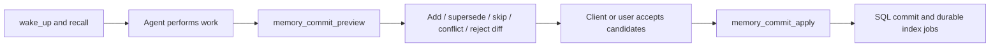

# Memory Commit — transactional session closeout for agent memory

**Status:** proposal
**Date:** 2026-08-06
**Owner:** TBD

## Summary

Levara exposes strong low-level memory primitives, but ordinary MCP clients
still need prompt discipline to recall before writing, choose `room × hall`,
avoid duplicates, preserve supersession history, and keep secrets or temporary
state out of durable memory.

This proposal adds **Memory Commit**, a client-neutral, two-phase closeout flow:

1. an agent submits a small set of structured memory candidates;
2. Levara validates them and returns a deterministic memory diff;
3. the client or user accepts all or part of that diff;
4. Levara applies the accepted plan atomically and enqueues vector indexing.

The proposed MCP tools are:

- `memory_commit_preview`
- `memory_commit_apply`

`save_memory` remains available as the low-level single-record primitive.

## Problem

The hardest part of durable agent memory is not storage. It is consistent
memory behavior across Codex, Claude, Cursor, custom Agent SDK clients, and
future MCP hosts.

Today every client must independently implement the following workflow:

- select the correct collection;
- recall before recommending or saving;
- distinguish durable outcomes from temporary task state;
- select the correct hall;
- search for duplicates;
- decide whether to add, skip, or supersede;
- avoid secrets and raw transcripts;
- attach provenance when available;
- report what was written.

Agent skills and project instructions can encode that policy, but they are
client-specific, easy to omit, and difficult to evaluate consistently. A
single `save_memory` call also cannot show the user the effect of a group of
related candidate writes before they happen.

## Existing features and the remaining gap

| Existing surface | What it does | What Memory Commit adds |
| --- | --- | --- |
| `save_memory` | Upserts one memory and indexes it | Batch diff, duplicate decisions, conflicts, approval, and atomic apply |
| Memory Behavior | Measures recall/save discipline from sanitized MCP trajectories | Content-level closeout supplied explicitly by the client |
| Memory Scaffold | Proposes improvements to agent instructions and memory policy | Commits durable memory values, not policy text |
| Consolidation | Merges or cleans existing memories | Prevents noisy or conflicting writes before insertion |
| Long-Horizon candidates | Promotes verified memories when a Task completes | Works for ordinary MCP sessions without Task Runtime |

Memory Commit should reuse these primitives and metrics rather than create a
parallel memory model.

## Goals

1. Give all MCP clients one bounded end-of-session memory workflow.
2. Show an explicit add/supersede/skip/conflict/reject diff before mutation.
3. Make retries idempotent and concurrent changes detectable.
4. Apply accepted memory rows and durable index jobs in one SQL transaction.
5. Preserve owner, tenant, collection, room, hall, and provenance boundaries.
6. Reject high-confidence credentials and invalid memory shapes before write.
7. Keep the first release deterministic and usable without an LLM provider.
8. Leave `save_memory` backward compatible.

## Non-goals

- Mining raw chat history on the server.
- Persisting a full session transcript.
- Replacing Long-Horizon Task Runtime checkpoints or receipts.
- Replacing Memory Behavior or Scaffold proposals.
- Automatically pinning committed memories.
- Treating semantic similarity as proof that two memories are equivalent.
- Making vector indexes the source of truth.

## User experience



Example preview summary:

```text
+ add        idle-polling-root-cause
~ supersede  worker-poll-default
= skip       duplicate deployment fact
? conflict   auth-provider-decision changed without supersession target
! reject     candidate contains a possible credential
```

The client remains responsible for deciding when work is complete and for
constructing concise candidates. Levara owns validation, comparison, planning,
authorization, concurrency control, and persistence.

## MCP contract

### `memory_commit_preview`

Create or return an idempotent prepared commit plan. Preview does not mutate
the `memories` table, pin state, graph, or vector collections. Persisting the
short-lived plan itself is allowed so apply can detect races and survive a
client retry.

Example input:

```json
{
  "collection": "levara",
  "idempotency_key": "codex-task-7f39-closeout-v1",
  "candidates": [
    {
      "candidate_id": "idle-polling-root-cause",
      "room": "memory-index",
      "hall": "discovery",
      "key": "idle-polling-root-cause",
      "value": "Symptom: idle CPU remained high. Root cause: every worker polled the durable outbox at a very short interval. Fix: use a configurable conservative interval while continuing to drain an active backlog without delay. Validation: compare idle CPU samples and verify save and recall.",
      "verification_status": "verified",
      "source_task_id": "",
      "source_receipt_ids": []
    }
  ]
}
```

Required request rules:

- `collection` must be non-empty and authorized for the caller.
- `idempotency_key` must be non-empty and scoped to owner plus collection.
- `candidates` must contain 1–20 entries in v1.
- `candidate_id`, `room`, `hall`, `key`, and `value` are required.
- `hall` uses the existing controlled vocabulary.
- `verification_status`, `source_task_id`, `source_receipt_ids`, and
  `supersedes_memory_id` use the existing memory provenance model.
- Candidate values use the same size ceiling as `save_memory`.

Example output:

```json
{
  "commit_id": "mc_01J...",
  "status": "prepared",
  "collection": "levara",
  "plan_digest": "sha256:...",
  "expires_at": "2026-08-06T12:30:00Z",
  "summary": {
    "add": 1,
    "supersede": 0,
    "skip": 0,
    "conflict": 0,
    "reject": 0
  },
  "items": [
    {
      "candidate_id": "idle-polling-root-cause",
      "action": "add",
      "reason_code": "no_equivalent",
      "reason": "no equivalent memory found",
      "target_memory_id": "",
      "warnings": []
    }
  ]
}
```

Every preview item must include a stable `reason_code` plus human-readable
`reason`. Initial v1 codes:

| `reason_code` | Typical action |
| --- | --- |
| `no_equivalent` | `add` |
| `exact_duplicate` | `skip` |
| `key_conflict` | `conflict` |
| `explicit_supersede` | `supersede` |
| `stale_target` | `reject` or stale-plan conflict on apply |
| `secret_rejected` | `reject` |
| `schema_invalid` | `reject` |
| `unauthorized` | `reject` |

Allowed item actions:

| Action | Meaning | Apply behavior |
| --- | --- | --- |
| `add` | No equivalent live memory exists | Insert a new memory |
| `supersede` | Candidate explicitly and safely replaces an existing memory | Use the `supersede_memory` state transition: archive the old row (`superseded_by` / `valid_until`) and insert the replacement in the same SQL transaction as index-outbox enqueue. Do **not** implement this via `save_memory` upsert or provenance-only `supersedes_memory_id` |
| `skip` | Candidate is an exact or normalized duplicate | No memory mutation |
| `conflict` | Existing memory differs and intent is ambiguous | Require a new preview with explicit intent |
| `reject` | Invalid, unauthorized, unsafe, or unsupported candidate | Cannot be accepted |

### `memory_commit_apply`

Atomically apply selected actionable items from a prepared plan.

Example input:

```json
{
  "commit_id": "mc_01J...",
  "plan_digest": "sha256:...",
  "accepted_candidate_ids": ["idle-polling-root-cause"]
}
```

If `accepted_candidate_ids` is omitted, apply every `add` and `supersede`
item. `skip` items remain no-ops. `conflict` and `reject` items are never
applied.

Example output:

```json
{
  "commit_id": "mc_01J...",
  "status": "applied",
  "added": 1,
  "superseded": 0,
  "skipped": 0,
  "index_jobs": [
    {
      "memory_id": "...",
      "job_id": "...",
      "status": "pending"
    }
  ]
}
```

Repeated apply calls with the same commit ID and digest return the original
result. They must not create additional rows or index jobs.

## Deterministic planning rules

Run rules in this order:

1. Validate authorization, collection, schema, hall, size, and provenance.
2. Reject high-confidence secret patterns before storing a plan value.
3. Compare the normalized key and value digest with live memories owned by the
   caller in the same collection.
4. Classify an exact key and equivalent value as `skip`.
5. Classify an existing key with a different value as `conflict` unless the
   candidate identifies the intended `supersedes_memory_id`.
6. Validate an explicit supersession target for owner, collection, live state,
   and current digest; then classify it as `supersede`.
7. Use semantic similarity only to attach duplicate warnings in v1. Do not
   automatically skip or supersede based on embeddings.
8. Classify the remaining candidate as `add`.

The output must include a stable `reason_code` in addition to human-readable
`reason` so clients and evals do not parse prose.

## Persistence and atomicity

Introduce durable prepared-plan state with a short TTL. One possible schema is:

```text
memory_commits
  id, owner_id, collection_name, idempotency_key
  status, plan_digest, plan_json, result_json
  created_at, expires_at, applied_at
```

The exact schema is an implementation detail, but the following invariants
are required:

- `(owner_id, collection_name, idempotency_key)` is unique.
- A prepared plan records the IDs and digests of memories it compared.
- Apply revalidates those observations before mutation.
- A changed comparison target makes the plan stale and returns a conflict;
  the server never silently recalculates a different apply plan.
- Accepted memory writes and `MemoryIndexOutbox.EnqueueTx` calls occur in the
  same SQL transaction for SQLite and PostgreSQL.
- A `supersede` apply must perform the same row transition as
  `supersede_memory` (archive old key / set `superseded_by` and `valid_until`,
  then insert the replacement) inside that transaction. `save_memory` upsert
  semantics are forbidden for this action.
- A transaction failure leaves both memories and index jobs unchanged.
- Vector indexing remains asynchronous and observable through existing index
  job status and reconciliation surfaces.

This is an application-level prepare/apply protocol, not a distributed
two-phase database commit.

## Authorization and privacy

Memory Commit must follow the exact authentication and ownership path used by
existing memory tools.

- Resolve the caller from the MCP request context.
- Scope every lookup and mutation by owner or explicitly shared memory rules.
- Enforce collection and tenant membership before previewing existing data.
- Never reveal conflicting memory values to an unauthorized caller.
- Do not write candidate values, existing values, or detected secrets to
  access logs, heartbeat metadata, metrics labels, or audit summaries.
- Store hashes and bounded metadata in audit records where possible.
- Reject high-confidence API keys, bearer tokens, private keys, passwords,
  and credential assignments. Return only the detector category and candidate
  ID, not the matched secret.
- Keep secret detection deterministic in v1. An optional external scanner can
  be added behind a separate interface later.

The server does not inspect raw chat history. Only candidates intentionally
submitted by the authorized client cross this boundary.

## Concurrency and lifecycle

- Default prepared-plan TTL: 30 minutes.
- `preview` retry with the same idempotency key returns the same live plan.
- Reusing an idempotency key with a different request digest returns a
  conflict.
- `apply` requires the exact `plan_digest` returned by preview.
- Only `prepared` plans can transition to `applied` or `expired`.
- Apply obtains the required database locks or uses optimistic digest checks
  so two commits cannot silently supersede the same memory.
- Expiration removes candidate values according to the normal data-retention
  policy; it does not affect already applied memories.

## Relationship to client skills

An Agent Skill remains useful for deciding when to recall and which outcomes
are worth proposing. Memory Commit does **not** replace the canonical
immediate-save policy in `AGENTS.md` / `levara_instructions`. Agents should
still call `save_memory` (or `supersede_memory`) as soon as a durable decision,
discovery, preference, advice, or dated event is verified.

Memory Commit is an additional reconciliation / closeout path for a small set
of curated candidates: duplicate detection, explicit supersession, conflict
surfaces, approval, and atomic apply. Once it exists, the skill can prefer
preview/apply for that closeout instead of hand-rolling duplicate and
supersession policy through multiple MCP calls, while mid-session immediate
saves remain valid.

The complementary closeout becomes:

```text
immediate save_memory / supersede_memory for verified outcomes during work
    -> optional memory_commit_preview for remaining curated candidates
    -> present or inspect the diff
    -> memory_commit_apply
```

This keeps policy portable across clients while leaving judgment about task
meaning with the agent and user.

## Tool profiles and rollout

Recommended rollout:

1. **Phase 0 — contract and eval fixtures**
   - agree on schemas, reason codes, and threat model;
   - add golden preview fixtures without registering public tools.
2. **Phase 1 — deterministic preview**
   - exact duplicate, explicit supersession, conflict, schema validation, and
     secret rejection;
   - expose behind `LEVARA_MEMORY_COMMIT=1` in the `memory` and `full` toolsets.
3. **Phase 2 — atomic apply**
   - durable plans, TTL, optimistic revalidation, SQL transaction, index
     outbox, idempotent results, and audit events.
4. **Phase 3 — client integration**
   - update or add a client memory skill so closeout prefers Memory Commit when
     the tools are available, while preserving immediate mid-session saves;
   - keep a `save_memory` / `supersede_memory` fallback for `core` and for
     hosts that do not enable `LEVARA_MEMORY_COMMIT`;
   - add WebUI review for prepared commits if real usage demonstrates demand.
5. **Phase 4 — broader default**
   - consider adding the tools to `core` after behavior metrics and security
     canaries meet agreed thresholds.

Do not make semantic similarity an automatic mutation rule during the initial
rollout.

## Observability

Suggested metrics:

```text
levara_memory_commit_previews_total{outcome}
levara_memory_commit_candidates_total{action,reason}
levara_memory_commit_applies_total{outcome}
levara_memory_commit_apply_latency_seconds
levara_memory_commit_stale_plans_total
levara_memory_commit_secret_rejections_total{category}
```

Useful behavior indicators:

- duplicate candidate rate;
- conflict rate;
- preview-to-apply conversion;
- partial-acceptance rate;
- indexing failure rate after apply;
- average candidates per commit;
- memory recall usefulness before and after rollout.

Never place collection names, memory keys, candidate text, owner IDs, or
secret fragments in metric labels.

## Test matrix

### Contract

- input and output schemas validate for both tools;
- unknown halls and missing room/key/value are rejected;
- result arrays are present and empty rather than `null`;
- reason codes are stable and documented.

### Planning

- new memory -> `add`;
- same key and equivalent value -> `skip`;
- same key and different value -> `conflict`;
- valid explicit target -> `supersede`;
- stale or cross-owner target -> `reject` without data disclosure;
- semantic near-duplicate -> warning only;
- high-confidence credential -> `reject`.

### Apply

- selected items apply atomically;
- partial acceptance applies only selected actionable items;
- repeated apply is idempotent;
- request-digest mismatch is rejected;
- expired plan is rejected;
- changed comparison target returns stale-plan conflict;
- SQL failure rolls back memories and outbox jobs;
- successful apply produces one durable index job per changed memory.

### Isolation and security

- owners and tenants cannot preview each other's conflicts or values;
- collection authorization is enforced during preview and apply;
- logs, metrics, audit records, and errors contain no candidate values or
  secret fragments;
- concurrent commits cannot silently overwrite or supersede each other.

### Compatibility

- existing `save_memory`, recall, consolidation, and Task Runtime behavior is
  unchanged when the feature flag is disabled;
- SQLite and PostgreSQL produce equivalent plans and apply results;
- feature-disabled tool profiles do not advertise the new tools.

## Alternatives considered

### Keep the workflow entirely in Agent Skills

This is useful immediately but duplicates policy across clients and cannot
offer an atomic server-validated diff.

### Automatically summarize raw conversations

This creates privacy, prompt-injection, cost, and memory-noise risks. Memory
Commit intentionally accepts explicit structured candidates instead.

### Extend `save_memory` with more flags

A single upsert cannot represent a batch plan, partial approval, stale-plan
check, or transaction-wide result without turning the existing primitive into
a breaking state machine.

### Require Long-Horizon Task Runtime

Task memory candidates already provide strong evidence-based promotion, but
ordinary coding and conversational sessions should not need an alpha task
runtime merely to close out memory safely.

## Open questions

1. Should prepared plans store encrypted candidate values when an external KMS
   is configured, or should v1 use only the existing database-at-rest model?
2. Should unverified candidates be allowed as `add` with a warning, or always
   rejected from Memory Commit while remaining available through
   `save_memory`?
3. Should `memory_commit_apply` support a client-supplied decision note for
   each accepted conflict resolution?
4. Is a 30-minute TTL appropriate for WebUI approval, or should UI-created
   plans use a separate longer-lived review queue?
5. Which deterministic secret patterns have an acceptable false-positive
   rate for the initial gate?
6. Should `core` include Memory Commit after stabilization, or should it remain
   exclusive to `memory` and `full`?

## Acceptance criteria for an implementation PR

- The MCP contract and reason codes are covered by deterministic tests.
- Preview performs no durable memory or vector mutation.
- Apply is idempotent, owner-scoped, stale-plan safe, and SQL-atomic with index
  outbox writes.
- Candidate values and detected secrets do not appear in logs or metrics.
- SQLite and PostgreSQL behavior is equivalent.
- Existing memory and Long-Horizon tests remain green.
- Feature-disabled deployments expose no new tools or behavior changes.
- Documentation includes a client closeout example and operational metrics.
