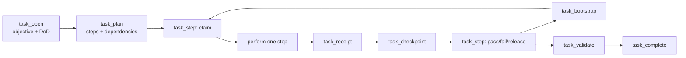

# Long-Horizon Task Runtime

[Русская версия](long-horizon-runtime.ru.md)

Long-Horizon Task Runtime is Levara's alpha execution ledger for work that must
survive context compaction, process restarts, agent handoffs, or scheduled
continuation. It stores the task objective, authority, Definition of Done,
versioned plan, atomic step leases, immutable evidence, checkpoints, blockers,
and completion state in SQL.

Task Runtime does not execute work by itself and does not grant additional
authority. An agent or host performs the work; Levara makes its state and proof
recoverable and validates completion deterministically.

## Enable it

Task tools are hidden unless the feature flag is enabled. Set both variables
before starting the server:

```bash
export DB_PROVIDER=sqlite
export DB_PATH=./data/levara.db
export LEVARA_LONG_HORIZON_RUNTIME=1
export LEVARA_MCP_TOOLSET=long-horizon
./levara-server -profile=standalone -port=8080 -grpc-port=0
```

The `full` tool profile also includes Task Runtime tools while the flag is on.
Restart the server and reconnect the MCP client after changing either variable
so the client refreshes `tools/list`.

SQLite and PostgreSQL are supported, but Task Runtime cannot operate in the
WAL-only configuration where the SQL database is disabled. Artifact receipts
additionally require a configured local storage/workspace root or
object-storage backend.

Verify the runtime:

- `runtime_stats` must report `task_runtime.enabled=true`;
- `doctor` must report a reachable Task Runtime schema and no orphan records;
- the MCP tool list must contain the eight `task_*` tools below.

## Lifecycle



| Tool | Responsibility |
|---|---|
| `task_open` | Create or idempotently reopen a task scoped to one collection and room |
| `task_plan` | Save an acyclic step plan before execution starts |
| `task_bootstrap` | Recover bounded task state, next eligible step, blockers and scoped memories |
| `task_step` | Atomically claim, renew, release, pass or fail a step lease |
| `task_receipt` | Append immutable command, artifact, source, observation or reviewer evidence |
| `task_checkpoint` | Save compact recovery state, add/resolve blockers and propose durable memories |
| `task_validate` | Report missing, stale or failed evidence and incomplete runtime state |
| `task_complete` | Complete a valid task and promote accepted memory candidates |

## Minimal workflow

The snippets below are MCP tool arguments, not raw HTTP request bodies. Always
use the latest returned `version` as the next mutation's `base_version` or
`expected_version`.

### 1. Open a scoped task

```json
{
  "collection": "levara",
  "room": "task-runtime",
  "objective": "Publish the Long-Horizon Runtime with verified documentation",
  "idempotency_key": "publish-long-horizon-v1",
  "risk_level": "medium",
  "authority": {
    "may_edit_repository": true,
    "may_publish_branch": true,
    "may_deploy": false
  },
  "definition_of_done": [
    {
      "criterion_id": "tests",
      "description": "Relevant Go tests pass",
      "required": true
    },
    {
      "criterion_id": "docs",
      "description": "English and Russian guides describe the shipped behavior",
      "required": true
    }
  ]
}
```

Keep the returned `task_id`; it is the stable recovery handle. Reusing the same
owner, collection, and `idempotency_key` returns the existing task.

### 2. Plan verifiable steps

```json
{
  "task_id": "<task-id>",
  "base_version": 2,
  "steps": [
    {
      "step_id": "implement",
      "description": "Implement and test the runtime",
      "criterion_ids": ["tests"]
    },
    {
      "step_id": "document",
      "description": "Document setup, lifecycle and limitations",
      "dependencies": ["implement"],
      "criterion_ids": ["docs"]
    }
  ]
}
```

Dependencies must reference steps in the same task and form an acyclic graph.
The plan cannot be replaced after any step has started.

### 3. Claim one step

Call `task_bootstrap` immediately before claiming work, then claim the returned
eligible step:

```json
{
  "task_id": "<task-id>",
  "step_id": "implement",
  "action": "claim",
  "base_version": 3,
  "actor_id": "agent:implementer",
  "lease_seconds": 900
}
```

Leases are clamped to 30–3600 seconds. Only the lease owner can renew, release,
pass, or fail the step. An expired lease can be reclaimed by another actor.

### 4. Attach observed evidence

```json
{
  "task_id": "<task-id>",
  "base_version": 4,
  "idempotency_key": "go-test-pkg-mcp-1",
  "receipt_type": "command",
  "status": "pass",
  "criterion_ids": ["tests"],
  "observation": "go test ./pkg/mcp completed successfully",
  "exit_code": 0,
  "workspace_revision": "<actual-workspace-revision>"
}
```

Receipts are immutable and idempotent. Record what was actually observed; a
summary or intention is not evidence. `command`, `artifact`, and `reviewer`
receipts require a workspace revision. Evidence tied to an older revision is
reported as stale after the task revision changes.

Artifact receipts require `evidence_uri` and a full SHA-256 digest. Supported
URIs are `file://` paths inside configured storage/workspace roots and
`storage://` objects from the configured backend. Completion re-reads the
artifact bytes and verifies the digest.

### 5. Checkpoint, block, and resume

Use checkpoints for compact verified recovery state:

```json
{
  "task_id": "<task-id>",
  "base_version": 5,
  "idempotency_key": "checkpoint-after-tests",
  "step_id": "implement",
  "summary": "Implementation and focused tests are complete",
  "verified": ["tests"],
  "next_action": "Update operator documentation",
  "workspace_revision": "<actual-workspace-revision>"
}
```

When external authority or a decision is required, include a blocker. After the
condition is satisfied, create a new checkpoint with the exact active IDs from
`task_bootstrap`:

```json
{
  "task_id": "<task-id>",
  "base_version": 6,
  "idempotency_key": "publication-approved",
  "summary": "Repository owner approved branch publication",
  "resolved_blocker_ids": ["<blocker-id>"]
}
```

Resolving a blocker preserves its history and records `resolved_at`; it does not
expand the task's stored authority.

### 6. Validate and complete

After all required steps are passed and leases are released, call
`task_validate` with `mode=completion`. Completion is rejected while any of the
following remain:

- a required criterion has no passing receipt;
- evidence is stale or failed;
- a required step is incomplete;
- a blocker or live lease is active;
- a high-risk task lacks a current passing `reviewer` receipt.

Call `task_complete` only with the version returned by the latest bootstrap or
validation. Accepted memory candidates are then saved with task/receipt
provenance; unsupported or insufficiently evidenced candidates are rejected.

## Recovery and concurrency rules

- Treat `task_id` as the recovery handle; do not reconstruct operational state
  from chat history.
- Call `task_bootstrap` after a restart, handoff, compaction, version conflict,
  or expired lease. Its budget is 100–4000 approximate tokens.
- A mutation increments the optimistic task version. On conflict, bootstrap
  again and decide from current state instead of retrying stale arguments.
- Give every open, receipt, and checkpoint operation a stable idempotency key.
- Use one claimed step at a time per actor. Dependency checks and lease claims
  are atomic.

## Security and current limitations

The Task Runtime graduated from alpha (2026-09-04). The tool schemas are
frozen as canonical v1 in [contract.json](contract.json); additive changes
only from here on. A read-only WebUI dashboard (`/tasks`) observes tasks,
steps, leases, receipts, checkpoints, and blockers — mutations remain
MCP-only by design so leases and idempotency keys cannot be bypassed.

- The runtime records authority but does not grant filesystem, network,
  deployment, payment, or publication permission.
- Tool profiles reduce schema size; they are not authorization boundaries.
- Task access follows the authenticated owner scope plus collection/room
  isolation.
- Local artifact verification rejects symlink escapes and paths outside the
  configured roots. Unsupported URI schemes are never trusted implicitly.
- The optional in-process worker (`LEVARA_TASK_WORKER=1`) advances auto_run
  tasks through the same task_step CAS primitives as external hosts, with
  retry caps, deadlines, and deadlock detection. External MCP hosts remain
  free to resume or schedule tasks themselves.
- Declarative authority manifests (per-task tool/file/network allowlists
  validated at claim time) are not yet implemented — see backlog B4.

For the original alpha acceptance evidence, see the
[alpha report](long-horizon-alpha-report.md). The canonical input/output
schemas are generated in [api-contract.md](api-contract.md). The S2/S3
multi-user load gate runs per release candidate (CI job "task runtime load
gate (S2/S3)", benchmark/task_load_gate.sh).
