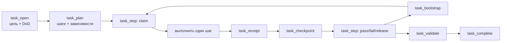

# Long-Horizon Task Runtime

[English version](long-horizon-runtime.md)

Long-Horizon Task Runtime — alpha-журнал исполнения Levara для работы, которая
должна переживать сжатие контекста, перезапуски процесса, передачу между
агентами и продолжение по расписанию. В SQL сохраняются цель, полномочия,
Definition of Done, версионированный план, атомарные leases шагов, неизменяемые
evidence, checkpoints, blockers и состояние завершения.

Task Runtime не выполняет работу самостоятельно и не выдаёт дополнительных
полномочий. Работу выполняет агент или host; Levara делает состояние и
доказательства восстанавливаемыми и детерминированно проверяет завершение.

## Включение

По умолчанию task-инструменты скрыты. Перед запуском сервера задайте обе
переменные:

```bash
export DB_PROVIDER=sqlite
export DB_PATH=./data/levara.db
export LEVARA_LONG_HORIZON_RUNTIME=1
export LEVARA_MCP_TOOLSET=long-horizon
./levara-server -profile=standalone -port=8080 -grpc-port=0
```

Профиль `full` также включает Task Runtime, пока активен feature flag. После
изменения переменных перезапустите сервер и переподключите MCP-клиент, чтобы он
обновил `tools/list`.

Поддерживаются SQLite и PostgreSQL, но Task Runtime не работает в WAL-only
конфигурации с отключённой SQL-базой. Для artifact receipts дополнительно нужен
настроенный локальный storage/workspace root или object-storage backend.

Проверка runtime:

- `runtime_stats` сообщает `task_runtime.enabled=true`;
- `doctor` видит схему Task Runtime и не находит orphan-записей;
- в списке MCP присутствуют восемь `task_*` инструментов.

## Жизненный цикл



| Инструмент | Ответственность |
|---|---|
| `task_open` | Создать или идемпотентно открыть задачу в одной collection и room |
| `task_plan` | Сохранить ациклический план шагов до начала исполнения |
| `task_bootstrap` | Восстановить ограниченное состояние, следующий шаг, blockers и scoped memory |
| `task_step` | Атомарно claim/renew/release/pass/fail lease одного шага |
| `task_receipt` | Добавить неизменяемое command/artifact/source/observation/reviewer evidence |
| `task_checkpoint` | Сохранить recovery-сводку, добавить/разрешить blockers и предложить память |
| `task_validate` | Найти отсутствующие, устаревшие или неуспешные evidence и незавершённое состояние |
| `task_complete` | Завершить валидную задачу и продвинуть принятые memory candidates |

## Минимальный рабочий процесс

Ниже показаны аргументы MCP-инструментов, а не сырые HTTP-запросы. Для каждой
следующей мутации используйте последний возвращённый `version` как
`base_version` или `expected_version`.

### 1. Открыть scoped task

```json
{
  "collection": "levara",
  "room": "task-runtime",
  "objective": "Опубликовать Long-Horizon Runtime с проверенной документацией",
  "idempotency_key": "publish-long-horizon-v1",
  "risk_level": "medium",
  "authority": {
    "may_edit_repository": true,
    "may_publish_branch": true,
    "may_deploy": false
  },
  "definition_of_done": [
    {
      "criterion_id": "tests",
      "description": "Релевантные Go-тесты проходят",
      "required": true
    },
    {
      "criterion_id": "docs",
      "description": "Английское и русское руководства описывают поставляемое поведение",
      "required": true
    }
  ]
}
```

Сохраните возвращённый `task_id`: это стабильный recovery handle. Повторный
вызов с тем же owner, collection и `idempotency_key` вернёт существующую задачу.

### 2. Составить проверяемый план

```json
{
  "task_id": "<task-id>",
  "base_version": 2,
  "steps": [
    {
      "step_id": "implement",
      "description": "Реализовать и протестировать runtime",
      "criterion_ids": ["tests"]
    },
    {
      "step_id": "document",
      "description": "Описать запуск, жизненный цикл и ограничения",
      "dependencies": ["implement"],
      "criterion_ids": ["docs"]
    }
  ]
}
```

Зависимости должны ссылаться на шаги той же задачи и образовывать ациклический
граф. После запуска любого шага заменить план нельзя.

### 3. Захватить один шаг

Непосредственно перед claim вызовите `task_bootstrap`, затем захватите
возвращённый доступный шаг:

```json
{
  "task_id": "<task-id>",
  "step_id": "implement",
  "action": "claim",
  "base_version": 3,
  "actor_id": "agent:implementer",
  "lease_seconds": 900
}
```

Lease ограничивается диапазоном 30–3600 секунд. Только владелец lease может
выполнить renew, release, pass или fail. Истёкший lease может перехватить другой
actor.

### 4. Приложить наблюдаемое evidence

```json
{
  "task_id": "<task-id>",
  "base_version": 4,
  "idempotency_key": "go-test-pkg-mcp-1",
  "receipt_type": "command",
  "status": "pass",
  "criterion_ids": ["tests"],
  "observation": "go test ./pkg/mcp завершился успешно",
  "exit_code": 0,
  "workspace_revision": "<actual-workspace-revision>"
}
```

Receipts неизменяемы и идемпотентны. Фиксируйте реально наблюдаемый результат:
намерение или summary не является evidence. Для `command`, `artifact` и
`reviewer` обязателен workspace revision. После изменения revision старое
evidence отмечается как stale.

Artifact receipt требует `evidence_uri` и полный SHA-256 digest. Поддерживаются
`file://` внутри настроенных storage/workspace roots и `storage://` из
настроенного backend. При completion runtime повторно читает байты и проверяет
digest.

### 5. Checkpoint, blocker и продолжение

Checkpoint хранит компактное проверенное recovery-состояние:

```json
{
  "task_id": "<task-id>",
  "base_version": 5,
  "idempotency_key": "checkpoint-after-tests",
  "step_id": "implement",
  "summary": "Реализация и сфокусированные тесты завершены",
  "verified": ["tests"],
  "next_action": "Обновить эксплуатационную документацию",
  "workspace_revision": "<actual-workspace-revision>"
}
```

Если требуется внешнее полномочие или решение, добавьте blocker. После
выполнения условия создайте новый checkpoint с точными активными ID из
`task_bootstrap`:

```json
{
  "task_id": "<task-id>",
  "base_version": 6,
  "idempotency_key": "publication-approved",
  "summary": "Владелец репозитория разрешил публикацию ветки",
  "resolved_blocker_ids": ["<blocker-id>"]
}
```

Разрешение blocker сохраняет его историю и записывает `resolved_at`, но не
расширяет сохранённые полномочия задачи.

### 6. Валидация и завершение

После прохождения обязательных шагов и освобождения leases вызовите
`task_validate` с `mode=completion`. Завершение отклоняется, пока остаётся хотя
бы одно условие:

- обязательный критерий не имеет passing receipt;
- evidence устарело или имеет статус fail;
- обязательный шаг не завершён;
- активен blocker или lease;
- high-risk task не имеет актуального passing `reviewer` receipt.

Вызывайте `task_complete` только с версией из последнего bootstrap или
validation. Принятые memory candidates сохраняются с provenance задачи и
receipts; неподдерживаемые или недостаточно доказанные кандидаты отклоняются.

## Правила восстановления и конкурентности

- Используйте `task_id` как recovery handle; не восстанавливайте операционное
  состояние из истории чата.
- Вызывайте `task_bootstrap` после restart, handoff, compaction, version
  conflict или истёкшего lease. Бюджет — 100–4000 приблизительных токенов.
- Каждая мутация увеличивает optimistic version. При конфликте снова выполните
  bootstrap и примите решение по актуальному состоянию.
- Используйте стабильный idempotency key для open, receipt и checkpoint.
- Один actor должен выполнять один claimed step за раз. Проверка зависимостей и
  claim lease атомарны.

## Безопасность и границы alpha

- В alpha Task Runtime доступен через MCP; отдельного процесса в WebUI пока нет.
- Runtime записывает authority, но не выдаёт права на filesystem, network,
  deploy, payment или publication.
- Tool profiles уменьшают размер схемы, но не являются границей авторизации.
- Доступ к task учитывает authenticated owner и изоляцию collection/room.
- Локальная проверка artifacts отклоняет выход через symlink и пути вне
  настроенных roots. Неподдерживаемые URI-схемы не считаются доверенными.
- Автономного scheduler/worker нет: задачу продолжает MCP host или внешний
  запуск по расписанию.

Проверенные сценарии и команды воспроизведения приведены в
[alpha-отчёте](long-horizon-alpha-report.md). Канонические входные и выходные
схемы генерируются в [api-contract.md](api-contract.md).
