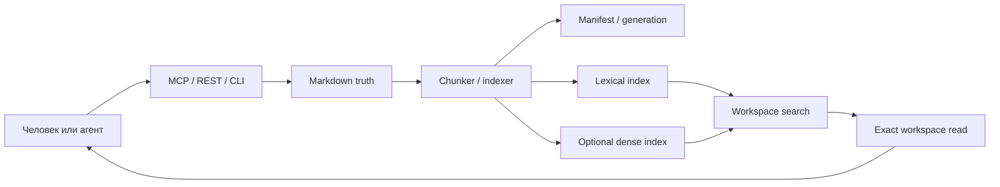

# Markdown-Native Workspace в Levara

Workspace хранит канонические Markdown-файлы и производные поисковые индексы.
Агент сначала находит фрагмент, затем читает точный файл и только после этого
делает вывод или предлагает изменение. Это отдельный workflow от дискретной
[памяти](memory-workflow-skill.ru.md) и [загрузки документов](document-management.md).

## 1. Когда использовать

Workspace подходит для ADR, runbooks, проектных заметок, API/SQL artifacts и
результатов агентских запусков. Для PDF/аудио/офисных документов сначала нужен
upload/extraction workflow. Для небольшого устойчивого решения часто достаточно
`save_memory`; для leases, checkpoints и доказательств исполнения —
[Task Runtime](long-horizon-runtime.ru.md).

## 2. Архитектура



Индекс помогает найти текст, но не заменяет актуальный файл. Manifest связывает
project, branch, generation, path, file digest и IDs chunks/vectors. Поколения
позволяют построить новый индекс и затем переключить активный manifest.

## 3. Storage layout

По умолчанию workspace находится в `<data-dir>/workspace`:

```text
workspace/
  projects/<project-id>/<branch>/...md
  .kb/manifests/
  .kb/commits/
  .kb/jobs/
  .kb/audit/
  .kb/context-artifacts.json
```

Файлы проекта и сохранённые снимки — исходные данные; индексы и manifest —
производное и служебное состояние. Не удаляйте весь workspace под предлогом
пересборки индекса. Полный [backup inventory](deployment.md#backup-and-recovery)
включает SQL, файлы, vector storage, uploads и внешние objects.

## 4. Проект и права

В аутентифицированном режиме `project_id` соответствует **ID dataset**, а не
произвольному имени проекта. Создайте dataset и используйте его ID; владельцу
или отдельному пользователю можно назначить viewer/editor/admin. Название
collection, branch, room и tags не создаёт права. Эффективных групповых и
отдельных document grants нет.

Перед работой вызовите `workspace_context`, а для диагностики прав —
`workspace_access_check`. Viewer использует чтение/поиск, изменения требуют
соответствующего grant. Проверка заранее помогает объяснить отказ, но сервер
всё равно должен авторизовать саму операцию. [Сценарии доступа](document-workflow-scenarios.md)
проверяют и разрешённые, и запрещённые действия с известными IDs.

## 5. Read → guarded write → search

Аргументы ниже предназначены для MCP-инструментов; подставьте ID доступного
проекта, путь и digest из фактического результата:

```text
workspace_context(project_id="DATASET_ID", branch="main")
workspace_search(project_id="DATASET_ID", branch="main", query="timeout")
workspace_read(project_id="DATASET_ID", branch="main", path="docs/timeouts.md")
workspace_write(project_id="DATASET_ID", branch="main", path="docs/timeouts.md",
                text="REVIEWED_MARKDOWN", expected_file_digest="DIGEST_FROM_READ")
```

Если файл изменился после read, digest conflict требует перечитать файл и
согласовать изменение. Не подставляйте новый digest механически ради обхода
конфликта. Для нового файла и параметров индексации следуйте текущей
[схеме](api-contract.md).

CLI удобен для личной загрузки текста из stdin, но текущий `workspace write`
не принимает `expected_file_digest`; для конкурентного редактирования с этой
защитой используйте MCP/REST. Например, для нового учебного файла:

```bash
export LEVARA_URL=http://127.0.0.1:8080/api/v1
./levara workspace write docs/example.md --project=DATASET_ID --no-index <<'MD'
# Example
The payment client uses an explicit request timeout.
MD
./levara workspace read docs/example.md --project=DATASET_ID
```

`--no-index` сохраняет truth без обещания готового поиска. Чтобы построить новое
поколение из файлов проекта:

```bash
./levara workspace reconcile --project=DATASET_ID --branch=main \
  --generation=example-001 --chunk-strategy=merged --activate
```

Используйте свежее имя generation для новой публикации. Лексический поиск
доступен без модели; dense/hybrid требуют совместимых embeddings и индекса.
Для exact-source ответа проверяйте `workspace_read`, а не только cached hit.

## 6. Индексация и generations

`workspace_index` создаёт поисковые производные из переданного текста;
`workspace_write` пишет truth. Индексация текста с клиентского диска не означает,
что файл появился в truth tree сервера. `workspace_reindex_paths` обновляет
выбранные пути, `workspace_reconcile` сверяет дерево проекта с manifest,
включая удалённые и изменённые файлы.

При сбоях смотрите активную generation, список conflicts и состояние jobs.
Не активируйте неполное поколение ради исчезновения предупреждения. Обновление
embedding-модели требует повторной индексации; [migration runbook](deployment.md#embedding-migration-shadow-evaluate-cut-over-roll-back)
описывает отдельный переход коллекции.

## 7. Commit, log, revert

Снимки workspace сохраняют ревизии truth; это не замена Git-репозитория кода.

```bash
./levara workspace commit --project=DATASET_ID --message='before revision'
./levara workspace log --project=DATASET_ID
./levara workspace revert COMMIT_ID --project=DATASET_ID
```

Revert восстанавливает файлы. Проверьте результат и пересоберите поиск через
reconcile; автоматическую актуальность старых производных предполагать нельзя.
Удаление, GC и revert имеют разные области действия — сначала проверьте
[контракт](api-contract.md), scope и backup.

## 8. Watcher и фоновые jobs

`LEVARA_WORKSPACE_WATCH=1` включает наблюдение, а
`LEVARA_WORKSPACE_INDEX_WORKER=1` — обработку durable index jobs.
`LEVARA_WORKSPACE_WATCH_ASYNC_INDEX=1` переводит watcher на очередь.
Эти настройки не включают полезный executor Task Runtime: это другой worker.

Наблюдайте `workspace_watch_status`, `workspace_index_jobs`,
`workspace_ops_status`; после устранения ошибки используйте
`workspace_retry_index_job` или новый reconcile. Ошибка embedding-сервиса,
недоступный файл или dead-letter не должны интерпретироваться как готовность.

## 9. Context artifacts и agent hosts

В `.kb/context-artifacts.json` задаются include rules для OpenAPI, SQL и других
проектных artifacts. `workspace_context_artifacts` показывает правила,
`workspace_reindex_artifacts` обновляет их производные. Текст artifact может
содержать секреты: review происходит до публикации в индекс/провайдер.

[Deployment recipes](markdown-workspace-deployment-recipes.md) содержат
конфигурации watcher, метрик, host configs и sync. [Agent integration](tutorials/02-agent-integration.md)
описывает правильный MCP URL и актуальную передачу токена Codex.

## 10. Freshness и диагностика

| Наблюдение | Следующий шаг |
|---|---|
| В context нет проекта | Проверить доступный dataset ID, SQL и credentials |
| Нет active generation | Reconcile файлов в новое поколение и проверка результата |
| Search и exact read расходятся | Conflicts/manifest; индекс отстаёт от truth |
| Lexical работает, dense нет | Проверить endpoint, модель, dimension и coverage |
| Job pending слишком долго | Проверить отдельный workspace index worker |
| Job dead_letter | Исправить причину; retry или новая generation |
| Digest conflict | Перечитать файл, проверить изменения, сформировать новую запись |
| После restore поиск старый | Проверить truth, затем reconcile |

Проверяемые пользовательские кейсы и ссылки на тесты:
[workspace scenarios](markdown-workspace-user-scenarios.md). Общие команды
проверок и границы evidence: [testing](testing.md).
