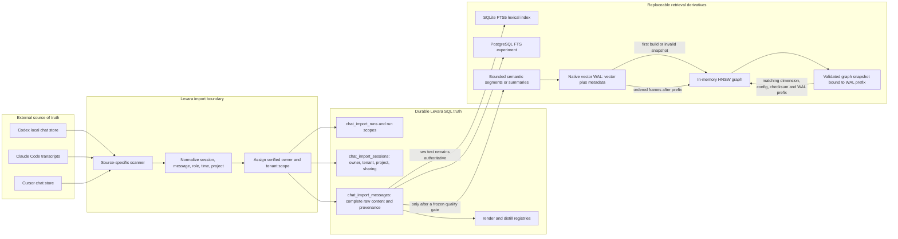
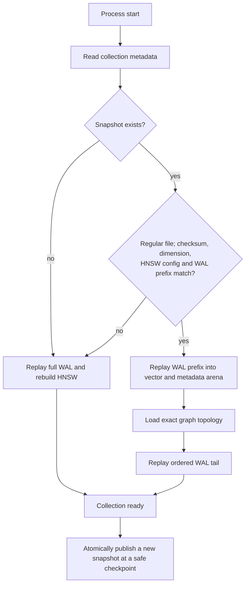

# V3 storage, startup, and chat retrieval evaluation

Status: evaluation complete. The selected restart optimization is implemented
behind the default-off `-hnsw-snapshots` flag; rollout remains a separate
deployment decision.

## Constraints and baseline

- Branch: `v3`, based on `3b9a85d46b379f4c7a993254dfbc7296cc143d67`.
- Never run `TestMemoryREST` or any prefix of it.
- Do not open production native collections in a benchmark process: startup
  truncates and rebuilds `meta.bin` and may repair an incomplete WAL tail.
- Experiments use deterministic synthetic collections or isolated SQL exports.
- Mac experiments may use at most 4 GiB under a task-owned temporary root and
  must leave at least 12 GiB free.
- Report process-cold startup separately from host-cold startup. Page cache is
  not silently treated as a cold host.
- Current observed host-cold startup is 41m01s for 326 collections.

Initial Mac inventory before moving reproducible model caches:

| Item | Records | Dimension | Disk |
|---|---:|---:|---:|
| Imported-chat SQL tables | — | — | 589 MiB |
| `chat-imports` | 962,786 | 256 | 8.3 GiB |
| `chat-imports-v2` | 900,108 | 768 | 9.4 GiB |
| Free filesystem space | — | — | 17 GiB |

## End-to-end data flow

The source applications may use SQLite or another local format, but Levara does
not attach to or mutate those databases. The importer copies their messages into
Levara's own SQL tables, where owner, tenant, project, sharing, and provenance
are enforced. `chat_import_messages.content` remains complete raw truth. FTS,
summaries, vectors, HNSW, and snapshots are indexes that may be rebuilt or
deleted without deleting the imported message.

The snapshot avoids recomputing graph edges; it does not duplicate raw message
content or replace the WAL. A corrupt, stale, mismatched, symlinked, or
structurally invalid snapshot is ignored and takes the existing full-rebuild
path. Listener-level lazy loading is a separate option: it can shorten listener
readiness, but the first collection read must report loading or wait rather than
return an empty result.

## Storage and startup variants

| ID | Variant | Test status | Include reason | Production dependency |
|---|---|---|---|---|
| S0 | Current eager WAL replay + HNSW rebuild | Required baseline | Existing behavior and fallback | None |
| S1 | Exact-WAL graph-only HNSW snapshot | Prototype | Smallest change that removes repeated graph construction | Versioned serializer, WAL digest, atomic publication |
| S2 | Snapshot plus ordered WAL-tail replay | Prototype after S1 | Fast restart after new writes or crash | Stable WAL frame boundary and prefix identity |
| S3 | Lazy/singleflight collection loading | Prototype after S1 | Fast listener readiness | Explicit loading state; no false-empty reads |
| S4 | PostgreSQL + pgvector | Environment/feasibility row | Persistent shared ANN backend | Extension is currently unavailable; migration and ACL parity required |
| S5 | SQLite vector extension | Environment/feasibility row | Portable persistent ANN candidate | No vector extension currently integrated; Mac/Linux/ARM64 parity required |
| S6 | Plain SQL BLOB + brute-force vectors | Diagnostic only | Measures lower bound without ANN | Reads about 2.58 GiB for each v2 full scan |
| S7 | Archive legacy `chat-imports` | Operational experiment | Frees 8.3 GiB after coverage proof | Exact source/session/segment coverage comparison |
| S8 | Tiered SQL truth + compact semantic index | Quality experiment | Largest durable size reduction | Frozen summary/distill policy and non-inferior quality |

`pgvector` is not available in the current PostgreSQL installation. PostgreSQL
full-text search needs no extension. SQLite FTS5 is available.

## Imported-chat retrieval variants

Every controlled row uses the same frozen raw SQL export and query oracle.
Existing live v1/v2 results are observational only because their coverage,
renderer version, model, and dimension differ.

| ID | Variant | Purpose |
|---|---|---|
| Q0 | Raw SQL `%LIKE%` | Diagnostic scan baseline |
| Q1 | PostgreSQL FTS | Practical server lexical baseline |
| Q2 | SQLite FTS5 | Portable lexical baseline |
| Q3 | Dense v1 encoder on frozen corpus | Controlled 256d comparison |
| Q4 | Dense v2 encoder on frozen corpus | Controlled 768d incumbent |
| Q5 | Dense v2 + cross-encoder rerank | Candidate quality ceiling |
| Q6 | PostgreSQL FTS + dense RRF | Full hybrid baseline |
| Q7 | Conversation-summary vectors | Smallest semantic derivative |
| Q8 | Segment-summary vectors | Compact derivative with long-chat coverage |
| Q9 | Distilled-memory vectors | Highly compressed, deliberately lossy tier |
| Q10 | FTS + conversation summaries | Compact hybrid |
| Q11 | FTS + segment summaries | Compact hybrid with finer provenance |
| Q12 | FTS + distilled memories | Exact raw search plus curated semantic memory |

The current `search_chats` tool is not a Q0/Q1 implementation: it searches
`interactions`, not `chat_import_messages`. The current in-memory BM25 is not a
valid full-corpus row because it caps new documents at 100,000.

## Frozen quality oracle

Freeze all inputs before any scored result:

- repository revision and benchmark source digest;
- raw SQL export digest and renderer version;
- platform, session, external-message, project, owner, and tenant identities;
- model, dimension, normalization, distance metric, and index configuration;
- generated summary/distill artifacts and prompt/model digest;
- query text, required facts, relevant message IDs, and acceptable session IDs.

Use at least 120 hand-verified queries split across:

- exact IDs, errors, versions, dates, numbers, and code symbols;
- Russian, English, and cross-language paraphrases;
- long sessions, cross-segment facts, and a message larger than 200 KiB;
- corrected/stale answers, negation, unknown/abstain requests;
- identical text in private, shared, revoked, and foreign projects.

An LLM is not the relevance judge. Generated summaries may be inputs only after
their content and hashes are frozen.

Quality metrics: Recall@1/3/5/10, MRR@10, nDCG@10, all-required-facts success,
session and exact-message recall, stale-hit rate, duplicate-hit rate, and
unknown-query nonempty rate. Hard gates are zero unauthorized hits, complete
allowed-source provenance, and zero active stale-version hits.

## Performance harness

The offline harness uses child processes and JSON receipts. Fixture defaults:

- seed `20261008`;
- dimensions 768 and compatibility coverage at 256;
- Gaussian vectors and 4096-byte metadata payloads;
- HNSW `M=16`, `M0=32`, `efSearchMult=6`, `efSearchMin=48`;
- scales 1k, 10k, 50k, and 100k; 250k only when preflight predicts a task root
  at or below 4 GiB and free space remains at least 12 GiB;
- one large collection and 326-directory fanout with two populated collections;
- three fresh child processes per mode.

Each receipt records the HEAD, startup-source-tree and actual test-executable
digests, Go module/build identity, GOOS/GOARCH, GOMAXPROCS, seed, configuration
digest, fixture and query hashes, wall and CPU time, peak RSS, input WAL bytes,
rebuilt output `meta.bin` bytes, persistent fixture disk, record count, executed
query and returned-result counts, search p50/p95/p99, throughput, errors,
quality applicability/sample count, recall@10 when applicable, and result
digest. S0 creates no separate temporary artifact and makes no temporary-disk
claim. Any snapshot variant must measure and enforce its actual peak temporary
disk before it may report that field. S3 reports listener readiness and lazy-load
time/record throughput separately; eager startup record throughput is omitted
because it is not applicable before the collection load completes.

Executed correctness cases include empty collection, tombstone,
insert-delete-reinsert, checkpointed WAL, appended tail, incomplete crash tail,
truncated/corrupt or checksum-valid structurally forged snapshots, wrong
dimension/config, symlink rejection, concurrent first lazy load, terminal load
errors, and close-during-load cleanup. Zero-vector coverage, bounded interrupted
atomic-publish fault injection, ENOSPC injection, and model-identity binding remain
planned and must pass before production wiring.

## Decision gates

Do not collapse safety, quality, speed, and storage into one score.

1. Every authorization and provenance gate must pass exactly.
2. Snapshot roundtrip must preserve top-k IDs and scores against its source
   graph; any mismatch must take the current full-rebuild fallback.
3. HNSW Recall@10 must remain at least 0.90 on exact ground truth.
4. A compact retrieval variant may replace full v2 only if sealed-holdout
   Recall@5 is non-inferior within a margin frozen after calibration.
5. The selected startup path must materially reduce process-cold open time at
   100k records without increasing persistent plus temporary disk beyond the
   declared budget.
6. Lazy reads must report loading or wait; they must never return a false empty
   collection.
7. Full-scale and host-cold validation happen only after isolated evidence and
   a separate maintenance/deployment decision.

## Selected phased outcome

1. Ship exact-WAL graph snapshots with ordered tail replay behind
   `-hnsw-snapshots` (default off). The first opt-in start rebuilds and
   atomically publishes `hnsw.snapshot`; later starts load it when its
   dimension, HNSW config, checksum, topology, and WAL prefix still match.
2. Keep listener lazy loading out of production until the API has an explicit
   loading-state contract.
3. Evaluate SQLite FTS5 next for imported-chat lexical retrieval after the
   access-controlled API and sealed corpus exist.
4. Keep compact semantic retrieval and legacy-data removal gated by proven
   abstention and coverage parity.

Checkpointing may invalidate an older WAL-prefix snapshot. The next opt-in
start safely rebuilds from WAL and publishes a replacement; snapshot failures
never replace the WAL as the source of truth.
