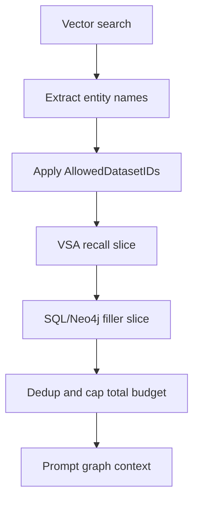

# VSA Before SQL Graph Architecture

Date: 2026-06-18

Status: implemented for `GRAPH_COMPLETION` and
`GRAPH_COMPLETION_CONTEXT_EXTENSION`.

## Problem

Levara currently appends VSA graph facts after the regular graph context:

1. `GRAPH_COMPLETION` resolves vector hits to entity names.
2. Neo4j or SQL graph context is fetched first.
3. VSA context is appended only if there is remaining context budget.

The quantitative evaluation shows this hides the VSA signal under pressure:

| Mode | fact_recall@k | MRR | nDCG@k |
|---|---:|---:|---:|
| `current_append` | 0.000 | 0.000 | 0.000 |
| `vsa_first` | 1.000 | 1.000 | 1.000 |

The explicit order regression confirms the same failure mode:

```text
VSA before SQL graph target hits=52/52; SQL before VSA target hits=0/52
```

The issue is not that SQL graph is incorrect. It is that SQL/Neo4j graph context
can consume the budget with source-local filler before predicate-specific VSA
facts are allowed into the prompt.

## Design Goal

Make VSA a first-class graph-context source, queried before SQL/Neo4j filler, so
predicate-specific facts get a protected chance to enter the answer context.

Non-goals:

- Do not remove SQL graph or Neo4j.
- Do not bypass `AllowedDatasetIDs`.
- Do not make VSA the only context source.
- Do not require live LLM calls for evaluation.

## Proposed Flow



Current flow:

```text
SQL/Neo4j first -> VSA only if remaining budget
```

Target flow:

```text
VSA first -> SQL/Neo4j fills remaining budget
```

## Context Assembler

Introduce one internal assembler instead of open-coding order inside handlers:

```go
type graphContextItem struct {
    SourceName string
    Predicate string
    TargetName string
    DatasetID string
    Provider string // "vsa", "sql", "neo4j"
    Score float64
    Text string
}

type graphContextPolicy struct {
    TotalLimit int
    VSAReserve int
    SQLFillerLimit int
    Order string // "vsa_first", "sql_first", "sql_only", "vsa_only"
}

func assembleGraphContext(
    ctx context.Context,
    cfg APIConfig,
    entityNames []string,
    allowedDatasetIDs []string,
    policy graphContextPolicy,
) []string
```

Initial policy:

```text
TotalLimit: 20
VSAReserve: min(10, TotalLimit)
SQLFillerLimit: TotalLimit - len(vsaContext)
Order: vsa_first
```

Rationale:

- `vsa_first` captures the tested win.
- SQL/Neo4j still contribute breadth and readable relationship context.
- Existing response shape can remain unchanged: `context` is still `[]string`.

Implementation note: the assembler should merge typed `graphContextItem`
values and format to strings at the edge. `vsaGraphContext` currently returns
formatted strings with score suffixes, which is fine for API output but too
fragile for deduplication and source accounting.

Implemented shape:

- `internal/http/graph_context_assembler.go` owns `graphContextItem`,
  `graphContextPolicy`, `assembleGraphContext`, env parsing, dedup, ordering,
  and debug metadata.
- `vsaGraphContextItems` performs typed VSA reads and the legacy
  `vsaGraphContext` remains as a string wrapper.
- `vsaGraphContextItems` ranks available VSA predicates against query tokens
  before applying the predicate cap, so query-specific predicates enter the
  protected VSA slice ahead of generic fan-out predicates.
- `graph_predicate_synonyms` stores generated, manual, and feedback synonym
  weights per dataset. Generated rows refresh after VSA rebuild; manual
  defaults provide a safe baseline for common predicates.
- `vsamemory.QueryObjectWithOptions` adds query-aware candidate reranking
  inside each VSA predicate result set. It keeps `QueryObject` as a compatible
  wrapper and boosts candidates by target-name/query overlap plus edge
  confidence.
- `graphContextItemsFromPostgres` and `graphContextItemsFromNeo4j` perform
  typed graph reads; legacy string helpers remain as wrappers for unaffected
  search modes.

## Budget Policy

Use a protected VSA slice, not just "query VSA then append SQL":

1. Query VSA up to `VSAReserve`.
2. Query SQL/Neo4j up to `TotalLimit`.
3. Deduplicate by normalized relationship key.
4. Return all VSA facts first, then SQL/Neo4j filler until `TotalLimit`.

Default budget:

| Setting | Value | Reason |
|---|---:|---|
| `TotalLimit` | 20 | Existing graph prompt budget. |
| `VSAReserve` | 10 | Enough for predicate-specific recall in fan-out/distractor cases. |
| `PerPredicateTopK` | 3 | Existing `vsaGraphContext` behavior. |
| `MaxSources` | 5 | Existing source cap. |
| `MaxPredicates` | 8 | Existing predicate cap. |

The order should be visible in debug metadata:

```json
{
  "graph_context_policy": "vsa_first",
  "graph_context_total_limit": 20,
  "graph_context_vsa_count": 10,
  "graph_context_sql_count": 10
}
```

## Handler Integration

### `GRAPH_COMPLETION`

Replace the current block:

```go
graphContext = graphContextFromPostgres(...)
graphContext = append(graphContext, vsaGraphContext(...remaining)...)
```

with:

```go
graphContext := assembleGraphContext(ctx, cfg, entityNames, req.AllowedDatasetIDs, defaultGraphContextPolicy())
```

### `GRAPH_COMPLETION_CONTEXT_EXTENSION`

Keep the two-hop behavior, but do not let hop1/hop2 consume the VSA budget first.

Recommended order:

1. VSA direct facts for original entities.
2. SQL/Neo4j hop1 filler.
3. SQL/Neo4j hop2 filler only if budget remains.

The response can keep `context_hop1` and `context_hop2`, but should add either:

```json
"context_vsa": [...]
```

or include VSA facts in `context_hop1` with metadata counters. The cleaner long
term shape is `context_vsa`, `context_hop1`, `context_hop2`, and combined
`context`.

## Deduplication

Normalize both VSA and SQL/Neo4j strings into the same relationship key:

```text
source_name + "\x00" + predicate + "\x00" + target_name
```

VSA strings include score suffixes, so string-level dedup is insufficient.
This should be implemented on typed context items, not by parsing output text.

Required behavior:

- If VSA and SQL return the same fact, keep the VSA copy first.
- If SQL returns a relationship absent from VSA, keep it as filler.
- If a target is not resolvable by name, use target id consistently.

## Access Control

VSA-before-SQL must preserve existing tenant isolation:

- Pass `AllowedDatasetIDs` into `vsaGraphContext`.
- Keep source resolution filtered by dataset.
- Keep SQL/Neo4j endpoint filtering.
- Keep tests covering cross-dataset edges and expired facts.

The quantitative report already shows:

```text
tenant_leak_rate = 0
expired_fact_leak_rate = 0
```

These must become release gates for any production rollout.

## SQL Communication Points

The redesign touches these SQL-backed operations:

| Step | Function | SQL Role |
|---|---|---|
| VSA schema/index read | `vsaGraphContextItems` → `vsamemory.Store` | Ensures VSA tables, lists datasets/predicates, queries VSA shards. |
| VSA source resolution | `vsaResolveSources` | Resolves entity names to graph node IDs with dataset filtering. |
| VSA target naming | `vsaNodeName` | Resolves VSA candidate target IDs back to node names. |
| SQL graph filler | `graphContextItemsFromPostgres` | Reads direct graph edges after VSA budget is protected. |
| RBAC input | `AllowedDatasetIDs` on request | Restricts VSA and SQL graph reads to caller-visible datasets. |
| Test VSA rebuild | `vsamemory.RebuildFromGraph` | Builds VSA shards from `graph_edges.dataset_id`. |
| Predicate synonyms | `refreshPredicateSynonyms` / `loadPredicateSynonyms` | Maintains and reads per-dataset generated/manual/feedback synonym weights. |
| VSA candidate rerank | `QueryObjectWithOptions` | Reads target node names and edge confidence for query-aware candidate ordering. |

Implementation note: test fixtures now include `graph_edges.dataset_id` because
the VSA rebuild path reads graph facts from SQL by dataset.

## Configuration

Start with environment flags to reduce rollout risk:

| Env | Default | Meaning |
|---|---|---|
| `LEVARA_GRAPH_CONTEXT_ORDER` | `vsa_first` | `vsa_first`, `sql_first`, `sql_only`, `vsa_only`. |
| `LEVARA_GRAPH_CONTEXT_LIMIT` | `20` | Total graph context lines. |
| `LEVARA_GRAPH_CONTEXT_VSA_RESERVE` | `10` | Protected VSA budget. |

During rollout, keep `sql_first` available as a rollback mode. After validation,
remove or demote it to a compatibility mode.

## Observability

Emit counters per request:

- `graph_context_order`
- `graph_context_vsa_count`
- `graph_context_sql_count`
- `graph_context_total_count`
- `graph_context_vsa_latency_ms`
- `graph_context_sql_latency_ms`
- `graph_context_dedup_count`

Add these to debug responses first; promote to metrics after the API shape is
stable.

## Testing Plan

Keep the existing tests as gates:

- `TestVSAQuantitativeEval`
- `TestVSABeforeSQLGraphPreservesTargetUnderBudget`
- `TestVSAGraphContextABShowsRecallLift`
- tenant isolation tests for SQL graph context
- VSA dataset filter tests

Add production-path tests:

1. `GRAPH_COMPLETION` with VSA index built and SQL distractors present returns
   VSA fact inside `context`.
2. Same setup with `LEVARA_GRAPH_CONTEXT_ORDER=sql_first` reproduces the old
   failure, validating the test scenario.
3. `GRAPH_COMPLETION_CONTEXT_EXTENSION` returns VSA facts before hop fillers.
4. Cross-tenant graph edge does not appear through VSA or SQL.
5. Expired edge does not appear through VSA or SQL.

Implemented production-path tests:

- `TestGraphCompletionSearch_VSABeforeSQLGraphUsesProtectedBudget`
- `TestGraphCompletionSearch_SQLFirstCanStillHideVSAUnderBudget`
- `TestContextExtensionSearch_VSABeforeSQLGraph`
- `TestRankVSAPredicatesForQuery`
- `TestRankVSAPredicatesForQuery_ManualSynonym`
- `TestRefreshPredicateSynonyms`
- `TestGraphCompletionSearch_VSASynonymMapRanksPredicate`

The first and third exercise the real search handler, vector entity extraction,
SQL graph fixture, VSA rebuild, assembler policy, and response/debug metadata.
The second keeps `sql_first` as a rollback mode and proves it still reproduces
the budget-hiding failure. The predicate ranking test proves query tokens can
move a relevant predicate ahead of generic predicates before the VSA cap.
The synonym tests prove generated synonym refresh and manual synonym ranking
work through the production search path.

Latest production-path eval shows the combined effect:

| Mode | recall@k | MRR | nDCG@k | p95 latency |
|---|---:|---:|---:|---:|
| `sql_first` | 0.000 | 0.000 | 0.000 | ~0.8ms |
| `vsa_first` | 1.000 | 1.000 | 1.000 | ~93ms |

The rerank step fixed the earlier `vsa_first` MRR gap (`0.700` to `1.000`) on
the search-handler architecture eval while preserving recall and leak gates.

## Predicate-Specific Routing

The VSA path now applies lightweight predicate-specific routing:

1. Tokenize the user query and available graph predicates.
2. Load per-dataset synonyms from `graph_predicate_synonyms`.
3. Add generated predicate tokens and manual defaults as fallback synonyms.
4. Score predicates by exact predicate-token, manual synonym, generated
   synonym, feedback synonym, and substring matches.
5. Sort predicates by score before applying the `MaxPredicates` cap.
6. Preserve store order for ties.

This keeps the protected VSA slice focused when the query mentions a predicate,
for example prioritizing `VALIDATES` over generic `CALLS` for a query such as
`what validates checkout`.

Synonym weights:

| Source | Weight |
|---|---:|
| exact predicate token | 100 |
| manual synonym | 80 |
| generated predicate token | 50 |
| feedback synonym | 30 |
| substring match | 20 |

Known limitation: the synonym map is still lexical and curated. It now maps
common phrases such as `maintains` to `OWNED_BY`, but broader semantic matching
should be added through feedback rows or an ontology-backed synonym generator,
not by making the default manual map too broad.

## Rollout Plan

1. Add the context assembler and policy parser.
2. Refactor VSA and SQL/Neo4j graph context helpers to produce typed
   `graphContextItem` values internally.
3. Wire `GRAPH_COMPLETION` to `vsa_first` behind env config.
4. Wire `GRAPH_COMPLETION_CONTEXT_EXTENSION`.
5. Add debug metadata counters.
6. Run quantitative report and production-path tests.
7. Default to `vsa_first` once all gates pass.

## Release Gates

- `TestVSABeforeSQLGraphPreservesTargetUnderBudget` keeps `52/52` VSA-first
  target hits and `0/52` SQL-first target hits on the stress fixture.
- `TestVSAQuantitativeEval` keeps VSA-first fact recall and MRR above baseline
  by the configured thresholds.
- Tenant and expired leak rates remain zero.
- Production-path graph search tests prove `GRAPH_COMPLETION` and
  `GRAPH_COMPLETION_CONTEXT_EXTENSION` expose VSA facts before SQL/Neo4j filler.

## Decision

Adopt `vsa_first` as the target architecture for graph context assembly.

The test result is strong enough to justify changing the ordering policy:
VSA-before-SQL recovers all 52 target facts in the stress dataset, while the
current SQL-before-VSA append path recovers none.
